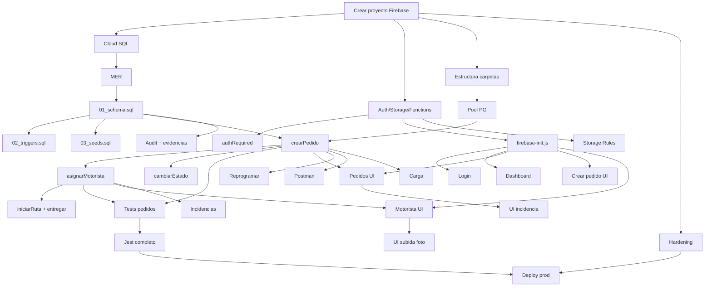
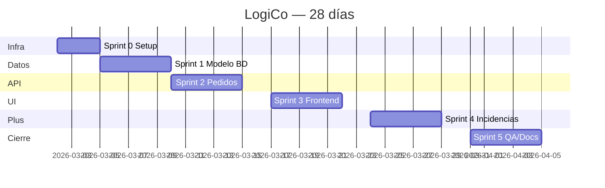

# 1. Metodología — Scrum

LogiCo se desarrolló siguiendo **Scrum** con sprints de **1 semana** (5 días hábiles).
Esta cadencia corta se eligió por el alcance acotado del proyecto integrado y por la
necesidad de validar tempranamente la integración Firebase ↔ PostgreSQL.

## 1.1 Roles del equipo

| Rol | Persona | Responsabilidad |
|---|---|---|
| **Product Owner (PO)** | Cliente / docente | Prioriza el backlog y aprueba entregables |
| **Scrum Master (SM)** | Líder del equipo | Facilita ceremonias, remueve impedimentos |
| **Dev Backend (BE)** | Ingeniero #1 | SQL + Firebase Functions |
| **Dev Frontend (FE)** | Ingeniero #2 | HTML/CSS/JS + integración Firebase Auth |
| **QA / DevOps** | Ingeniero #3 | Pruebas (Jest + Postman) + despliegue |

## 1.2 Ceremonias

| Ceremonia | Cuándo | Duración |
|---|---|---|
| Sprint Planning | Lunes 9:00 | 1 h |
| Daily Standup | 9:30 todos los días | 15 min |
| Sprint Review | Viernes 14:00 | 45 min |
| Sprint Retrospective | Viernes 15:00 | 30 min |

## 1.3 Definición de Hecho (Definition of Done)

Una historia se considera **DONE** cuando:

1. Código revisado por al menos 1 par (PR aprobado).
2. Tests unitarios verdes (`npm test` → 38 casos en `functions/tests/`).
3. Validación de integración/E2E con Postman/Newman o UI (sin suite supertest en repo).
4. Documentación actualizada (`docs/`), incluyendo limitaciones de seguridad §6.10 si aplica.
5. Despliegue exitoso en emulador o proyecto Firebase demo.

---

## 1.4 Cronograma maestro (5 sprints + Sprint 0)

| Sprint | Fechas | Objetivo macro |
|---|---|---|
| Sprint 0 | Día 1-3 | Infraestructura, repos, Cloud SQL, Auth |
| Sprint 1 | Día 4-8 | Modelo de datos + Functions base |
| Sprint 2 | Día 9-13 | Lógica de pedidos + asignación |
| Sprint 3 | Día 14-18 | Frontend operadora + motorista |
| Sprint 4 | Día 19-23 | Incidencias, reprogramación, evidencias |
| Sprint 5 | Día 24-28 | Pruebas, hardening seguridad, documentación |

### Sprint 0 — Setup (3 días)

| ID | Tarea | Resp. | Días | Prioridad | Depende de |
|---|---|---|---|---|---|
| S0-1 | Crear proyecto Firebase `logico-20f73` | DevOps | 0.5 | Alta | — |
| S0-2 | Crear Cloud SQL PostgreSQL + usuario `logico_app` | DevOps | 0.5 | Alta | S0-1 |
| S0-3 | Habilitar Auth + Storage + Functions | DevOps | 0.5 | Alta | S0-1 |
| S0-4 | Estructura de carpetas + `firebase.json` + `.firebaserc` | BE | 0.5 | Alta | S0-1 |
| S0-5 | CI básico (lint + test) | DevOps | 1.0 | Media | S0-4 |

### Sprint 1 — Modelo de datos (5 días)

| ID | Tarea | Resp. | Días | Prioridad | Depende de |
|---|---|---|---|---|---|
| S1-1 | Diseñar MER (núcleo 10 tablas + extensiones farmacias/motos) | BE | 1 | Alta | S0-2 |
| S1-2 | `01_schema.sql` (tablas, FK, índices, vistas) | BE | 1 | Alta | S1-1 |
| S1-3 | `02_triggers.sql` (sincronía estado, validación rol) | BE | 1 | Alta | S1-2 |
| S1-4 | `03_seeds.sql` (estados + usuarios demo) | BE | 0.5 | Alta | S1-2 |
| S1-5 | Pool PG + `withTransaction()` | BE | 0.5 | Alta | S0-4 |
| S1-6 | Middleware `authRequired` | BE | 1 | Alta | S0-3 |

### Sprint 2 — Lógica de pedidos (5 días)

| ID | Tarea | Resp. | Días | Prioridad | Depende de |
|---|---|---|---|---|---|
| S2-1 | `crearPedido()` + tests | BE | 1 | Alta | S1-2, S1-5 |
| S2-2 | `asignarMotorista()` + bloqueos `FOR UPDATE` | BE | 1.5 | Alta | S2-1 |
| S2-3 | `cambiarEstadoPedido()` con máquina de transiciones | BE | 1 | Alta | S2-1 |
| S2-4 | `iniciarRuta()` + `registrarEntrega()` | BE | 0.5 | Alta | S2-2 |
| S2-5 | Tests unitarios módulos pedidos/rutas/estados | QA | 1 | Alta | S2-1..S2-4 |

### Sprint 3 — Frontend (5 días)

| ID | Tarea | Resp. | Días | Prioridad | Depende de |
|---|---|---|---|---|---|
| S3-1 | `firebase-init.js` + `apiFetch` con ID Token | FE | 0.5 | Alta | S0-3 |
| S3-2 | `index.html` (login con Firebase Auth) | FE | 0.5 | Alta | S3-1 |
| S3-3 | `dashboard.html` con KPIs | FE | 1 | Media | S3-1 |
| S3-4 | `pedidos.html` + `pedido.html` (CRUD operadora) | FE | 1.5 | Alta | S3-1, S2-* |
| S3-5 | `crear-pedido.html` | FE | 0.5 | Alta | S3-1, S2-1 |
| S3-6 | `motorista.html` (vista motorista) | FE | 1 | Alta | S3-1, S2-* |

### Sprint 4 — Incidencias / evidencias (5 días)

| ID | Tarea | Resp. | Días | Prioridad | Depende de |
|---|---|---|---|---|---|
| S4-1 | `registrarIncidencia()` con cancelación de ruta | BE | 1 | Alta | S2-2 |
| S4-2 | `reprogramarPedido()` | BE | 0.5 | Alta | S2-1 |
| S4-3 | `audit_logs` + `evidencias` (esquema + servicio) | BE | 1 | Media | S1-2 |
| S4-4 | Storage Rules + integración subida desde frontend | FE+BE | 1 | Media | S0-3 |
| S4-5 | UI de incidencia y reprogramación (modales) | FE | 0.5 | Alta | S3-4 |
| S4-6 | UI motorista: subida de foto entrega | FE | 1 | Media | S3-6, S4-4 |

### Sprint 5 — QA + seguridad + docs (5 días)

| ID | Tarea | Resp. | Días | Prioridad | Depende de |
|---|---|---|---|---|---|
| S5-1 | Suite Jest completa (≥ 80 % cobertura) | QA | 1.5 | Alta | S2-5 |
| S5-2 | Postman collection (16 casos end-to-end) | QA | 0.5 | Alta | S2-* |
| S5-3 | Helmet + rate-limit + Storage Rules | DevOps | 1 | Alta | S0-* |
| S5-4 | Pruebas de carga (k6 / artillery) | QA | 0.5 | Media | S2-* |
| S5-5 | Documentación 4+1 + seguridad + plan de pruebas | Todo el equipo | 1 | Alta | Todos |
| S5-6 | Despliegue producción + smoke tests | DevOps | 0.5 | Alta | S5-1, S5-3 |

---

## 1.5 Diagrama de dependencias entre tareas

## 1.6 Backlog priorizado (MoSCoW)

| Prioridad | Historias |
|---|---|
| **Must Have** | Login Firebase, crear pedido, asignar motorista, cambiar estado, registrar entrega, transacciones SQL, autenticación obligatoria, FK e integridad |
| **Should Have** | Incidencias, reprogramaciones, vista motorista, dashboard, validación de transiciones, auditoría |
| **Could Have** | Subida de evidencias a Storage, exportación reportes, KPIs avanzados |
| **Won't Have** (v1) | Notificaciones push, mapas en tiempo real, app nativa, billing |

## 1.7 Distribución de esfuerzo del equipo

| Rol | Sprint 0 | Sprint 1 | Sprint 2 | Sprint 3 | Sprint 4 | Sprint 5 | **Total h** | **%** |
|---|---:|---:|---:|---:|---:|---:|---:|---:|
| Dev Backend | 4 | 20 | 28 | 8 | 16 | 8 | **84 h** | 30 % |
| Dev Frontend | 2 | 4 | 4 | 32 | 16 | 4 | **62 h** | 22 % |
| DevOps / QA | 12 | 4 | 8 | 4 | 8 | 24 | **60 h** | 21 % |
| Scrum Master | 4 | 4 | 4 | 4 | 4 | 8 | **28 h** | 10 % |
| Product Owner | 4 | 4 | 4 | 4 | 4 | 8 | **28 h** | 10 % |
| Documentación | 0 | 4 | 0 | 0 | 4 | 20 | **28 h** | 7 % |
| **Total proyecto** | **26** | **40** | **48** | **52** | **52** | **72** | **290 h** | **100 %** |

*Base: 1 día hábil = 8 h; duración total 28 días ≈ 5.8 semanas.*

## 1.8 Carta Gantt

Ver diagrama en `docs/assets/gantt-logico.mmd` (flowchart, preview en VS Code/Cursor) y
`docs/assets/gantt-logico.md` (Gantt clásico para GitHub).

## 1.9 Evidencia Jira

Export del backlog, keys de issues y capturas: **`docs/assets/jira-evidencia.md`** y **`docs/assets/jira-backlog-export.csv`**.

## 1.10 Flujo cronológico y matriz de dependencias

| Orden | Hito | Predecesor obligatorio | Prioridad |
|:---:|---|---|---|
| 1 | Proyecto Firebase + Cloud SQL | — | Alta |
| 2 | Esquema SQL + triggers | 1 | Alta |
| 3 | API pedidos / rutas | 2 | Alta |
| 4 | Login + UI operadora | 1, 3 | Alta |
| 5 | UI motorista + asignación | 3, 4 | Alta |
| 6 | Incidencias + Storage | 5 | Media |
| 7 | Mantenedores admin (farmacias, motos, motoristas) | 2, 4 | Media |
| 8 | Pruebas + documentación rúbrica | 3–7 | Alta |
| 9 | Deploy producción | 8 | Alta |

## 1.11 Riesgos identificados

| Riesgo | Prob | Impacto | Mitigación |
|---|---|---|---|
| Conflictos en asignación concurrente de motoristas | Alta | Alto | `SELECT FOR UPDATE` + índice único parcial en `rutas` |
| Inconsistencia entre `pedidos.estado_actual_id` e `historial_estados` | Media | Alto | Trigger `fn_sync_estado_pedido` + `fn_bloquear_update_estado_directo` |
| Token de Firebase expirado durante operación larga | Media | Medio | Refresh automático en `apiFetch` |
| Coste imprevisto de Cloud SQL | Media | Medio | Tier `db-f1-micro` en dev, alertas de billing |
| Fuga de credenciales en repo | Baja | Crítico | `.gitignore` para `.env`, rotación trimestral |
