# 2. Arquitectura — Modelo 4 + 1 de Kruchten

LogiCo se documenta con las cinco vistas del modelo 4+1 de Philippe Kruchten (Kruchten, 1995).
La vista **Escenarios (+1)** enlaza requisitos con las vistas técnicas; las secciones siguientes
indican dónde está cada artefacto.

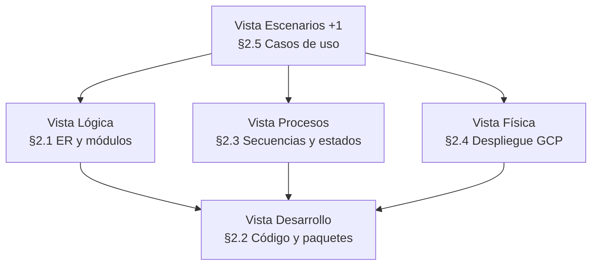
```mermaid
flowchart TB
    SC[Vista Escenarios +1<br/>§2.5 Casos de uso]
    LG[Vista Lógica<br/>§2.1 ER y módulos]
    PR[Vista Procesos<br/>§2.3 Secuencias y estados]
    FI[Vista Física<br/>§2.4 Despliegue GCP]
    DE[Vista Desarrollo<br/>§2.2 Código y paquetes]
    SC --> LG
    SC --> PR
    SC --> FI
    LG --> DE
    PR --> DE
    FI --> DE
```

### 2.0 Trazabilidad rúbrica 2.1.2.3 (artefactos UML)

| Requisito evaluación | Artefacto | Ubicación en este documento |
|---|---|---|
| Paradigma 4+1 (5 vistas) | Diagrama relación vistas + secciones §2.1–§2.5 | §intro, §2.1–§2.4 |
| Casos de uso | Pedidos, motorista, admin | §2.5 |
| Diagrama de clases | Dominio logístico | §2.6 |
| ≥3 diagramas de secuencia (mantenedores + núcleo) | Farmacias, motoristas, motos + pedidos + auth | §2.3.1–§2.3.7, §2.11 |
| Diagrama de actividad | Operadora y motorista | §2.7, §2.7.2 |
| Máquina de estados (pedido) | `TRANSICIONES` en `estados.js` | §2.5.2 |
| Diagrama de componentes | Capas cliente / Firebase / BD | §2.8 |
| Diagrama de paquetes | `public/`, `functions/`, `database/` | §2.9 |

### 2.0.1 Dominio de negocio y glosario

**LogiCo** gestiona la **última milla** de pedidos originados en una operación de farmacia o
despacho: una **operadora** registra el pedido (cliente final, dirección, fecha programada),
asigna un **motorista** con vehículo (moto registrada en flota), el motorista **inicia la ruta**,
**entrega** o registra **incidencia**, dejando trazabilidad de estados y evidencias fotográficas.

| Término | Significado en LogiCo | No significa |
|---|---|---|
| `retiro_receta` / `retiro_pedido` | **Estados logísticos** del flujo (recogida en punto / recogida para reparto) | Prescripción médica obligatoria |
| Farmacia | Punto de origen opcional del pedido (`farmacias`) | Dispensación regulada en el MVP |
| Ruta | Vínculo pedido ↔ motorista con `estado_ruta` | Optimización de ruta GPS multi-parada |
| Moto | Patente asignada a motorista para identificación de flota | Tracking GPS en tiempo real |

Pedido **sin farmacia**: válido; la operadora crea un despacho directo (`crear-pedido.html` → “Sin farmacia”).

### 2.0.2 Seguridad y alcance del MVP

Limitaciones de autorización fina (detalle de pedido, Storage) y matriz de acceso:
[`06-seguridad.md`](06-seguridad.md) §6.10–§6.11. La arquitectura las contempla como **deuda
documentada**, no como requisito cumplido al 100 %.

---

## 2.1 Vista lógica — Modelo de datos y módulos

Describe **qué** hace el sistema desde la perspectiva del dominio.

### 2.1.1 Diagrama Entidad-Relación

```mermaid
erDiagram
    USUARIOS ||--o{ PEDIDOS                  : "crea"
    USUARIOS ||--o{ HISTORIAL_ESTADOS        : "registra"
    USUARIOS ||--o{ RUTAS                    : "es motorista"
    USUARIOS ||--|| DISPONIBILIDAD_MOTORISTA : "tiene"
    USUARIOS ||--o{ INCIDENCIAS              : "reporta"
    USUARIOS ||--o{ REPROGRAMACIONES         : "ejecuta"
    USUARIOS ||--o{ EVIDENCIAS               : "sube"
    USUARIOS ||--o{ AUDIT_LOGS               : "actor"

    PEDIDOS ||--|| ESTADOS_PEDIDO            : "estado_actual"
    PEDIDOS ||--o{ HISTORIAL_ESTADOS         : "trazabilidad"
    PEDIDOS ||--o| RUTAS                     : "1 ruta activa"
    PEDIDOS ||--o{ INCIDENCIAS               : "puede tener"
    PEDIDOS ||--o{ REPROGRAMACIONES          : "puede tener"
    PEDIDOS ||--o{ EVIDENCIAS                : "tiene"

    ESTADOS_PEDIDO ||--o{ HISTORIAL_ESTADOS  : "categoriza"
    RUTAS ||--o{ INCIDENCIAS                 : "asociadas"
    USUARIOS ||--o{ MOTOS                    : "conduce_flota"
    PEDIDOS }o--o| FARMACIAS                 : "origen_opcional"
    USUARIOS ||--o{ AUDITORIA                : "acciones_admin"
    USUARIOS ||--o{ AUDIT_LOGS               : "eventos_jsonb"

    USUARIOS {
        bigserial id_usuario PK
        varchar firebase_uid UK
        varchar nombre
        varchar apellido
        citext  correo UK
        varchar contrasena
        varchar rol "operadora|motorista|admin"
        boolean activo
        timestamptz fecha_creacion
    }
    PEDIDOS {
        bigserial id_pedido PK
        varchar codigo_pedido UK
        varchar nombre_cliente
        varchar direccion_entrega
        varchar telefono_cliente
        text    detalle_pedido
        text    observacion
        timestamptz fecha_creacion
        timestamptz fecha_programada
        int     estado_actual_id FK
        bigint  operadora_crea_id FK
        bigint  operadora_modifica_id FK
        boolean activo
    }
    ESTADOS_PEDIDO {
        serial id_estado PK
        varchar nombre_estado UK
    }
    HISTORIAL_ESTADOS {
        bigserial id_historial PK
        bigint pedido_id FK
        int    estado_id FK
        timestamptz fecha_hora
        text   comentario
        bigint usuario_id FK
    }
    RUTAS {
        bigserial id_ruta PK
        varchar codigo_ruta UK
        bigint  pedido_id FK
        bigint  motorista_id FK
        timestamptz fecha_asignacion
        timestamptz fecha_inicio
        timestamptz fecha_fin
        varchar estado_ruta
    }
    DISPONIBILIDAD_MOTORISTA {
        bigserial id_disponibilidad PK
        bigint  motorista_id FK UK
        boolean disponible
        timestamptz fecha_actualizacion
    }
    INCIDENCIAS {
        bigserial id_incidencia PK
        bigint  pedido_id FK
        bigint  ruta_id FK
        varchar tipo_incidencia
        text    descripcion
        timestamptz fecha_hora
        bigint  usuario_id FK
    }
    REPROGRAMACIONES {
        bigserial id_reprogramacion PK
        bigint  pedido_id FK
        timestamptz fecha_anterior
        timestamptz fecha_nueva
        text    motivo
        timestamptz fecha_registro
        bigint  usuario_id FK
    }
    EVIDENCIAS {
        bigserial id_evidencia PK
        bigint  pedido_id FK
        bigint  incidencia_id FK
        varchar tipo
        varchar storage_path
        text    download_url
        bigint  subido_por FK
    }
    AUDIT_LOGS {
        bigserial id_log PK
        timestamptz fecha_hora
        bigint  usuario_id FK
        varchar accion
        varchar entidad
        bigint  entidad_id
        jsonb   payload
        varchar nivel
    }
    MOTOS {
        bigserial id_moto PK
        varchar patente UK
        bigint  motorista_id FK
        boolean activa
    }
    FARMACIAS {
        bigserial id_farmacia PK
        varchar nombre
        boolean activa
    }
    AUDITORIA {
        bigserial id_auditoria PK
        bigint  usuario_id FK
        varchar accion
        varchar entidad_afectada
    }
```

> **`audit_logs` vs `auditoria`:** dos tablas distintas (ver `04-base-datos.md` §4.11).
> El ER las muestra por separado; no son redundancia accidental.

### 2.1.2 Módulos lógicos del backend

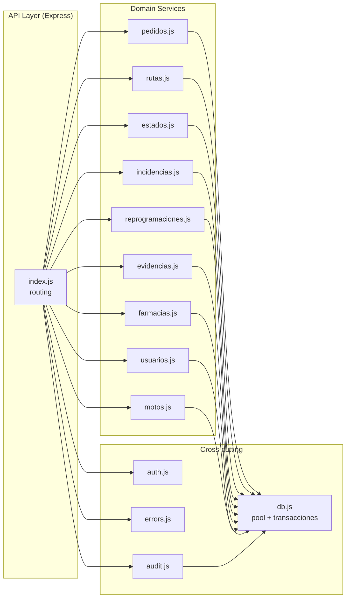
```mermaid
graph LR
    subgraph "API Layer (Express)"
        IDX[index.js<br/>routing]
    end
    subgraph "Domain Services"
        PED[pedidos.js]
        RUT[rutas.js]
        EST[estados.js]
        INC[incidencias.js]
        REP[reprogramaciones.js]
        EVI[evidencias.js]
        FAR[farmacias.js]
        USR[usuarios.js]
        MOT[motos.js]
    end
    subgraph "Cross-cutting"
        AUTH[auth.js]
        ERR[errors.js]
        AUD[audit.js]
        DB[db.js<br/>pool + transacciones]
    end
    IDX --> AUTH
    IDX --> PED
    IDX --> RUT
    IDX --> EST
    IDX --> INC
    IDX --> REP
    IDX --> EVI
    IDX --> FAR
    IDX --> USR
    IDX --> MOT
    IDX --> AUD
    PED --> DB
    RUT --> DB
    EST --> DB
    INC --> DB
    REP --> DB
    EVI --> DB
    FAR --> DB
    USR --> DB
    MOT --> DB
    AUD --> DB
    IDX --> ERR
```

---

## 2.2 Vista de desarrollo — Estructura del código

Describe **cómo** está organizado el código fuente.

```
Logico/
├── firebase.json / .firebaserc / storage.rules
├── database/                       Capa SQL (DDL + triggers + seeds)
│   ├── 01_schema.sql … 04_audit_storage.sql
│   ├── 05_admin_farmacias.sql      Mantenedor farmacias
│   ├── 07_motos.sql                Flota y asignación motorista
│   └── 08_cambiar_rol_usuario.sql  RPC cambio de rol
├── functions/                      Backend (Node 20 + Express)
│   ├── index.js                    API HTTP única (montaje rutas)
│   ├── package.json
│   ├── src/
│   │   ├── db.js, auth.js, audit.js, errors.js
│   │   ├── pedidos.js, rutas.js, estados.js, incidencias.js
│   │   ├── reprogramaciones.js, evidencias.js
│   │   ├── farmacias.js, usuarios.js, motos.js
│   │   └── usuarios-table.js       Resolución tabla usuarios
│   └── tests/                      Jest (6 suites, ~38 casos)
│       ├── pedidos.test.js, rutas.test.js, estados.test.js
│       ├── incidencias.test.js, farmacias.test.js, usuarios.test.js
│       └── helpers/fakeDb.js
├── public/                         Frontend (HTML + ES Modules)
│   ├── index.html, dashboard.html, pedidos.html, pedido.html
│   ├── crear-pedido.html, motorista.html
│   ├── admin-farmacias.html, admin-motoristas.html, admin-motos.html
│   ├── admin-usuarios.html, admin-auditoria.html
│   ├── css/styles.css
│   └── js/ (config, firebase-init, sidebar)
├── postman/LogiCo.postman_collection.json
└── docs/01 … docs/11
```

### Decisiones de empaquetado

- **Una sola Function HTTP (`api`)** que monta Express, en lugar de N funciones
  individuales. Reduce cold starts y simplifica el routing/CORS.
- **Servicios sin estado** (`src/*.js`): cada función recibe el `usuario` y retorna
  un resultado puro. Permite probarlos con mocks sin levantar Express.
- **Frontend sin bundler**: HTML + módulos ES nativos cargados con
  `<script type="module">` desde CDN de Google. Cero build step.

---

## 2.3 Vista de procesos — Pedidos y motoristas

Describe **cómo** interactúan operadora, motorista y la API en el ciclo de un pedido.

### 2.3.1 Secuencia — Crear pedido y asignar motorista

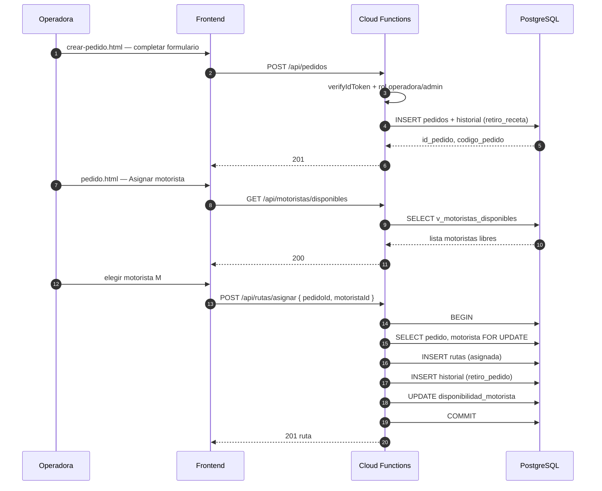
```mermaid
sequenceDiagram
    autonumber
    participant Op as Operadora
    participant FE as Frontend
    participant Fn as Cloud Functions
    participant PG as PostgreSQL

    Op->>FE: crear-pedido.html — completar formulario
    FE->>Fn: POST /api/pedidos
    Fn->>Fn: verifyIdToken + rol operadora/admin
    Fn->>PG: INSERT pedidos + historial (retiro_receta)
    PG-->>Fn: id_pedido, codigo_pedido
    Fn-->>FE: 201

    Op->>FE: pedido.html — Asignar motorista
    FE->>Fn: GET /api/motoristas/disponibles
    Fn->>PG: SELECT v_motoristas_disponibles
    PG-->>Fn: lista motoristas libres
    Fn-->>FE: 200

    Op->>FE: elegir motorista M
    FE->>Fn: POST /api/rutas/asignar { pedidoId, motoristaId }
    Fn->>PG: BEGIN
    Fn->>PG: SELECT pedido, motorista FOR UPDATE
    Fn->>PG: INSERT rutas (asignada)
    Fn->>PG: INSERT historial (retiro_pedido)
    Fn->>PG: UPDATE disponibilidad_motorista
    Fn->>PG: COMMIT
    Fn-->>FE: 201 ruta
```

### 2.3.2 Secuencia — Motorista: sesión, rutas y moto asignada

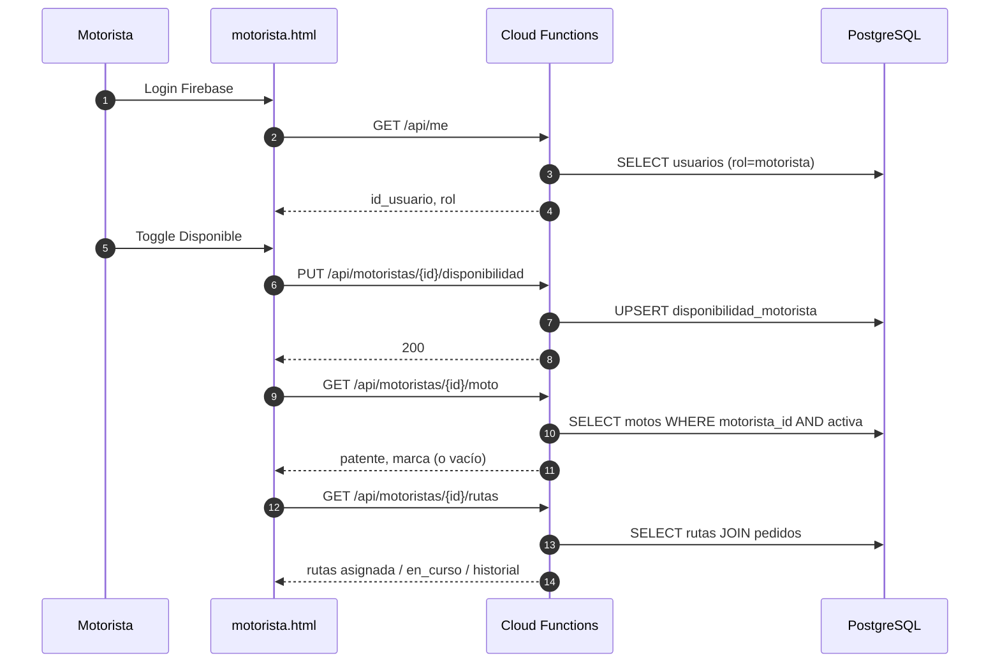
```mermaid
sequenceDiagram
    autonumber
    participant Mo as Motorista
    participant FE as motorista.html
    participant Fn as Cloud Functions
    participant PG as PostgreSQL

    Mo->>FE: Login Firebase
    FE->>Fn: GET /api/me
    Fn->>PG: SELECT usuarios (rol=motorista)
    Fn-->>FE: id_usuario, rol

    Mo->>FE: Toggle Disponible
    FE->>Fn: PUT /api/motoristas/{id}/disponibilidad
    Fn->>PG: UPSERT disponibilidad_motorista
    Fn-->>FE: 200

    FE->>Fn: GET /api/motoristas/{id}/moto
    Fn->>PG: SELECT motos WHERE motorista_id AND activa
    Fn-->>FE: patente, marca (o vacío)

    FE->>Fn: GET /api/motoristas/{id}/rutas
    Fn->>PG: SELECT rutas JOIN pedidos
    Fn-->>FE: rutas asignada / en_curso / historial
```

### 2.3.3 Secuencia — Motorista: iniciar ruta y entregar pedido

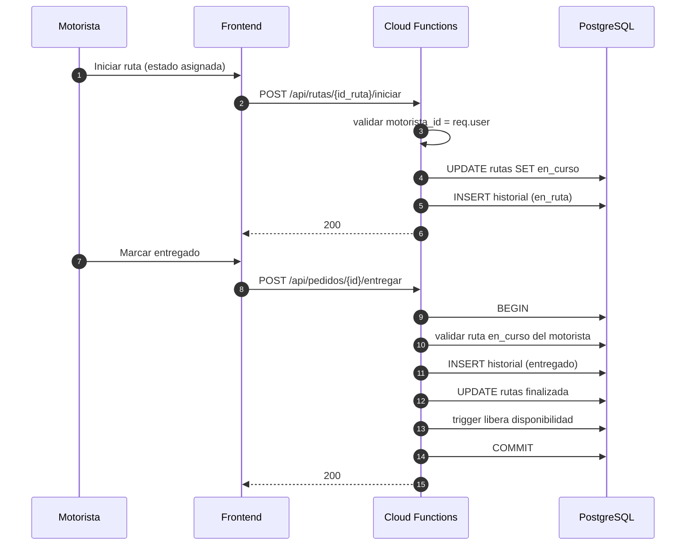
```mermaid
sequenceDiagram
    autonumber
    participant Mo as Motorista
    participant FE as Frontend
    participant Fn as Cloud Functions
    participant PG as PostgreSQL

    Mo->>FE: Iniciar ruta (estado asignada)
    FE->>Fn: POST /api/rutas/{id_ruta}/iniciar
    Fn->>Fn: validar motorista_id = req.user
    Fn->>PG: UPDATE rutas SET en_curso
    Fn->>PG: INSERT historial (en_ruta)
    Fn-->>FE: 200

    Mo->>FE: Marcar entregado
    FE->>Fn: POST /api/pedidos/{id}/entregar
    Fn->>PG: BEGIN
    Fn->>PG: validar ruta en_curso del motorista
    Fn->>PG: INSERT historial (entregado)
    Fn->>PG: UPDATE rutas finalizada
    Fn->>PG: trigger libera disponibilidad
    Fn->>PG: COMMIT
    Fn-->>FE: 200
```

### 2.3.4 Secuencia alternativa — Incidencia en ruta

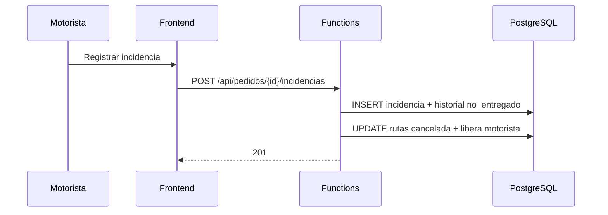
```mermaid
sequenceDiagram
    participant Mo as Motorista
    participant FE as Frontend
    participant Fn as Functions
    participant PG as PostgreSQL

    Mo->>FE: Registrar incidencia
    FE->>Fn: POST /api/pedidos/{id}/incidencias
    Fn->>PG: INSERT incidencia + historial no_entregado
    Fn->>PG: UPDATE rutas cancelada + libera motorista
    Fn-->>FE: 201
```

### 2.3.5 Secuencia — Admin: registrar farmacia (mantenedor)

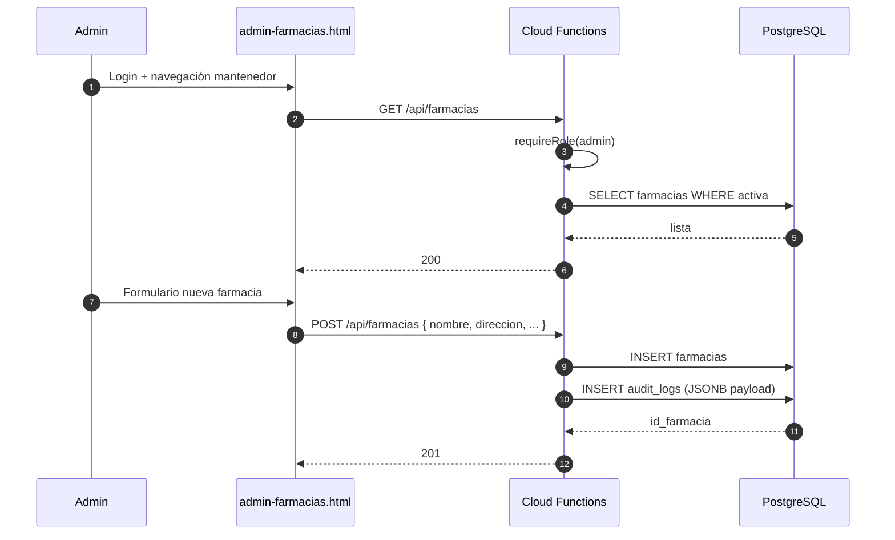
```mermaid
sequenceDiagram
    autonumber
    participant Ad as Admin
    participant FE as admin-farmacias.html
    participant Fn as Cloud Functions
    participant PG as PostgreSQL

    Ad->>FE: Login + navegación mantenedor
    FE->>Fn: GET /api/farmacias
    Fn->>Fn: requireRole(admin)
    Fn->>PG: SELECT farmacias WHERE activa
    PG-->>Fn: lista
    Fn-->>FE: 200

    Ad->>FE: Formulario nueva farmacia
    FE->>Fn: POST /api/farmacias { nombre, direccion, ... }
    Fn->>PG: INSERT farmacias
    Fn->>PG: INSERT audit_logs (JSONB payload)
    PG-->>Fn: id_farmacia
    Fn-->>FE: 201
```

### 2.3.6 Secuencia — Admin: gestionar motoristas y disponibilidad

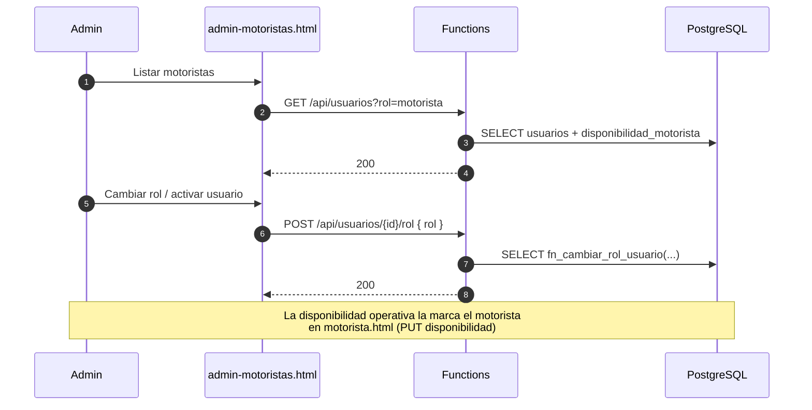
```mermaid
sequenceDiagram
    autonumber
    participant Ad as Admin
    participant FE as admin-motoristas.html
    participant Fn as Functions
    participant PG as PostgreSQL

    Ad->>FE: Listar motoristas
    FE->>Fn: GET /api/usuarios?rol=motorista
    Fn->>PG: SELECT usuarios + disponibilidad_motorista
    Fn-->>FE: 200

    Ad->>FE: Cambiar rol / activar usuario
    FE->>Fn: POST /api/usuarios/{id}/rol { rol }
    Fn->>PG: SELECT fn_cambiar_rol_usuario(...)
    Fn-->>FE: 200

    Note over Ad,PG: La disponibilidad operativa la marca el motorista<br/>en motorista.html (PUT disponibilidad)
```

### 2.3.7 Secuencia — Admin: registrar moto y asignar a motorista

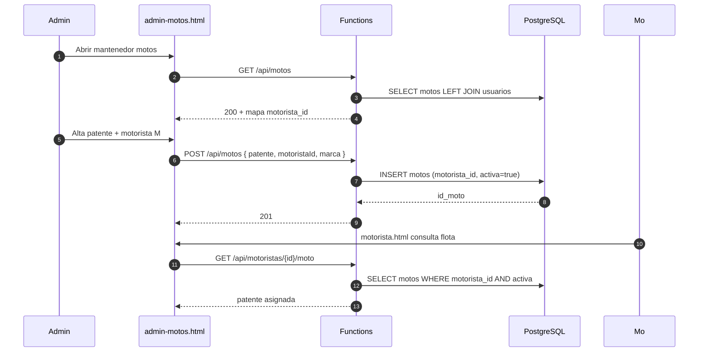
```mermaid
sequenceDiagram
    autonumber
    participant Ad as Admin
    participant FE as admin-motos.html
    participant Fn as Functions
    participant PG as PostgreSQL

    Ad->>FE: Abrir mantenedor motos
    FE->>Fn: GET /api/motos
    Fn->>PG: SELECT motos LEFT JOIN usuarios
    Fn-->>FE: 200 + mapa motorista_id

    Ad->>FE: Alta patente + motorista M
    FE->>Fn: POST /api/motos { patente, motoristaId, marca }
    Fn->>PG: INSERT motos (motorista_id, activa=true)
    PG-->>Fn: id_moto
    Fn-->>FE: 201

    Mo->>FE: motorista.html consulta flota
    FE->>Fn: GET /api/motoristas/{id}/moto
    Fn->>PG: SELECT motos WHERE motorista_id AND activa
    Fn-->>FE: patente asignada
```

### 2.3.8 Concurrencia y bloqueos

- **`SELECT ... FOR UPDATE`** en `asignarMotorista` y `cambiarEstadoPedido` impide
  carreras (ej: dos operadoras intentan asignar el mismo motorista al mismo tiempo).
- **Índices únicos parciales** (`uq_motorista_ruta_activa`, `uq_pedido_ruta_activa`)
  son la red de seguridad final: aunque la lógica falle, PostgreSQL rechaza el INSERT.
- **Transacciones**: todas las operaciones multi-tabla usan `withTransaction(work)`
  que envuelve `BEGIN/COMMIT/ROLLBACK`.

---

## 2.4 Vista física — Despliegue

Describe **dónde** corre cada componente.

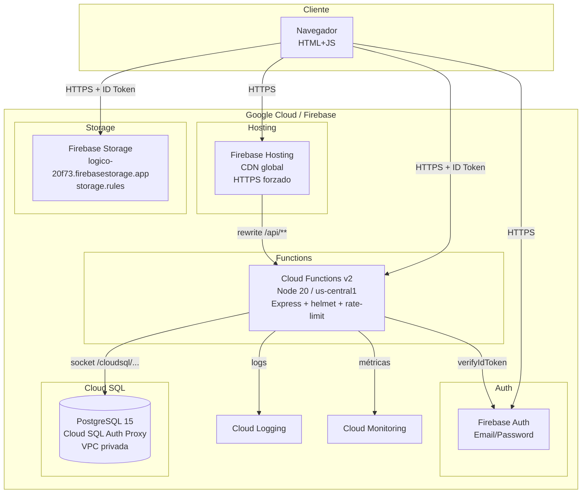
```mermaid
graph TB
    subgraph "Cliente"
        BR[Navegador<br/>HTML+JS]
    end

    subgraph "Google Cloud / Firebase"
        subgraph "Hosting"
            HS[Firebase Hosting<br/>CDN global<br/>HTTPS forzado]
        end
        subgraph "Auth"
            AU[Firebase Auth<br/>Email/Password]
        end
        subgraph "Functions"
            FN[Cloud Functions v2<br/>Node 20 / us-central1<br/>Express + helmet + rate-limit]
        end
        subgraph "Storage"
            STO[Firebase Storage<br/>logico-20f73.firebasestorage.app<br/>storage.rules]
        end
        subgraph "Cloud SQL"
            DB[(PostgreSQL 15<br/>Cloud SQL Auth Proxy<br/>VPC privada)]
        end
        LOG[Cloud Logging]
        MON[Cloud Monitoring]
    end

    BR -- HTTPS --> HS
    BR -- HTTPS --> AU
    BR -- HTTPS + ID Token --> FN
    BR -- HTTPS + ID Token --> STO
    HS -- rewrite /api/** --> FN
    FN -- verifyIdToken --> AU
    FN -- socket /cloudsql/... --> DB
    FN -- logs --> LOG
    FN -- métricas --> MON
```

### Especificaciones de infraestructura

| Componente | Tier sugerido | SLA | Backup |
|---|---|---|---|
| Cloud SQL PostgreSQL | `db-g1-small` (prod) / `db-f1-micro` (dev) | 99.95% | Diario automático, retención 7 días |
| Cloud Functions v2 | 256 MB, max 10 instancias | 99.95% | Stateless |
| Firebase Hosting | Plan Spark / Blaze | 99.95% global CDN | Versionado por deploy |
| Firebase Auth | — | 99.95% | Cuentas en backend de Google |
| Firebase Storage | Multi-region us | 99.95% | Versioning opcional |

### Aislamiento de red

- Cloud SQL **sin IP pública**; acceso solo vía Cloud SQL Auth Proxy o VPC.
- Las Functions se conectan vía **socket UNIX** `/cloudsql/PROJECT:REGION:INSTANCE`.
- Hosting expone el dominio público; las Functions están detrás de él via `rewrites`.

---

## 2.5 Escenarios (+1) — Casos de uso

### 2.5.0 Diagrama de casos de uso — Pedidos y motoristas

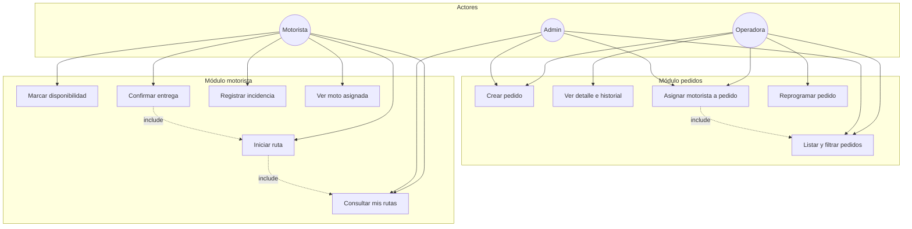
```mermaid
flowchart TB
    subgraph Actores
        OP((Operadora))
        MO((Motorista))
        AD((Admin))
    end

    subgraph Modulo_Pedidos["Módulo pedidos"]
        UC1[Crear pedido]
        UC2[Listar y filtrar pedidos]
        UC3[Ver detalle e historial]
        UC4[Asignar motorista a pedido]
        UC5[Reprogramar pedido]
    end

    subgraph Modulo_Motorista["Módulo motorista"]
        UC6[Marcar disponibilidad]
        UC7[Consultar mis rutas]
        UC8[Iniciar ruta]
        UC9[Confirmar entrega]
        UC10[Registrar incidencia]
        UC11[Ver moto asignada]
    end

    OP --> UC1
    OP --> UC2
    OP --> UC3
    OP --> UC4
    OP --> UC5
    AD --> UC1
    AD --> UC2
    AD --> UC4

    MO --> UC6
    MO --> UC7
    MO --> UC8
    MO --> UC9
    MO --> UC10
    MO --> UC11
    AD --> UC7

    UC4 -.->|include| UC2
    UC8 -.->|include| UC7
    UC9 -.->|include| UC8
```

### CU-P01: Crear pedido

| Campo | Valor |
|---|---|
| Actor | Operadora o admin |
| Precondición | Sesión activa, rol permitido |
| Flujo | Formulario `crear-pedido.html` → `POST /api/pedidos` → INSERT `pedidos` + `historial_estados` |
| Postcondición | Pedido en `retiro_receta` |

### CU-P02: Asignar motorista a pedido

| Campo | Valor |
|---|---|
| Actor | Operadora o admin |
| Precondición | Pedido sin ruta activa; motorista en `v_motoristas_disponibles` |
| Flujo | `pedido.html` → `GET /motoristas/disponibles` → `POST /rutas/asignar` con `SELECT FOR UPDATE` |
| Alterno | Dos asignaciones simultáneas al mismo motorista → 409 (índice único parcial) |
| Postcondición | Ruta `asignada`; pedido pasa a `retiro_pedido`; motorista no disponible |

### CU-M01: Consultar rutas y moto

| Campo | Valor |
|---|---|
| Actor | Motorista |
| Precondición | Rol motorista; solo `id_usuario` propio |
| Flujo | `motorista.html` → `GET /motoristas/{id}/rutas` + `GET /motoristas/{id}/moto` |
| Postcondición | UI muestra ruta activa o mensaje sin ruta; patente de moto si admin la asignó en Motos |

### CU-M02: Iniciar ruta y entregar

| Campo | Valor |
|---|---|
| Actor | Motorista |
| Precondición | Ruta `asignada` (iniciar) o `en_curso` (entregar) |
| Flujo | `POST /rutas/{id}/iniciar` → estado `en_ruta` → `POST /pedidos/{id}/entregar` → `entregado` + ruta `finalizada` |
| Postcondición | Motorista disponible de nuevo (trigger disponibilidad) |

### CU-M03: Registrar incidencia

| Campo | Valor |
|---|---|
| Actor | Motorista |
| Precondición | Ruta activa |
| Flujo | `POST /pedidos/{id}/incidencias` → `no_entregado`, ruta `cancelada` |
| Postcondición | Pedido no entregado; motorista liberado para nueva asignación |

### 2.5.1 Diagrama de casos de uso — Mantenedores (admin)

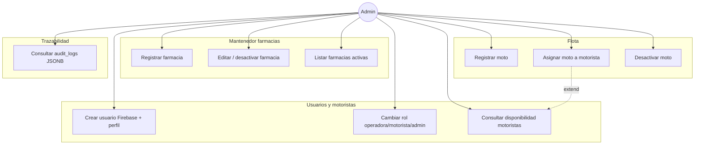
```mermaid
flowchart TB
    AD((Admin))

    subgraph Admin_Farmacias["Mantenedor farmacias"]
        A1[Registrar farmacia]
        A2[Editar / desactivar farmacia]
        A3[Listar farmacias activas]
    end

    subgraph Admin_Usuarios["Usuarios y motoristas"]
        B1[Crear usuario Firebase + perfil]
        B2[Cambiar rol operadora/motorista/admin]
        B3[Consultar disponibilidad motoristas]
    end

    subgraph Admin_Motos["Flota"]
        C1[Registrar moto]
        C2[Asignar moto a motorista]
        C3[Desactivar moto]
    end

    subgraph Admin_Auditoria["Trazabilidad"]
        D1[Consultar audit_logs JSONB]
    end

    AD --> A1
    AD --> A2
    AD --> A3
    AD --> B1
    AD --> B2
    AD --> B3
    AD --> C1
    AD --> C2
    AD --> C3
    AD --> D1
    C2 -.->|extend| B3
```

### 2.5.2 Máquina de estados del pedido

Fuente de verdad en código: `functions/src/estados.js` (`TRANSICIONES`).
Los estados terminales (`entregado`) no admiten transiciones salientes.

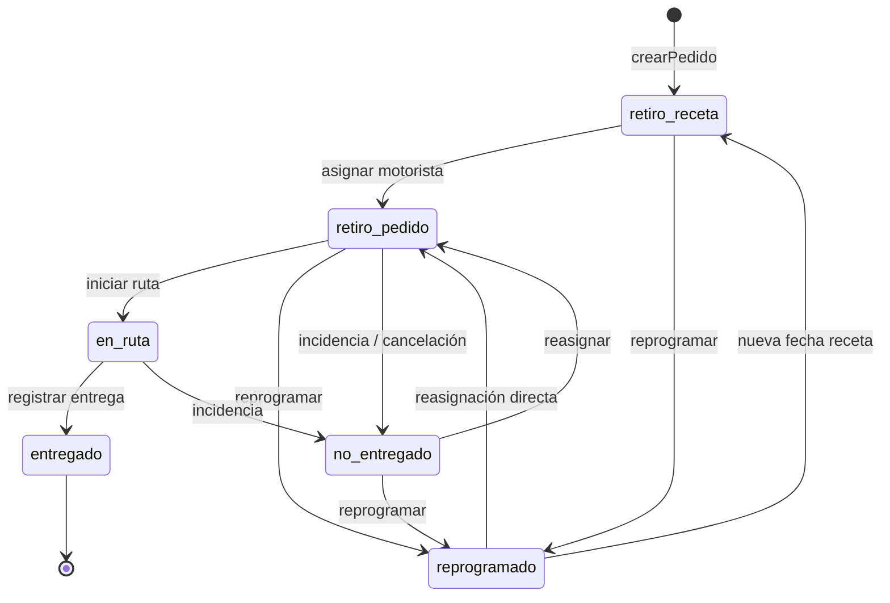
```mermaid
stateDiagram-v2
    [*] --> retiro_receta: crearPedido

    retiro_receta --> retiro_pedido: asignar motorista
    retiro_receta --> reprogramado: reprogramar

    retiro_pedido --> en_ruta: iniciar ruta
    retiro_pedido --> reprogramado: reprogramar
    retiro_pedido --> no_entregado: incidencia / cancelación

    en_ruta --> entregado: registrar entrega
    en_ruta --> no_entregado: incidencia

    no_entregado --> reprogramado: reprogramar
    no_entregado --> retiro_pedido: reasignar

    reprogramado --> retiro_receta: nueva fecha receta
    reprogramado --> retiro_pedido: reasignación directa

    entregado --> [*]
```

| Estado origen | Destinos permitidos (API) |
|---|---|
| `retiro_receta` | `retiro_pedido`, `reprogramado` |
| `retiro_pedido` | `en_ruta`, `reprogramado`, `no_entregado` |
| `en_ruta` | `entregado`, `no_entregado` |
| `no_entregado` | `reprogramado`, `retiro_pedido` |
| `reprogramado` | `retiro_receta`, `retiro_pedido` |
| `entregado` | — (final) |

---

## 2.6 Diagrama de clases (dominio logístico)

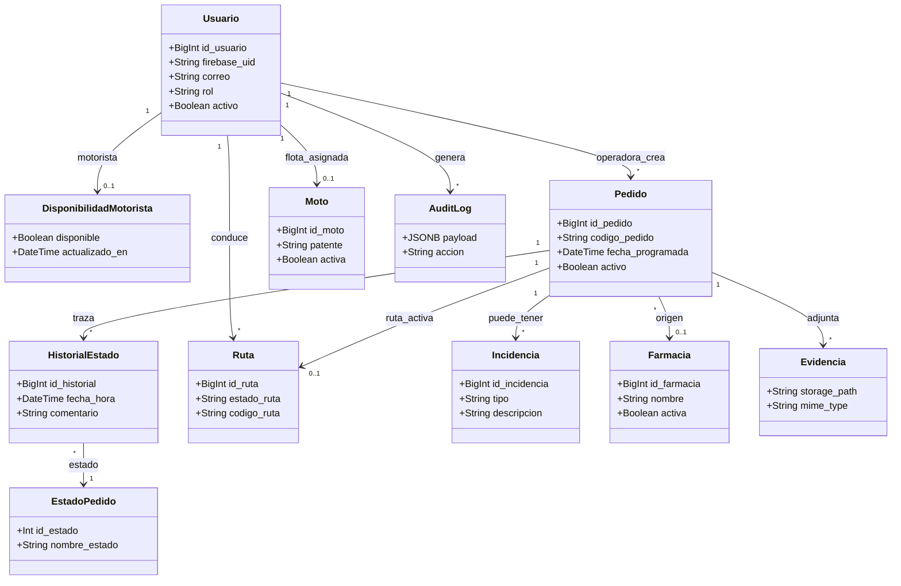
```mermaid
classDiagram
    class Usuario {
        +BigInt id_usuario
        +String firebase_uid
        +String correo
        +String rol
        +Boolean activo
    }
    class DisponibilidadMotorista {
        +Boolean disponible
        +DateTime actualizado_en
    }
    class Pedido {
        +BigInt id_pedido
        +String codigo_pedido
        +DateTime fecha_programada
        +Boolean activo
    }
    class EstadoPedido {
        +Int id_estado
        +String nombre_estado
    }
    class HistorialEstado {
        +BigInt id_historial
        +DateTime fecha_hora
        +String comentario
    }
    class Ruta {
        +BigInt id_ruta
        +String estado_ruta
        +String codigo_ruta
    }
    class Incidencia {
        +BigInt id_incidencia
        +String tipo
        +String descripcion
    }
    class Moto {
        +BigInt id_moto
        +String patente
        +Boolean activa
    }
    class Farmacia {
        +BigInt id_farmacia
        +String nombre
        +Boolean activa
    }
    class Evidencia {
        +String storage_path
        +String mime_type
    }
    class AuditLog {
        +JSONB payload
        +String accion
    }

    Usuario "1" --> "*" Pedido : operadora_crea
    Usuario "1" --> "0..1" DisponibilidadMotorista : motorista
    Usuario "1" --> "*" Ruta : conduce
    Usuario "1" --> "0..1" Moto : flota_asignada
    Pedido "1" --> "*" HistorialEstado : traza
    HistorialEstado "*" --> "1" EstadoPedido : estado
    Pedido "1" --> "0..1" Ruta : ruta_activa
    Pedido "*" --> "0..1" Farmacia : origen
    Pedido "1" --> "*" Incidencia : puede_tener
    Pedido "1" --> "*" Evidencia : adjunta
    Usuario "1" --> "*" AuditLog : genera
```

## 2.7 Diagrama de actividad — Operadora: crear pedido y asignar

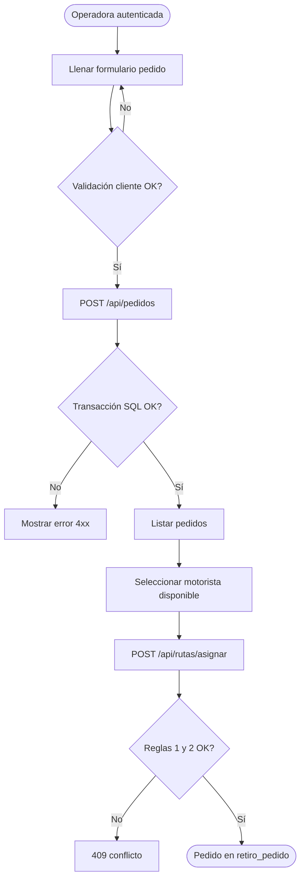
```mermaid
flowchart TD
    A([Operadora autenticada]) --> B[Llenar formulario pedido]
    B --> C{Validación cliente OK?}
    C -- No --> B
    C -- Sí --> D[POST /api/pedidos]
    D --> E{Transacción SQL OK?}
    E -- No --> F[Mostrar error 4xx]
    E -- Sí --> G[Listar pedidos]
    G --> H[Seleccionar motorista disponible]
    H --> I[POST /api/rutas/asignar]
    I --> J{Reglas 1 y 2 OK?}
    J -- No --> K[409 conflicto]
    J -- Sí --> L([Pedido en retiro_pedido])
```

### 2.7.2 Diagrama de actividad — Motorista: jornada de reparto

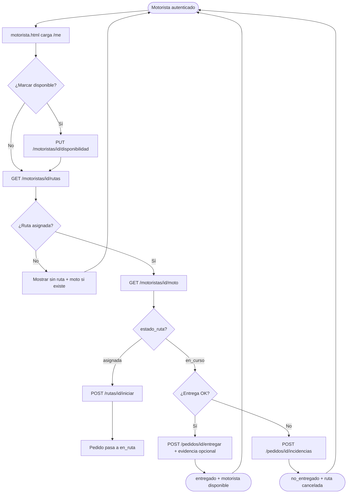
```mermaid
flowchart TD
    M0([Motorista autenticado]) --> M1[motorista.html carga /me]
    M1 --> M2{¿Marcar disponible?}
    M2 -- Sí --> M3[PUT /motoristas/id/disponibilidad]
    M2 -- No --> M4[GET /motoristas/id/rutas]
    M3 --> M4
    M4 --> M5{¿Ruta asignada?}
    M5 -- No --> M6[Mostrar sin ruta + moto si existe]
    M5 -- Sí --> M7[GET /motoristas/id/moto]
    M7 --> M8{estado_ruta?}
    M8 -- asignada --> M9[POST /rutas/id/iniciar]
    M9 --> M10[Pedido pasa a en_ruta]
    M8 -- en_curso --> M11{¿Entrega OK?}
    M11 -- Sí --> M12[POST /pedidos/id/entregar + evidencia opcional]
    M12 --> M13([entregado + motorista disponible])
    M11 -- No --> M14[POST /pedidos/id/incidencias]
    M14 --> M15([no_entregado + ruta cancelada])
    M6 --> M0
    M13 --> M0
    M15 --> M0
```

## 2.8 Diagrama de componentes

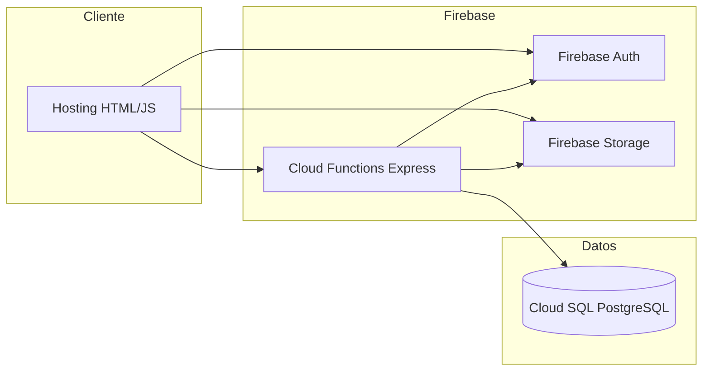
```mermaid
flowchart LR
    subgraph Cliente
        UI[Hosting HTML/JS]
    end
    subgraph Firebase
        AUTH[Firebase Auth]
        API[Cloud Functions Express]
        ST[Firebase Storage]
    end
    subgraph Datos
        PG[(Cloud SQL PostgreSQL)]
    end
    UI --> AUTH
    UI --> API
    UI --> ST
    API --> AUTH
    API --> PG
    API --> ST
```

## 2.9 Diagrama de paquetes

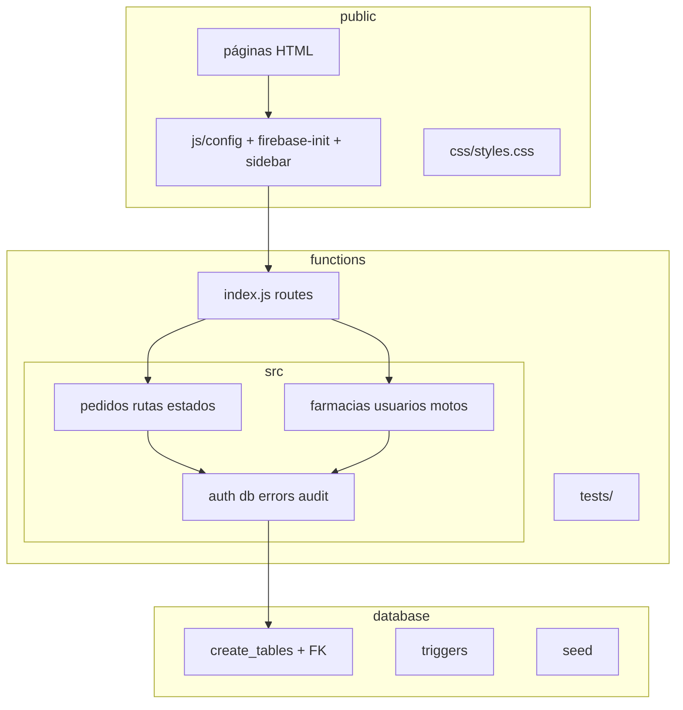
```mermaid
flowchart TB
    subgraph public
        PHTML[páginas HTML]
        PJS[js/config + firebase-init + sidebar]
        PCSS[css/styles.css]
    end
    subgraph functions
        IDX[index.js routes]
        subgraph src
            DOM[pedidos rutas estados]
            ADM[farmacias usuarios motos]
            XCUT[auth db errors audit]
        end
        TST[tests/]
    end
    subgraph database
        DDL[create_tables + FK]
        TRG[triggers]
        SEED[seed]
    end
    PHTML --> PJS
    PJS --> IDX
    IDX --> DOM
    IDX --> ADM
    DOM --> XCUT
    ADM --> XCUT
    XCUT --> DDL
```

## 2.11 Secuencia — Autenticación y sesión (transversal)

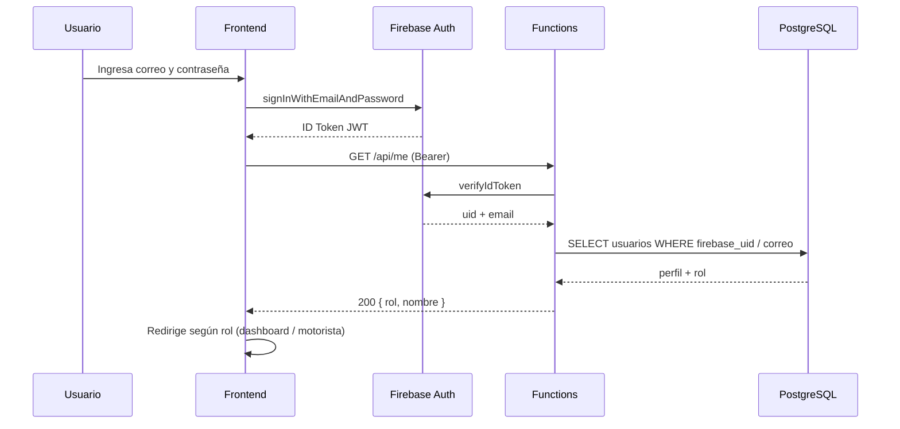
```mermaid
sequenceDiagram
    participant U as Usuario
    participant FE as Frontend
    participant Auth as Firebase Auth
    participant Fn as Functions
    participant PG as PostgreSQL

    U->>FE: Ingresa correo y contraseña
    FE->>Auth: signInWithEmailAndPassword
    Auth-->>FE: ID Token JWT
    FE->>Fn: GET /api/me (Bearer)
    Fn->>Auth: verifyIdToken
    Auth-->>Fn: uid + email
    Fn->>PG: SELECT usuarios WHERE firebase_uid / correo
    PG-->>Fn: perfil + rol
    Fn-->>FE: 200 { rol, nombre }
    FE->>FE: Redirige según rol (dashboard / motorista)
```
