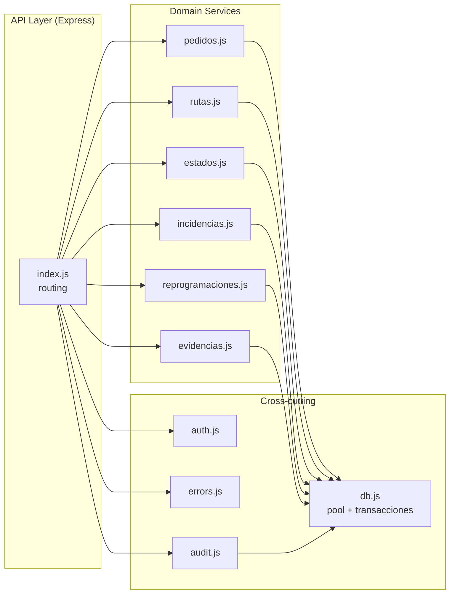
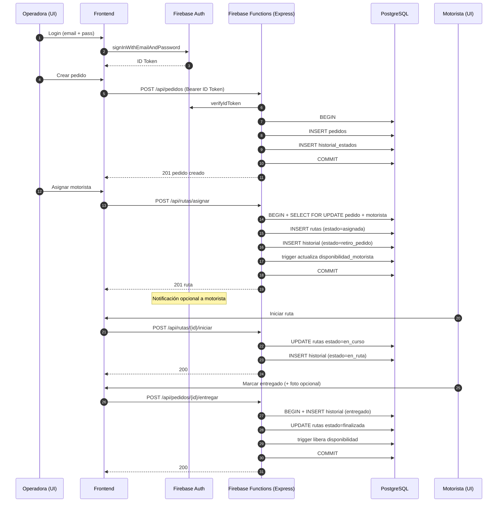
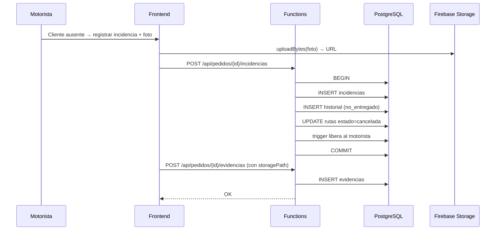
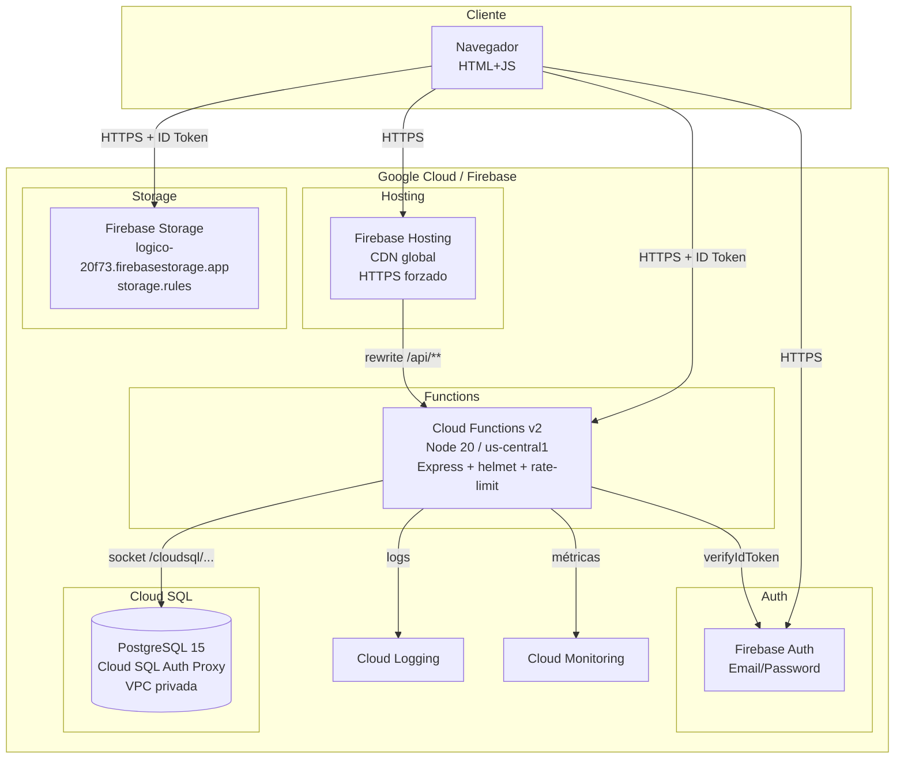

# 2. Arquitectura — Modelo 4 + 1 de Kruchten

LogiCo se documenta con las cinco vistas del modelo 4+1 de Philippe Kruchten:

```
            ┌──────────────────────┐
            │     Escenarios       │  ← +1 (casos de uso)
            └──────────┬───────────┘
        ┌──────────────┼──────────────┐
        ▼              ▼              ▼
  Vista lógica   Vista procesos  Vista física
        ▲                              ▲
        └─────── Vista de desarrollo ──┘
```

---

## 2.1 Vista lógica — Modelo de datos y módulos

Describe **qué** hace el sistema desde la perspectiva del dominio.

### 2.1.1 Diagrama Entidad-Relación

```mermaid
erDiagram
    USUARIOS ||--o{ PEDIDOS                  : "crea"
    USUARIOS ||--o{ HISTORIAL_ESTADOS        : "registra"
    USUARIOS ||--o{ RUTAS                    : "es motorista"
    USUARIOS ||--|| DISPONIBILIDAD_MOTORISTA : "tiene"
    USUARIOS ||--o{ INCIDENCIAS              : "reporta"
    USUARIOS ||--o{ REPROGRAMACIONES         : "ejecuta"
    USUARIOS ||--o{ EVIDENCIAS               : "sube"
    USUARIOS ||--o{ AUDIT_LOGS               : "actor"

    PEDIDOS ||--|| ESTADOS_PEDIDO            : "estado_actual"
    PEDIDOS ||--o{ HISTORIAL_ESTADOS         : "trazabilidad"
    PEDIDOS ||--o| RUTAS                     : "1 ruta activa"
    PEDIDOS ||--o{ INCIDENCIAS               : "puede tener"
    PEDIDOS ||--o{ REPROGRAMACIONES          : "puede tener"
    PEDIDOS ||--o{ EVIDENCIAS                : "tiene"

    ESTADOS_PEDIDO ||--o{ HISTORIAL_ESTADOS  : "categoriza"
    RUTAS ||--o{ INCIDENCIAS                 : "asociadas"

    USUARIOS {
        bigserial id_usuario PK
        varchar firebase_uid UK
        varchar nombre
        varchar apellido
        citext  correo UK
        varchar contrasena
        varchar rol "operadora|motorista|admin"
        boolean activo
        timestamptz fecha_creacion
    }
    PEDIDOS {
        bigserial id_pedido PK
        varchar codigo_pedido UK
        varchar nombre_cliente
        varchar direccion_entrega
        varchar telefono_cliente
        text    detalle_pedido
        text    observacion
        timestamptz fecha_creacion
        timestamptz fecha_programada
        int     estado_actual_id FK
        bigint  operadora_crea_id FK
        bigint  operadora_modifica_id FK
        boolean activo
    }
    ESTADOS_PEDIDO {
        serial id_estado PK
        varchar nombre_estado UK
    }
    HISTORIAL_ESTADOS {
        bigserial id_historial PK
        bigint pedido_id FK
        int    estado_id FK
        timestamptz fecha_hora
        text   comentario
        bigint usuario_id FK
    }
    RUTAS {
        bigserial id_ruta PK
        varchar codigo_ruta UK
        bigint  pedido_id FK
        bigint  motorista_id FK
        timestamptz fecha_asignacion
        timestamptz fecha_inicio
        timestamptz fecha_fin
        varchar estado_ruta
    }
    DISPONIBILIDAD_MOTORISTA {
        bigserial id_disponibilidad PK
        bigint  motorista_id FK UK
        boolean disponible
        timestamptz fecha_actualizacion
    }
    INCIDENCIAS {
        bigserial id_incidencia PK
        bigint  pedido_id FK
        bigint  ruta_id FK
        varchar tipo_incidencia
        text    descripcion
        timestamptz fecha_hora
        bigint  usuario_id FK
    }
    REPROGRAMACIONES {
        bigserial id_reprogramacion PK
        bigint  pedido_id FK
        timestamptz fecha_anterior
        timestamptz fecha_nueva
        text    motivo
        timestamptz fecha_registro
        bigint  usuario_id FK
    }
    EVIDENCIAS {
        bigserial id_evidencia PK
        bigint  pedido_id FK
        bigint  incidencia_id FK
        varchar tipo
        varchar storage_path
        text    download_url
        bigint  subido_por FK
    }
    AUDIT_LOGS {
        bigserial id_log PK
        timestamptz fecha_hora
        bigint  usuario_id FK
        varchar accion
        varchar entidad
        bigint  entidad_id
        jsonb   payload
        varchar nivel
    }
```

### 2.1.2 Módulos lógicos del backend



---

## 2.2 Vista de desarrollo — Estructura del código

Describe **cómo** está organizado el código fuente.

```
Logico/
├── firebase.json / .firebaserc / storage.rules
├── database/                       Capa SQL (DDL + triggers + seeds)
│   ├── 01_schema.sql
│   ├── 02_triggers.sql
│   ├── 03_seeds.sql
│   └── 04_audit_storage.sql
├── functions/                      Backend (Node 20 + Express)
│   ├── index.js                    API HTTP única
│   ├── package.json                Dependencias + scripts npm
│   ├── src/
│   │   ├── db.js                   Pool PG + withTransaction
│   │   ├── auth.js                 verifyIdToken + carga usuario
│   │   ├── audit.js                Logs JSONB
│   │   ├── errors.js               Errores tipados
│   │   ├── pedidos.js              Servicio dominio
│   │   ├── rutas.js                Servicio dominio
│   │   ├── estados.js              Máquina de transiciones
│   │   ├── incidencias.js          Servicio dominio
│   │   ├── reprogramaciones.js     Servicio dominio
│   │   └── evidencias.js           Metadatos Storage
│   └── tests/                      Jest (unitarias)
│       ├── helpers/fakeDb.js
│       ├── pedidos.test.js
│       ├── rutas.test.js
│       ├── estados.test.js
│       └── incidencias.test.js
├── public/                         Frontend (HTML + JS módulos ES)
│   ├── index.html (login)
│   ├── dashboard.html
│   ├── pedidos.html
│   ├── pedido.html (detalle)
│   ├── crear-pedido.html
│   ├── motorista.html
│   ├── css/styles.css
│   └── js/
│       ├── config.js               Config Firebase
│       ├── firebase-init.js        Auth + Storage + apiFetch
│       └── sidebar.js              Navegación por rol
├── postman/
│   └── LogiCo.postman_collection.json
└── docs/                           Documentación académica
    ├── 01-metodologia-scrum.md
    ├── 02-arquitectura-4+1.md      ← este archivo
    ├── 03-tecnologias.md
    ├── 04-base-datos.md
    ├── 05-datos-estructurados-no-estructurados.md
    ├── 06-seguridad.md
    ├── 07-codificacion-segura.md
    ├── 08-plan-pruebas.md
    ├── 09-prototipo.md
    └── 10-retroalimentacion.md
```

### Decisiones de empaquetado

- **Una sola Function HTTP (`api`)** que monta Express, en lugar de N funciones
  individuales. Reduce cold starts y simplifica el routing/CORS.
- **Servicios sin estado** (`src/*.js`): cada función recibe el `usuario` y retorna
  un resultado puro. Permite probarlos con mocks sin levantar Express.
- **Frontend sin bundler**: HTML + módulos ES nativos cargados con
  `<script type="module">` desde CDN de Google. Cero build step.

---

## 2.3 Vista de procesos — Flujos de ejecución

Describe **cómo** se comportan los procesos en tiempo de ejecución.

### 2.3.1 Flujo principal: Pedido → Entrega



### 2.3.2 Flujo alternativo: Incidencia



### 2.3.3 Concurrencia y bloqueos

- **`SELECT ... FOR UPDATE`** en `asignarMotorista` y `cambiarEstadoPedido` impide
  carreras (ej: dos operadoras intentan asignar el mismo motorista al mismo tiempo).
- **Índices únicos parciales** (`uq_motorista_ruta_activa`, `uq_pedido_ruta_activa`)
  son la red de seguridad final: aunque la lógica falle, PostgreSQL rechaza el INSERT.
- **Transacciones**: todas las operaciones multi-tabla usan `withTransaction(work)`
  que envuelve `BEGIN/COMMIT/ROLLBACK`.

---

## 2.4 Vista física — Despliegue

Describe **dónde** corre cada componente.



### Especificaciones de infraestructura

| Componente | Tier sugerido | SLA | Backup |
|---|---|---|---|
| Cloud SQL PostgreSQL | `db-g1-small` (prod) / `db-f1-micro` (dev) | 99.95% | Diario automático, retención 7 días |
| Cloud Functions v2 | 256 MB, max 10 instancias | 99.95% | Stateless |
| Firebase Hosting | Plan Spark / Blaze | 99.95% global CDN | Versionado por deploy |
| Firebase Auth | — | 99.95% | Cuentas en backend de Google |
| Firebase Storage | Multi-region us | 99.95% | Versioning opcional |

### Aislamiento de red

- Cloud SQL **sin IP pública**; acceso solo vía Cloud SQL Auth Proxy o VPC.
- Las Functions se conectan vía **socket UNIX** `/cloudsql/PROJECT:REGION:INSTANCE`.
- Hosting expone el dominio público; las Functions están detrás de él via `rewrites`.

---

## 2.5 Escenarios (+1) — Casos de uso

### CU-01: Crear pedido

| Campo | Valor |
|---|---|
| Actor primario | Operadora |
| Precondición | Sesión Firebase activa con rol operadora |
| Disparador | Click en "Crear pedido" |
| Flujo principal | 1. Llenar formulario<br/>2. Validar campos en cliente<br/>3. POST `/api/pedidos`<br/>4. Functions valida, abre tx, INSERT pedido + historial<br/>5. UI redirige al listado |
| Flujo alterno | Si BD detecta duplicado (índice único parcial), responde 409 |
| Postcondición | Pedido en estado `retiro_receta` con historial inicial |

### CU-02: Entregar pedido

| Campo | Valor |
|---|---|
| Actor primario | Motorista |
| Precondición | Ruta `en_curso` asignada al motorista |
| Disparador | Botón "Marcar entregado" |
| Flujo principal | 1. POST `/api/pedidos/{id}/entregar`<br/>2. Functions valida que el motorista sea el asignado<br/>3. Tx: insertar historial `entregado` + cerrar ruta `finalizada`<br/>4. Trigger libera disponibilidad |
| Postcondición | Pedido entregado; motorista vuelve a estar disponible |

### CU-03: Registrar incidencia

| Campo | Valor |
|---|---|
| Actor primario | Motorista |
| Precondición | Ruta activa |
| Disparador | "Registrar incidencia" |
| Flujo principal | 1. Subir foto a Storage (`evidencias/{pid}/incidencia/...`)<br/>2. POST `/api/pedidos/{id}/incidencias` con tipo + descripción<br/>3. Tx: INSERT incidencia + historial `no_entregado` + ruta `cancelada`<br/>4. POST `/api/pedidos/{id}/evidencias` para enlazar la foto |
| Postcondición | Pedido en `no_entregado`; motorista disponible; foto vinculada |

### CU-04: Reprogramar pedido

| Campo | Valor |
|---|---|
| Actor primario | Operadora |
| Precondición | Pedido activo, fecha nueva > fecha actual |
| Flujo principal | 1. POST `/api/pedidos/{id}/reprogramar`<br/>2. Tx: INSERT reprogramaciones + UPDATE pedidos.fecha_programada + INSERT historial `reprogramado` |
| Postcondición | Nueva fecha programada; histórico de reprogramaciones |

### CU-05: Asignar motorista (con concurrencia)

| Campo | Valor |
|---|---|
| Actor primario | Operadora |
| Precondición | Pedido sin ruta activa, motorista disponible |
| Flujo principal | 1. UI lista motoristas disponibles (vista `v_motoristas_disponibles`)<br/>2. Operadora elige uno<br/>3. POST `/api/rutas/asignar`<br/>4. Functions hace `SELECT FOR UPDATE` en pedido y motorista<br/>5. Verifica que ningún otro tenga ruta activa<br/>6. INSERT en `rutas` (estado=asignada)<br/>7. Trigger marca motorista no disponible |
| Flujo alterno (carrera) | Si dos operadoras intentan asignarlo simultáneamente, una completa COMMIT y la otra falla con 409 por el índice único parcial |
