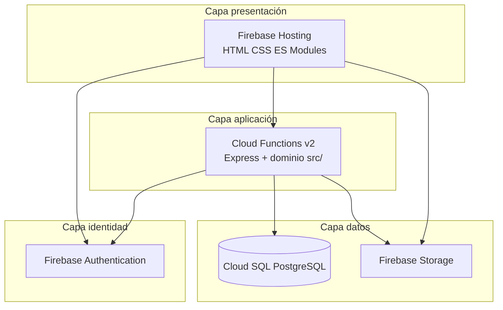

# 3. Tecnologías y justificación

Cada elección está respaldada por tres criterios obligatorios:
**escalabilidad**, **seguridad** y **rendimiento**.

| Capa | Tecnología | Versión |
|---|---|---|
| Hosting | Firebase Hosting | — (CDN global) |
| Auth | Firebase Authentication | Email/Password |
| Backend | Firebase Functions v2 (Cloud Run gen2) | Node.js 20 |
| Framework HTTP | Express | 4.19 |
| Hardening HTTP | helmet + express-rate-limit | 7.x |
| BD principal | Firebase SQL Connect / Cloud SQL PostgreSQL | 15 |
| Cliente PG | `pg` (node-postgres) | 8.13 |
| Storage no estructurado | Firebase Storage | — |
| Frontend | HTML5 + CSS3 + JavaScript ES Modules | nativo |
| Pruebas | Jest (38 unitarios) + Postman/Newman (E2E manual) | 29.7 / colección Postman |

### 3.0 Vista de capas (alineada con 4+1)

Detalle de despliegue físico: [`02-arquitectura-4+1.md`](02-arquitectura-4+1.md) §2.4.

---

## 3.1 Cloud SQL for PostgreSQL (Firebase SQL Connect)

**Por qué PostgreSQL y no Firestore**:

- LogiCo tiene **invariantes transaccionales** (1 ruta activa por pedido, 1 por motorista,
  estado actual = último historial). Firestore no soporta transacciones multi-documento
  con bloqueos pesimistas; PostgreSQL sí (`SELECT ... FOR UPDATE`).
- El modelo es **fuertemente relacional** con FK y constraints CHECK; replicarlo en NoSQL
  obligaría a duplicar lógica en cliente/funciones.
- **Reportes** y consultas analíticas (`v_pedidos_completos`, `v_motoristas_disponibles`)
  son triviales con SQL.

| Criterio | Justificación |
|---|---|
| **Escalabilidad** | Cloud SQL escala vertical hasta 624 GB RAM, 96 CPUs. Réplicas de lectura para reportes. Pooling de conexiones desde Functions. |
| **Seguridad** | Auth Proxy (sin IP pública), TLS 1.3, IAM en GCP, backups diarios, *point-in-time recovery*. |
| **Rendimiento** | Índices B-tree y GIN sobre JSONB, planificador de consultas maduro, prepared statements vía `pg`. p95 < 30 ms en queries indexadas. |

## 3.2 Firebase Functions v2 (Node.js 20 / Cloud Run gen2)

**Por qué v2 sobre v1**:
- v2 corre sobre Cloud Run → **escalado a 0** y a miles de instancias automáticamente.
- Cold starts < 1.5 s gracias a *minimum instances* configurable.
- Soporte nativo para conexión a Cloud SQL vía socket UNIX.

| Criterio | Justificación |
|---|---|
| **Escalabilidad** | `setGlobalOptions({ maxInstances: 10 })` puede subirse a 1000+. Cada request es atendido en aislamiento. |
| **Seguridad** | Verificación de ID Tokens con `firebase-admin`. Helmet añade cabeceras (`X-Frame-Options`, `Strict-Transport-Security`...). Rate limit de 120 req/min/IP. CORS restringido. |
| **Rendimiento** | Pool de PG reutilizado entre invocaciones (en la misma instancia caliente). Express con `json` limit 256 KB. |

## 3.3 Firebase Authentication

**Por qué no JWT propio**:
- Implementar refresh tokens, revocación, recuperación de contraseña, MFA y bloqueo
  por intentos fallidos a nivel custom es un riesgo de seguridad innecesario.
- Firebase Auth integra nativamente con Functions, Storage y Hosting.

| Criterio | Justificación |
|---|---|
| **Escalabilidad** | Soporta millones de usuarios sin tuning. |
| **Seguridad** | Hashing scrypt en Google. Tokens firmados con RS256, rotación de claves diaria. Soporta MFA, OAuth providers, magic link. |
| **Rendimiento** | Latencia de `verifyIdToken` ~5-10 ms gracias a JWKS cacheado en `firebase-admin`. |

## 3.4 Firebase Storage

Los datos **no estructurados** (fotos de evidencia de entrega, fotos de incidencias,
firmas) viven en Storage; en PostgreSQL solo se guarda la referencia (`storage_path`).

| Criterio | Justificación |
|---|---|
| **Escalabilidad** | Bucket multi-region con CDN; sin límite práctico. |
| **Seguridad** | Storage Rules basadas en `request.auth` y validación de `contentType`/`size`. |
| **Rendimiento** | Subidas directas cliente → Storage sin pasar por Functions (ahorra coste y CPU). |

## 3.5 Frontend vanilla (HTML + CSS + ES Modules)

**Por qué no React**:
- El alcance no justifica el overhead de un bundler/build pipeline.
- ES Modules nativos (cargados con `<script type="module">`) ofrecen modularidad sin transpilar.
- Mejor visibilidad para el evaluador académico (no hay magia oculta).

Si el proyecto crece, migrar a React es directo: cada `*.html` ya es una "página" independiente.

| Criterio | Justificación |
|---|---|
| **Escalabilidad** | Hosting CDN global, contenido estático cacheable. |
| **Seguridad** | CSP-friendly (sin `eval`), `escapeHtml()` antes de inyectar texto del usuario, HTTPS forzado. |
| **Rendimiento** | First Contentful Paint < 1 s; sin runtime de framework. |

## 3.6 Jest + Postman

| Herramienta | Uso en LogiCo |
|---|---|
| **Jest** | 6 suites / 38 tests en `functions/tests/` (servicios con `fakeDb`). |
| **Postman / Newman** | 14 escenarios E2E manuales (`postman/LogiCo.postman_collection.json`). |
| **supertest** | Dependencia declarada; **sin suites de integración** versionadas (ver `08-plan-pruebas.md` §8.3). |

Limitaciones de seguridad del MVP: [`06-seguridad.md`](06-seguridad.md) §6.10.

## 3.7 Tabla comparativa de infraestructura (rúbrica 2.1.2.4)

| Tecnología | Motivo de elección | Ventajas | Desventajas | Justificación final |
|---|---|---|---|---|
| **Cloud SQL PostgreSQL 15** | Modelo relacional + transacciones ACID | FK, triggers, `FOR UPDATE`, SQL analítico | Costo y tuning vs serverless NoSQL | Única opción que garantiza reglas 1-ruta-activa sin race conditions |
| **Firebase Functions v2 (Node 20)** | Requisito stack Firebase + API única | Escala automática, integración Auth, sin servidor propio | Cold start, límite timeout | Cumple arquitectura serverless del proyecto integrado |
| **Firebase Auth** | Identidad gestionada | JWT RS256, MFA, recuperación clave | Vendor lock-in Google | Evita implementar auth propio (OWASP A07) |
| **Firebase Hosting + CDN** | Frontend estático global | HTTPS gratis, rewrite a Functions | No SSR nativo | Suficiente para HTML/JS modular del prototipo |
| **Firebase Storage** | Evidencias binarias | Subida directa cliente, reglas por MIME/tamaño | Lectura por cualquier auth (L-02 §6.10) | Separa blobs de metadatos en PostgreSQL |
| **HTML/CSS/JS vanilla** | Prototipo académico legible | Cero build, FCP rápido | Menos componentización que React | Evaluable sin bundler; migración futura posible |
| **GCP Cloud (región us-central1)** | Co-ubicación Functions + SQL | SLA 99.95%, IAM, Logging | Facturación compleja | Minimiza latencia API↔BD |

### Hardware y hosting

| Capa | HW / Hosting | Especificación |
|---|---|---|
| Cliente | PC / tablet / smartphone del usuario | Navegador Chromium o Safari reciente |
| Frontend | Firebase Hosting (CDN edge) | Contenido estático, TLS 1.3 |
| Backend | Cloud Run bajo Functions v2 | 256 MB RAM, hasta 10 instancias |
| Base de datos | Cloud SQL `db-f1-micro` (dev) / `db-g1-small` (prod) | PostgreSQL 15, backup diario |
| Archivos | Firebase Storage multi-region | Máx. 8 MB por imagen en rules |

## 3.8 Resumen comparativo de alternativas descartadas

| Alternativa | Por qué se descartó |
|---|---|
| Firestore como BD principal | Sin FK ni transacciones multi-documento robustas |
| Django/Express tradicional | Romperíamos el requisito "todo en Firebase Functions"; coste extra de mantener un servidor |
| MongoDB | Modelo no encaja con invariantes referenciales |
| Auth0 | Costo + sobreingeniería frente a Firebase Auth nativo |
| Realtime Database | Mismo motivo que Firestore + obsoleto frente a Firestore |
| AWS RDS | El proyecto está casado con el ecosistema Firebase |
