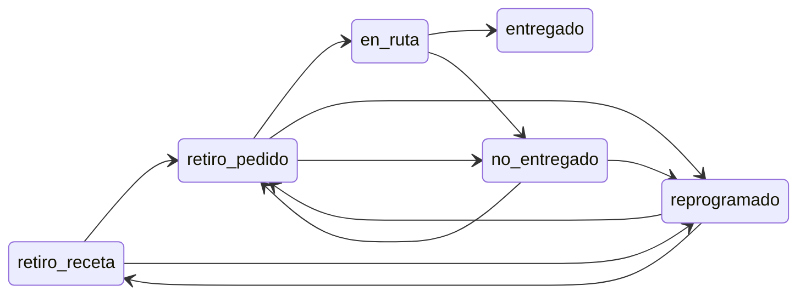

# 4. Base de datos relacional (PostgreSQL)

> Esquema completo en `database/01_schema.sql`, triggers en `02_triggers.sql`,
> seeds en `03_seeds.sql` y datos no estructurados en `04_audit_storage.sql`.

## 4.1 Inventario de tablas

El esquema se despliega en **dos capas**: núcleo logístico (`01_schema.sql` … `04_audit_storage.sql`)
y extensiones administrativas/geográficas (`05` … `08`). En total hay **16 tablas de negocio**
más catálogos de geografía.

### 4.1.1 Núcleo logístico (10 tablas — `01_schema.sql` + `04_audit_storage.sql`)

| # | Tabla | PK | Script | Descripción |
|---|---|---|---|---|
| 1 | `usuarios` | `id_usuario` | 01 | Operadoras, motoristas y admins |
| 2 | `estados_pedido` | `id_estado` | 01 | Catálogo de estados (6 valores fijos) |
| 3 | `pedidos` | `id_pedido` | 01 | Tabla central del reparto |
| 4 | `historial_estados` | `id_historial` | 01 | Trazabilidad append-only |
| 5 | `rutas` | `id_ruta` | 01 | Asignación motorista ↔ pedido |
| 6 | `disponibilidad_motorista` | `id_disponibilidad` | 01 | Flag operativo del motorista |
| 7 | `incidencias` | `id_incidencia` | 01 | Eventos de no-entrega |
| 8 | `reprogramaciones` | `id_reprogramacion` | 01 | Cambios de fecha programada |
| 9 | `audit_logs` | `id_log` | 04 | Auditoría técnica JSONB |
| 10 | `evidencias` | `id_evidencia` | 04 | Metadatos de archivos en Storage |

### 4.1.2 Extensiones administrativas (`05_admin_farmacias.sql`, `07_motos.sql`)

| # | Tabla | PK | Descripción |
|---|---|---|---|
| 11 | `farmacias` | `id_farmacia` | Puntos de despacho / origen opcional del pedido |
| 12 | `auditoria` | `id_auditoria` | Auditoría estructurada de acciones admin (≠ `audit_logs`) |
| 13 | `motos` | `id_moto` | Flota y asignación patente ↔ motorista |

### 4.1.3 Geografía Chile (`06_geografia_chile.sql`)

| # | Tabla | PK | Descripción |
|---|---|---|---|
| 14 | `regiones` | `id_region` | Catálogo regional |
| 15 | `provincias` | `id_provincia` | Provincias por región |
| 16 | `comunas` | `id_comuna` | Comunas; `farmacias.comuna_id` referencia aquí |

> `pedidos.farmacia_id` se agrega en `05_admin_farmacias.sql` (ALTER). Sin ejecutar ese script,
> el API de farmacias y el selector en `crear-pedido.html` fallan.

## 4.2 Foreign Keys e integridad referencial

| Tabla | FK | Referencia | ON DELETE | Justificación |
|---|---|---|---|---|
| `pedidos` | `estado_actual_id` | `estados_pedido` | RESTRICT | Un estado no se borra si tiene pedidos |
| `pedidos` | `operadora_crea_id` | `usuarios` | RESTRICT | No borrar usuario que ha creado pedidos |
| `pedidos` | `operadora_modifica_id` | `usuarios` | SET NULL | Permitir borrar usuario; el dato histórico queda |
| `historial_estados` | `pedido_id` | `pedidos` | CASCADE | Si se borra el pedido, su historial también |
| `historial_estados` | `estado_id` | `estados_pedido` | RESTRICT | — |
| `historial_estados` | `usuario_id` | `usuarios` | RESTRICT | Trazabilidad |
| `rutas` | `pedido_id` | `pedidos` | CASCADE | — |
| `rutas` | `motorista_id` | `usuarios` | RESTRICT | — |
| `disponibilidad_motorista` | `motorista_id` | `usuarios` | CASCADE | — |
| `incidencias` | `pedido_id` | `pedidos` | CASCADE | — |
| `incidencias` | `ruta_id` | `rutas` | SET NULL | — |
| `incidencias` | `usuario_id` | `usuarios` | RESTRICT | — |
| `reprogramaciones` | `pedido_id` | `pedidos` | CASCADE | — |
| `reprogramaciones` | `usuario_id` | `usuarios` | RESTRICT | — |
| `evidencias` | `pedido_id` | `pedidos` | CASCADE | — |
| `evidencias` | `incidencia_id` | `incidencias` | SET NULL | — |
| `audit_logs` | `usuario_id` | `usuarios` | SET NULL | El log debe sobrevivir al borrado del usuario |

## 4.3 Restricciones (constraints)

### CHECK
- `usuarios.rol IN ('operadora','motorista','admin')`
- `estados_pedido.nombre_estado IN ('retiro_receta','en_ruta','entregado','no_entregado','reprogramado','retiro_pedido')`
- `rutas.estado_ruta IN ('asignada','en_curso','finalizada','cancelada')`
- `incidencias.tipo_incidencia IN ('cliente_ausente','direccion_incorrecta','rechazo_cliente','accidente','producto_danado','otro')`
- `reprogramaciones.fecha_nueva > fecha_anterior`
- `evidencias.tipo IN ('entrega','incidencia','firma','otro')`
- `audit_logs.nivel IN ('INFO','WARN','ERROR','SECURITY')`

### UNIQUE
- `usuarios.correo` (CITEXT case-insensitive)
- `usuarios.firebase_uid`
- `pedidos.codigo_pedido`
- `estados_pedido.nombre_estado`
- `rutas.codigo_ruta`
- `disponibilidad_motorista.motorista_id`

### Índices únicos parciales (regla de negocio enforced en BD)

```sql
-- Regla 1: 1 ruta activa por motorista
CREATE UNIQUE INDEX uq_motorista_ruta_activa
    ON rutas (motorista_id)
    WHERE estado_ruta IN ('asignada','en_curso');

-- Regla 2: 1 ruta activa por pedido
CREATE UNIQUE INDEX uq_pedido_ruta_activa
    ON rutas (pedido_id)
    WHERE estado_ruta IN ('asignada','en_curso');

-- Anti-duplicados de pedido (mismo cliente + fecha + detalle)
CREATE UNIQUE INDEX uq_pedidos_no_duplicado
    ON pedidos (nombre_cliente, telefono_cliente, fecha_programada, md5(detalle_pedido))
    WHERE activo = TRUE;
```

## 4.4 Triggers (defensa en profundidad)

| Trigger | Tabla | Cuándo | Qué hace |
|---|---|---|---|
| `trg_sync_estado_pedido` | `historial_estados` | AFTER INSERT | Actualiza `pedidos.estado_actual_id` con el último historial |
| `trg_validar_rol_pedido` | `pedidos` | BEFORE INSERT | Solo `operadora`/`admin` pueden crear |
| `trg_validar_rol_ruta` | `rutas` | BEFORE INSERT/UPDATE | El usuario asignado debe tener `rol = motorista` |
| `trg_actualizar_disp_motorista` | `rutas` | AFTER INSERT/UPDATE | Marca `disponible=FALSE` al asignar y `TRUE` al cerrar |
| `trg_bloquear_update_estado_directo` | `pedidos` | BEFORE UPDATE OF estado_actual_id | Impide cambiar el estado sin haber insertado historial primero |

## 4.5 Vistas (consultas reutilizables)

```sql
v_pedidos_completos        -- pedido + estado + operadora + ruta + motorista (JOIN)
v_motoristas_disponibles   -- motoristas con flag disponible y sin ruta activa
```

## 4.6 Normalización (1FN – 3FN)

| Forma normal | Cumplimiento en LogiCo | Ejemplo |
|---|---|---|
| **1FN** | Atributos atómicos; sin listas repetidas en columnas | `detalle_pedido` es texto único; estados en catálogo `estados_pedido` |
| **2FN** | Todo atributo no clave depende de la PK completa | En `historial_estados`, `comentario` depende de `id_historial`, no de `pedido_id` solo |
| **3FN** | Sin dependencias transitivas entre no claves | `pedidos.estado_actual_id` es redundancia controlada; la fuente de verdad es `historial_estados` + trigger de sincronía |

**Modelo conceptual vs lógico:**

- **Conceptual:** entidades Usuario, Pedido, Ruta, Farmacia, Moto, Incidencia (ver ER en `docs/02-arquitectura-4+1.md`).
- **Lógico:** implementación PostgreSQL en `database/01_schema.sql` + extensiones `05_admin_farmacias.sql`, `07_motos.sql`.
- **Desnormalización intencional:** `pedidos.estado_actual_id` para consultas rápidas; se mantiene consistente vía trigger.

## 4.7 Diagrama del MER

El modelo entidad-relación completo (incluye `motos`, `farmacias`, `audit_logs`) está en
[`02-arquitectura-4+1.md`](02-arquitectura-4+1.md) §2.1.1.

### 4.7.1 Máquina de estados del pedido (persistencia)

Los nombres de estado en `estados_pedido.nombre_estado` deben coincidir con
`functions/src/estados.js`. El historial es **append-only** en `historial_estados`;
el trigger `trg_sync_estado_pedido` mantiene `pedidos.estado_actual_id`.



## 4.8 Diccionario de datos resumido

### `pedidos` (tabla central)

| Columna | Tipo | Null | Default | Descripción |
|---|---|---|---|---|
| `id_pedido` | BIGSERIAL | NO | — | PK |
| `codigo_pedido` | VARCHAR(30) | NO | gen | Código humano único (PED-XXX) |
| `nombre_cliente` | VARCHAR(120) | NO | — | — |
| `direccion_entrega` | VARCHAR(255) | NO | — | — |
| `telefono_cliente` | VARCHAR(30) | NO | — | — |
| `detalle_pedido` | TEXT | NO | — | — |
| `observacion` | TEXT | SI | NULL | — |
| `fecha_creacion` | TIMESTAMPTZ | NO | NOW() | Auditoría |
| `fecha_programada` | TIMESTAMPTZ | NO | — | Cuándo entregar |
| `estado_actual_id` | INT | NO | — | FK estados_pedido |
| `operadora_crea_id` | BIGINT | NO | — | FK usuarios |
| `operadora_modifica_id` | BIGINT | SI | NULL | FK usuarios (último que tocó) |
| `activo` | BOOLEAN | NO | TRUE | Soft delete |
| `farmacia_id` | BIGINT | SI | NULL | FK `farmacias` (script `05_admin_farmacias.sql`) |

### `historial_estados` (trazabilidad inmutable)

| Columna | Tipo | Descripción |
|---|---|---|
| `id_historial` | BIGSERIAL PK | — |
| `pedido_id` | BIGINT FK | — |
| `estado_id` | INT FK | — |
| `fecha_hora` | TIMESTAMPTZ | NOW() automático |
| `comentario` | TEXT | Opcional |
| `usuario_id` | BIGINT FK | Quien hizo el cambio |

> Esta tabla es **append-only**. Nunca se hace UPDATE ni DELETE en producción.

## 4.9 Estrategia de migraciones

Se usa una convención numérica (`01_*.sql`, `02_*.sql`, ...) ejecutada con `psql -f`.
Para producción se recomienda migrar a una herramienta como **node-pg-migrate** o **Flyway**
con tabla `schema_migrations`.

## 4.10 Plan de respaldos

| Tipo | Frecuencia | Retención | Responsable |
|---|---|---|---|
| Snapshot automático Cloud SQL | Diario 02:00 SLV | 7 días | Google |
| WAL / point-in-time recovery | Continuo | 7 días | Google |
| Export lógico (`pg_dump`) | Semanal lunes 03:00 | 30 días | DevOps (cron) |
| Export anual archivado | Anual | 7 años | DevOps + GCS coldline |

## 4.11 Scripts SQL (criterio 2.1.4.9)

### Checklist obligatorio (base `logico`, no `postgres`)

```text
\c logico
\i database/01_schema.sql
\i database/02_triggers.sql
\i database/03_seeds.sql
\i database/04_audit_storage.sql
\i database/05_admin_farmacias.sql
\i database/06_geografia_chile.sql
\i database/07_motos.sql
-- Opcionales operación:
\i database/08_cambiar_rol_usuario.sql
\i database/09_diagnostico_usuarios.sql
```

| Archivo | Propósito |
|---|---|
| `database/01_schema.sql` … `04_audit_storage.sql` | Núcleo logístico + audit JSONB + evidencias |
| `database/05_admin_farmacias.sql` | `farmacias`, `auditoria`, `pedidos.farmacia_id` |
| `database/06_geografia_chile.sql` | Regiones / provincias / comunas |
| `database/07_motos.sql` | Tabla `motos` + seed demo |
| `database/08_cambiar_rol_usuario.sql` | Función RPC cambio de rol |
| `database/create_tables.sql` + `primary_keys.sql` + `foreign_keys.sql` | Variante modular (rúbrica DDL separado) |
| `database/seed.sql` | Datos demo alternativos |
| `database/drop_*.sql` | Desinstalación controlada |

### Doble modelo de auditoría

| Tabla | Formato | Quién escribe | Uso |
|---|---|---|---|
| `audit_logs` | JSONB flexible (`payload`) | Middleware + `logAudit()` en mutaciones API | Trazabilidad técnica, consultas GIN |
| `auditoria` | Columnas fijas (`accion`, `entidad_afectada`, `exito`) | Servicios admin (`farmacias.js`, `usuarios.js`, …) | Informe de mantenedores en `admin-auditoria.html` |
