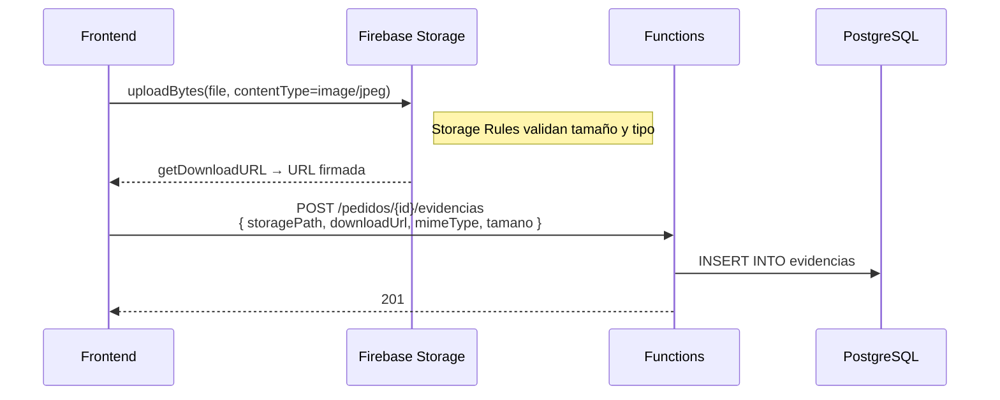

# 5. Bases estructuradas y no estructuradas

LogiCo combina **tres niveles** de estructura para cumplir el requisito de manejar
datos relacionales y no relacionales en el mismo sistema.

## 5.1 Estructurados — PostgreSQL relacional

Toda la información de negocio crítica vive en **8 tablas relacionales** con FK,
constraints y triggers (ver `docs/04-base-datos.md`).

| Beneficio | Cómo se manifiesta |
|---|---|
| Integridad referencial | FK declaradas en todas las tablas relacionadas |
| Transacciones ACID | `BEGIN/COMMIT/ROLLBACK` en cada función crítica |
| Reglas de negocio fuertes | Índices únicos parciales + triggers |
| Consultas complejas | Vistas (`v_pedidos_completos`, `v_motoristas_disponibles`) |

## 5.2 Semi-estructurados — JSONB en PostgreSQL

La tabla `audit_logs.payload` usa **JSONB** para registrar eventos heterogéneos:

```sql
CREATE TABLE audit_logs (
    id_log BIGSERIAL PRIMARY KEY,
    fecha_hora TIMESTAMPTZ NOT NULL DEFAULT NOW(),
    usuario_id BIGINT,
    accion VARCHAR(60) NOT NULL,
    entidad VARCHAR(40),
    entidad_id BIGINT,
    payload JSONB,                      -- ← campo flexible
    nivel VARCHAR(10) NOT NULL DEFAULT 'INFO'
);

-- Búsquedas con índice GIN
CREATE INDEX idx_audit_payload ON audit_logs USING GIN (payload jsonb_path_ops);
```

### Ejemplos de payload

```json
// Evento: pedido_creado
{ "codigo_pedido": "PED-T8K9-AB12" }

// Evento: ruta_asignada
{ "pedido_id": 100, "motorista_id": 7 }

// Evento: incidencia_registrada
{ "pedido_id": 100, "tipo": "cliente_ausente" }
```

### Consultas tipo NoSQL sobre el JSONB

```sql
-- Todas las incidencias del tipo cliente_ausente
SELECT * FROM audit_logs
 WHERE accion = 'incidencia_registrada'
   AND payload @> '{"tipo": "cliente_ausente"}';

-- Operadoras más activas
SELECT usuario_id, COUNT(*) FROM audit_logs
 WHERE accion = 'pedido_creado'
 GROUP BY usuario_id ORDER BY 2 DESC;
```

## 5.3 No estructurados — Firebase Storage

Los **archivos binarios** (fotos de evidencia de entrega, fotos de incidencias,
firmas digitalizadas) viven en **Firebase Storage** (Google Cloud Storage),
nunca en la BD relacional.

### Convención de rutas

```
gs://logico-20f73.firebasestorage.app/
└── evidencias/
    ├── {pedidoId}/
    │   ├── entrega/
    │   │   └── 1714398273_{firebaseUid}.jpg
    │   ├── incidencia/
    │   │   └── 1714398995_{firebaseUid}.jpg
    │   └── firma/
    │       └── 1714399120_{firebaseUid}.png
```

### Reglas de Storage (`storage.rules`)

```
match /evidencias/{pedidoId}/{kind}/{fileName} {
  allow read: if request.auth != null;
  allow write: if request.auth != null
                && request.resource.size < 8 * 1024 * 1024
                && request.resource.contentType.matches('image/.*')
                && kind in ['entrega', 'incidencia', 'firma', 'otro'];
}
```

### Vínculo con la BD relacional

La tabla `evidencias` guarda solo el **metadato**:

| Columna | Ejemplo |
|---|---|
| `pedido_id` | 100 |
| `tipo` | `incidencia` |
| `storage_path` | `evidencias/100/incidencia/1714398995_xyz.jpg` |
| `download_url` | `https://firebasestorage.googleapis.com/...` |
| `mime_type` | `image/jpeg` |
| `tamano_bytes` | 482103 |

De esta forma:
- El **modelo relacional** mantiene su disciplina (FK, integridad).
- Los archivos pesados **no inflan** la BD.
- Storage maneja el caching/CDN/redundancia.

## 5.4 Tabla resumen de qué va en dónde

| Tipo de dato | Dónde se almacena | Por qué |
|---|---|---|
| Datos del pedido (cliente, dirección, fechas) | PostgreSQL `pedidos` | Estructurados, con FK |
| Estado y trazabilidad | PostgreSQL `historial_estados` | Append-only, queries temporales |
| Foto de entrega | Firebase Storage | Binario pesado |
| Metadato de la foto | PostgreSQL `evidencias` | Vincular con pedido |
| Logs de acciones | PostgreSQL `audit_logs.payload` (JSONB) | Esquema flexible, queries auditoría |
| Logs de la plataforma | Cloud Logging | Stack traces, métricas |

## 5.5 Flujo end-to-end de una evidencia



Ningún byte del archivo pasa por las Functions, lo que reduce coste, latencia y CPU.
