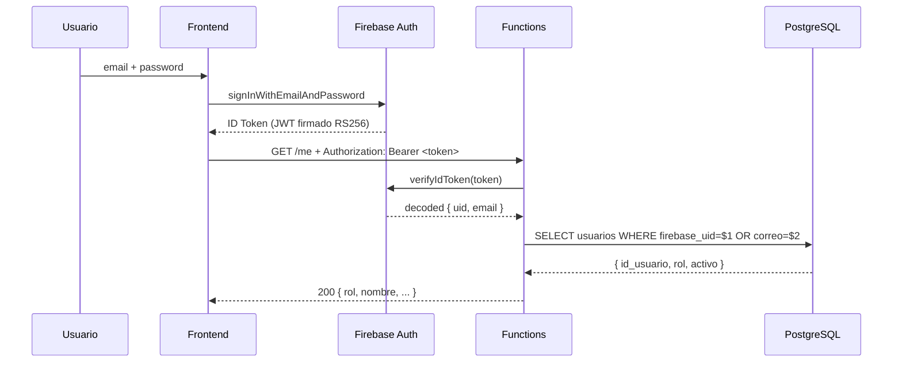
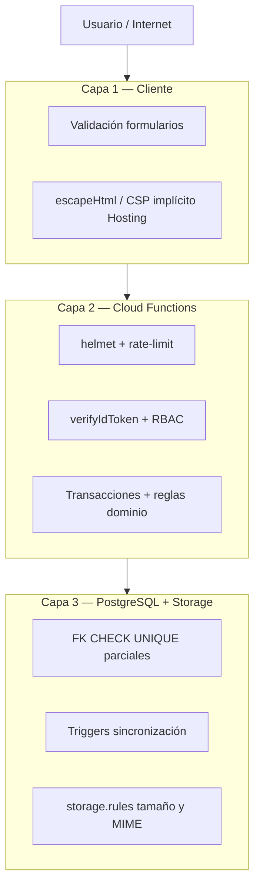

# 6. Seguridad

## 6.1 Modelo de autenticación

| Capa | Mecanismo |
|---|---|
| **Frontend** | Firebase Auth (email/password). El cliente obtiene un `ID Token` JWT firmado por Google con RS256. |
| **Functions** | `firebase-admin.auth().verifyIdToken(token)` valida firma + expiración + no revocado. |
| **PostgreSQL** | El usuario `logico_app` solo puede ejecutar SQL desde las Functions; no hay acceso público. |

### Flujo de autenticación



> El **ID Token** dura 1 hora; Firebase SDK lo refresca automáticamente.

## 6.2 Autorización por roles (RBAC)

3 roles con permisos explícitos:

| Acción | operadora | motorista | admin |
|---|:-:|:-:|:-:|
| Login | ✓ | ✓ | ✓ |
| Crear pedido | ✓ | ✗ | ✓ |
| Listar pedidos (`GET /pedidos`) | ✓ (todos) | ✓ (solo filtrados por su `id`) | ✓ |
| Detalle pedido (`GET /pedidos/:id`) | ✓ | ⚠ ver §6.11 | ✓ |
| Asignar motorista | ✓ | ✗ | ✓ |
| Iniciar ruta | ✗ | ✓ (propia) | ✓ |
| Cambiar estado (`POST …/estado`) | ✓ | ✓ (asignado en servicio) | ✓ |
| Marcar entregado | ✗ | ✓ (asignado en servicio) | ✓ |
| Registrar incidencia | ✓ (cualquier pedido) | ✓ (solo ruta propia) | ✓ |
| Reprogramar | ✓ | ✗ | ✓ |
| Subir evidencia (API + Storage) | ✓ | ⚠ ver §6.10 | ✓ |
| Ver auditoría | ✗ | ✗ | ✓ |
| Cambiar disponibilidad | ✗ | ✓ (propia) | ✓ |
| Mantenedores farmacias/motos/usuarios | ✗ | ✗ | ✓ |

### Implementación

```js
// functions/src/auth.js
function requireRole(...roles) {
    return (req, res, next) => {
        if (!req.user) return res.status(401).json({ error: 'No autenticado.' });
        if (!roles.includes(req.user.rol)) {
            return res.status(403).json({ error: `Roles permitidos: ${roles.join(', ')}.` });
        }
        next();
    };
}

// uso en routes
app.post('/pedidos', authRequired, requireRole('operadora', 'admin'), handler);
```

Y a nivel BD el trigger `fn_validar_rol_creacion_pedido` rechaza inserts donde
`operadora_crea_id` no tenga rol válido (defensa adicional).

## 6.3 Análisis de amenazas (STRIDE)

| Amenaza | Categoría STRIDE | Vector | Mitigación |
|---|---|---|---|
| **Acceso no autorizado** | Spoofing | Sin token o token falsificado | `verifyIdToken` valida firma JWT con clave pública de Google |
| **Suplantación de rol** | Elevation of Privilege | Cliente edita el "rol" en localStorage | El rol viene de **`SELECT` en BD** server-side, no del token |
| **SQL Injection** | Tampering | Inputs maliciosos | Todas las queries usan **parámetros `$1, $2`** (`pg`) |
| **XSS** | Tampering | HTML en campos texto | `escapeHtml()` en frontend + headers `X-Content-Type-Options`, CSP |
| **CSRF** | Tampering | Form cross-site | API solo acepta JSON con header `Authorization: Bearer`, no cookies |
| **Manipulación de datos** | Tampering | Cambiar `estado_actual_id` directo | Trigger `fn_bloquear_update_estado_directo` lo impide |
| **Fuga de información** | Information Disclosure | Errores con stack trace | `errorHandler` central retorna mensajes genéricos para 500 |
| **DoS / abuso** | Denial of Service | Spam de requests | `express-rate-limit` 120 req/min/IP |
| **Pérdida de evidencias** | Repudiation | Operadora niega haber creado un pedido | `audit_logs` + `historial_estados.usuario_id` registran todo |
| **Acceso a archivos privados** | Information Disclosure | Usuario autenticado adivina `pedidoId` en ruta Storage | Reglas exigen auth, **no** ownership por pedido (§6.10) |
| **Enumeración de pedidos** | Information Disclosure | `GET /pedidos/:id` sin chequeo de asignación | Documentado §6.11; mitigación en backlog |
| **Alta no autorizada en BD** | Elevation of Privilege | Token Firebase sin fila en `usuarios` | `AUTH_AUTO_PROVISION` (§6.10) |
| **Inyección por payload pesado** | DoS | JSON gigante | Express `json({ limit: '256kb' })` |
| **Robo de credenciales** | Spoofing | Sniffing | HTTPS forzado por Hosting + Firebase Auth |

## 6.4 Controles aplicados

### Defensa en profundidad (3 capas)



1. **Cliente**: validación de formularios, `escapeHtml`, contenido tipado.
2. **Backend (Functions)**: `helmet`, rate-limit, `verifyIdToken`, `requireRole`, validación de inputs, transacciones.
3. **BD**: FK + CHECK + UNIQUE parciales + triggers.

### Cabeceras HTTP de seguridad (helmet + Hosting headers)

```
Strict-Transport-Security: max-age=31536000; includeSubDomains
X-Content-Type-Options: nosniff
X-Frame-Options: DENY
Referrer-Policy: strict-origin-when-cross-origin
Cross-Origin-Opener-Policy: same-origin
```

### Storage Rules (archivo `storage.rules`)

```
match /evidencias/{pedidoId}/{kind}/{fileName} {
  allow read: if request.auth != null;
  allow write: if request.auth != null
                && request.resource.size < 8 * 1024 * 1024
                && request.resource.contentType.matches('image/.*')
                && kind in ['entrega', 'incidencia', 'firma', 'otro'];
}
match /{allPaths=**} { allow read, write: if false; }
```

## 6.5 Gestión de secretos

| Secreto | Dónde vive | Cómo se rota |
|---|---|---|
| Password de `logico_app` | Functions `.env` o Secret Manager | Trimestral / al cambio de team |
| Service account de Firebase Admin | Cloud Run identity (auto) | Manejado por Google |
| API keys (frontend) | `public/js/config.js` | No son secretas — la seguridad real está en Auth Rules |
| Cloud SQL connection string | Variables de Cloud Functions | Secret Manager si es prod |

> El proyecto incluye `.env.example`. El `.env` real está en `.gitignore`.

## 6.6 Cumplimiento y datos personales

### Controles técnicos

- **HTTPS forzado** por Firebase Hosting (HSTS preload).
- **Auditoría** en `audit_logs` (JSONB), `auditoria` (admin) e `historial_estados`.
- **Borrado lógico** (`pedidos.activo = FALSE`) para retención sin pérdida histórica inmediata.
- **Trazabilidad** de usuario y timestamp en acciones críticas.

### Datos personales del cliente final (Ley 19.628 Chile — alcance académico)

LogiCo almacena en `pedidos`: **nombre**, **teléfono**, **dirección de entrega** y detalle del pedido.
Son datos necesarios para la operación logística (finalidad: entrega farmacéutica / última milla).

| Principio | Implementación en LogiCo |
|---|---|
| Finalidad | Solo gestión del reparto; no se venden ni comparten a terceros |
| Acceso por rol | Operadora/admin ven listados; motorista debe limitarse a pedidos asignados (ver §6.11) |
| Seguridad | TLS, Auth Firebase, RBAC, auditoría |
| Conservación | Soft delete; respaldos Cloud SQL §4.10 |
| Derechos del titular | Fuera de alcance MVP; procedimiento manual vía admin en versión productiva |

> En defensa oral: distinguir **usuario del sistema** (empleado con Firebase) del **cliente final**
> (persona del pedido cuyos datos personales viajan en la tabla `pedidos`).

## 6.7 Plan de respuesta a incidentes

| Severidad | Tiempo de respuesta | Acción |
|---|---|---|
| Crítica (acceso no autorizado, pérdida de datos) | < 30 min | Aislar Functions afectadas, rotar secrets, snapshot BD, notificar |
| Alta (servicio caído) | < 2 h | Rollback al deploy anterior, postmortem |
| Media (bug funcional) | < 1 día | Hotfix + tests de regresión |
| Baja (mejora cosmética) | Próximo sprint | Backlog |

## 6.8 Políticas de seguridad (≥10)

| # | Política | Evidencia |
|---|---|---|
| P1 | Contraseñas Firebase Auth + bcrypt fallback | `03_seeds.sql`, Firebase Console |
| P2 | JWT 1 h, refresh SDK | `auth.js` |
| P3 | RBAC 3 roles | `requireRole()` en `index.js` |
| P4 | Rate-limit 120 req/min/IP | `express-rate-limit` |
| P5 | Motorista solo sus rutas / entrega / incidencia asignada | `rutas.js`, `estados.js`, `incidencias.js` |
| P5b | Listado pedidos motorista filtrado por `id_usuario` | `index.js` `GET /pedidos` |
| P6 | Rol desde BD, no del cliente | `auth.js` → `SELECT usuarios` |
| P7 | Pool PG con timeout | `db.js` |
| P8 | Auditoría `audit_logs` + `auditoria` | `audit.js`, `auditoria.js` |
| P9 | Cloud SQL sin IP pública | Auth Proxy / socket |
| P10 | HTTPS + helmet | Hosting, `index.js` |
| P11 | Storage: solo imágenes ≤8 MB autenticadas | `storage.rules` |
| P12 | Borrado lógico pedidos | `pedidos.activo` |

## 6.9 Mitigación OWASP (priorizada)

| # | Amenaza | Mitigación | Prioridad |
|---|---|---|---|
| 1 | A01 Broken Access Control | RBAC + validación en rutas/entrega/incidencia; huecos §6.10–§6.11 | P1 |
| 2 | A03 SQL Injection | Parámetros `$1..$n` en `pg` | P1 |
| 3 | A07 Auth failures | `verifyIdToken` | P1 |
| 4 | A04 Cryptographic failures | HTTPS, secretos en `.env` | P2 |
| 5 | A05 Misconfiguration | helmet, CORS, Storage deny default | P2 |
| 6 | API4 Resource consumption | rate-limit, body 256 KB | P2 |
| 7 | A03 XSS | `escapeHtml()` | P3 |
| 8 | Doble asignación motorista | `FOR UPDATE` + índices únicos parciales | P1 |
| 9 | A09 Logging failures | `audit_logs`, Cloud Logging | P3 |
| 10 | A10 SSRF | Sin fetch a URLs del cliente | P4 |

## 6.10 Limitaciones de seguridad del MVP (honestas)

Estas limitaciones están **presentes en el código actual** y se documentan para evaluación transparente.
La mitigación propuesta es trabajo futuro (no aplicada en este entregable académico).

| ID | Limitación | Comportamiento actual | Mitigación recomendada |
|---|---|---|---|
| L-01 | **IDOR detalle de pedido** | `GET /pedidos/:id` devuelve datos del cliente a cualquier usuario autenticado | Validar en API que motorista tenga ruta activa/histórica sobre ese `pedido_id` |
| L-02 | **IDOR evidencias Storage** | `allow read: if request.auth != null` sin validar pedido | URLs firmadas emitidas por backend tras validar asignación, o custom claims |
| L-03 | **Evidencias API** | `POST/GET …/evidencias` no valida asignación del motorista | Misma regla que L-01 en `evidencias.js` |
| L-04 | **Auto-provisión** | Si `AUTH_AUTO_PROVISION` ≠ `false`, un login Firebase nuevo crea fila `operadora` | En producción: `AUTH_AUTO_PROVISION=false` y alta solo por admin |
| L-05 | **Detalle en errores 401** | Respuesta puede incluir `details` del error Firebase | Ocultar en producción (`NODE_ENV`) |
| L-06 | **CORS** | `origin: true` refleja cualquier origen | Lista blanca del dominio Hosting |
| L-07 | **`/health` público** | Expone `database`, flags de tablas | Reducir campos en prod o proteger con API key interna |

### Configuración recomendada en demostración / producción

| Variable | Valor demo seguro | Efecto |
|---|---|---|
| `AUTH_AUTO_PROVISION` | `false` | Impide cuentas Firebase huérfanas con rol operadora |
| `PGDATABASE` | `logico` | Evita diagnósticos en BD `postgres` vacía |

## 6.11 Matriz de acceso a datos del cliente final

| Recurso | operadora | motorista (diseño negocio) | motorista (implementación API actual) | admin |
|---|---|---|---|---|
| Listado `GET /pedidos` | Todos los activos | Solo sus rutas (filtro server) | ✅ filtrado | Todos |
| Detalle `GET /pedidos/:id` | Sí | Solo pedidos asignados | ⚠ cualquier `id` autenticado (L-01) | Sí |
| Teléfono / dirección en JSON | Sí | Solo si asignado | ⚠ si conoce `id` | Sí |
| Foto Storage `/evidencias/{id}/…` | Sí si conoce ruta | Solo asignados | ⚠ cualquier auth (L-02) | Sí |
| `GET /motoristas/disponibles` | Sí | Sí (expuesto) | ✅ | Sí |

La UI del motorista (`motorista.html`) solo enlaza pedidos de sus rutas; el riesgo es **API directa**
(Postman) o enumeración de identificadores.
