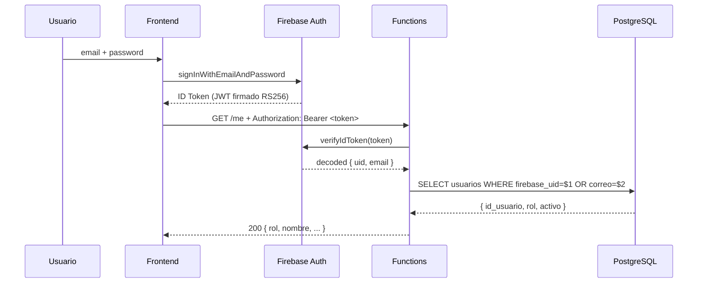

# 6. Seguridad

## 6.1 Modelo de autenticación

| Capa | Mecanismo |
|---|---|
| **Frontend** | Firebase Auth (email/password). El cliente obtiene un `ID Token` JWT firmado por Google con RS256. |
| **Functions** | `firebase-admin.auth().verifyIdToken(token)` valida firma + expiración + no revocado. |
| **PostgreSQL** | El usuario `logico_app` solo puede ejecutar SQL desde las Functions; no hay acceso público. |

### Flujo de autenticación



> El **ID Token** dura 1 hora; Firebase SDK lo refresca automáticamente.

## 6.2 Autorización por roles (RBAC)

3 roles con permisos explícitos:

| Acción | operadora | motorista | admin |
|---|:-:|:-:|:-:|
| Login | ✓ | ✓ | ✓ |
| Crear pedido | ✓ | ✗ | ✓ |
| Ver todos los pedidos | ✓ | ✗ | ✓ |
| Ver pedidos asignados | ✗ | ✓ | ✓ |
| Asignar motorista | ✓ | ✗ | ✓ |
| Iniciar ruta | ✗ | ✓ (propia) | ✓ |
| Cambiar estado pedido | ✓ | ✓ (asignado) | ✓ |
| Marcar entregado | ✗ | ✓ (asignado) | ✓ |
| Registrar incidencia | ✓ | ✓ (asignado) | ✓ |
| Reprogramar | ✓ | ✗ | ✓ |
| Subir evidencia | ✓ | ✓ | ✓ |
| Ver auditoría | ✗ | ✗ | ✓ |
| Cambiar disponibilidad | ✗ | ✓ (propia) | ✓ |

### Implementación

```js
// functions/src/auth.js
function requireRole(...roles) {
    return (req, res, next) => {
        if (!req.user) return res.status(401).json({ error: 'No autenticado.' });
        if (!roles.includes(req.user.rol)) {
            return res.status(403).json({ error: `Roles permitidos: ${roles.join(', ')}.` });
        }
        next();
    };
}

// uso en routes
app.post('/pedidos', authRequired, requireRole('operadora', 'admin'), handler);
```

Y a nivel BD el trigger `fn_validar_rol_creacion_pedido` rechaza inserts donde
`operadora_crea_id` no tenga rol válido (defensa adicional).

## 6.3 Análisis de amenazas (STRIDE)

| Amenaza | Categoría STRIDE | Vector | Mitigación |
|---|---|---|---|
| **Acceso no autorizado** | Spoofing | Sin token o token falsificado | `verifyIdToken` valida firma JWT con clave pública de Google |
| **Suplantación de rol** | Elevation of Privilege | Cliente edita el "rol" en localStorage | El rol viene de **`SELECT` en BD** server-side, no del token |
| **SQL Injection** | Tampering | Inputs maliciosos | Todas las queries usan **parámetros `$1, $2`** (`pg`) |
| **XSS** | Tampering | HTML en campos texto | `escapeHtml()` en frontend + headers `X-Content-Type-Options`, CSP |
| **CSRF** | Tampering | Form cross-site | API solo acepta JSON con header `Authorization: Bearer`, no cookies |
| **Manipulación de datos** | Tampering | Cambiar `estado_actual_id` directo | Trigger `fn_bloquear_update_estado_directo` lo impide |
| **Fuga de información** | Information Disclosure | Errores con stack trace | `errorHandler` central retorna mensajes genéricos para 500 |
| **DoS / abuso** | Denial of Service | Spam de requests | `express-rate-limit` 120 req/min/IP |
| **Pérdida de evidencias** | Repudiation | Operadora niega haber creado un pedido | `audit_logs` + `historial_estados.usuario_id` registran todo |
| **Acceso a archivos privados** | Information Disclosure | Otra cuenta accede a fotos | `storage.rules` exigen `request.auth != null` |
| **Inyección por payload pesado** | DoS | JSON gigante | Express `json({ limit: '256kb' })` |
| **Robo de credenciales** | Spoofing | Sniffing | HTTPS forzado por Hosting + Firebase Auth |

## 6.4 Controles aplicados

### Defensa en profundidad (3 capas)

1. **Cliente**: validación de formularios, `escapeHtml`, contenido tipado.
2. **Backend (Functions)**: `helmet`, rate-limit, `verifyIdToken`, `requireRole`, validación de inputs, transacciones.
3. **BD**: FK + CHECK + UNIQUE parciales + triggers.

### Cabeceras HTTP de seguridad (helmet + Hosting headers)

```
Strict-Transport-Security: max-age=31536000; includeSubDomains
X-Content-Type-Options: nosniff
X-Frame-Options: DENY
Referrer-Policy: strict-origin-when-cross-origin
Cross-Origin-Opener-Policy: same-origin
```

### Storage Rules (mínimo privilegio)

```
match /evidencias/{pedidoId}/{kind}/{fileName} {
  allow read: if request.auth != null;
  allow write: if request.auth != null
                && request.resource.size < 8 * 1024 * 1024
                && request.resource.contentType.matches('image/.*');
}
match /{allPaths=**} { allow read, write: if false; }
```

## 6.5 Gestión de secretos

| Secreto | Dónde vive | Cómo se rota |
|---|---|---|
| Password de `logico_app` | Functions `.env` o Secret Manager | Trimestral / al cambio de team |
| Service account de Firebase Admin | Cloud Run identity (auto) | Manejado por Google |
| API keys (frontend) | `public/js/config.js` | No son secretas — la seguridad real está en Auth Rules |
| Cloud SQL connection string | Variables de Cloud Functions | Secret Manager si es prod |

> El proyecto incluye `.env.example`. El `.env` real está en `.gitignore`.

## 6.6 Cumplimiento

- **HTTPS forzado** por Firebase Hosting (HSTS preload).
- **Auditoría completa** en `audit_logs` + `historial_estados`.
- **Borrado lógico** (`pedidos.activo = FALSE`) para cumplir requisitos de retención.
- **Trazabilidad de quién hizo qué y cuándo** en cada acción crítica.

## 6.7 Plan de respuesta a incidentes

| Severidad | Tiempo de respuesta | Acción |
|---|---|---|
| Crítica (acceso no autorizado, pérdida de datos) | < 30 min | Aislar Functions afectadas, rotar secrets, snapshot BD, notificar |
| Alta (servicio caído) | < 2 h | Rollback al deploy anterior, postmortem |
| Media (bug funcional) | < 1 día | Hotfix + tests de regresión |
| Baja (mejora cosmética) | Próximo sprint | Backlog |
