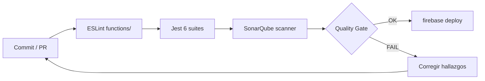

# 7. Codificación segura — Buenas prácticas aplicadas

## 7.0 Estándares aplicados (≥5)

| # | Estándar | Aplicación en LogiCo |
|---|---|---|
| 1 | **OWASP Top 10 / API Top 10** | Matriz §7.9; controles en [`06-seguridad.md`](06-seguridad.md) §6.8–6.9 |
| 2 | **CWE-89 SQL Injection** | Prepared statements en todo `pg` |
| 3 | **CWE-79 XSS** | `escapeHtml()` + headers helmet |
| 4 | **Validación de entradas** | `ValidationError` por servicio (`pedidos.js`, etc.) |
| 5 | **Principio de mínimo privilegio** | RBAC, Storage deny-by-default, rol SQL limitado §7.8 |
| 6 | **Manejo de excepciones** | `errorHandler` central; sin stack al cliente en 500 |

## 7.1 Validación de inputs

Cada función de servicio valida sus parámetros **antes** de tocar la BD:

```js
// functions/src/pedidos.js
function validarPayloadPedido(p) {
    const obligatorios = ['nombre_cliente', 'direccion_entrega',
                          'telefono_cliente', 'detalle_pedido', 'fecha_programada'];
    const faltan = obligatorios.filter(k => !p[k] || String(p[k]).trim() === '');
    if (faltan.length) throw new ValidationError(`Campos obligatorios: ${faltan.join(', ')}`);

    const fp = new Date(p.fecha_programada);
    if (Number.isNaN(fp.getTime())) {
        throw new ValidationError('fecha_programada inválida (use ISO 8601).');
    }
}
```

Validaciones específicas adicionales:

- `cambiarEstadoPedido`: el destino debe estar en lista blanca (`ESTADOS_VALIDOS`).
- `registrarIncidencia`: `tipo` ∈ `TIPOS_VALIDOS`, descripción no vacía.
- `reprogramarPedido`: `fechaNueva > fecha_programada` actual.
- `actualizarDisponibilidad`: `disponible` debe ser boolean.

Validaciones a nivel BD (segunda barrera):
- CHECK en columnas (`rol`, `nombre_estado`, `tipo_incidencia`...).
- Trigger `chk_rep_fecha`: rechaza reprogramaciones hacia el pasado.

## 7.2 Prepared statements (anti SQL Injection)

**Toda** consulta usa parámetros con `pg`, nunca string concatenation:

```js
// ✅ Correcto
await client.query(
    `INSERT INTO pedidos (codigo_pedido, nombre_cliente, ...)
     VALUES ($1, $2, ...)`,
    [codigo, payload.nombre_cliente, ...]
);

// ❌ NUNCA
await client.query(
    `INSERT INTO pedidos VALUES ('${codigo}', '${nombre}')`
);
```

`pg` envía los parámetros tipados por separado al protocolo PostgreSQL, eliminando
toda posibilidad de inyección.

**Test de regresión incluido en Postman**: caso #13 envía
`Robert'); DROP TABLE pedidos; --` como `nombre_cliente` y verifica que la respuesta
sea 201 (texto guardado tal cual) o 400, **nunca** una caída del servidor.

## 7.3 Control centralizado de errores

```js
// functions/src/errors.js
class HttpError extends Error { /* status + details */ }
class ValidationError extends HttpError { constructor(m,d){ super(400,m,d); }}
class NotFoundError      extends HttpError { ... }
class ConflictError      extends HttpError { ... }
class BusinessRuleError  extends HttpError { ... }

function errorHandler(err, _req, res, _next) {
    if (err instanceof HttpError) {
        return res.status(err.status).json({ error: err.message, details: err.details });
    }
    if (err.code === '23505') return res.status(409).json({ error: 'Duplicado', details: err.detail });
    if (err.code === '23503') return res.status(409).json({ error: 'FK violada', details: err.detail });
    if (err.code === '23514') return res.status(422).json({ error: 'CHECK violado' });
    if (err.code === 'P0001') return res.status(422).json({ error: err.message }); // RAISE de plpgsql
    console.error('[unhandled]', err);
    return res.status(500).json({ error: 'Error interno del servidor.' });
}
```

Reglas:
- **Nunca** se filtra stack trace al cliente.
- Códigos PG se mapean a HTTP semánticos (409, 422).
- `console.error` envía a Cloud Logging para auditoría interna.

## 7.4 No exponer datos sensibles

| Dato sensible | Cómo se protege |
|---|---|
| `usuarios.contrasena` | Hash bcrypt; nunca se devuelve por la API |
| Stack traces | Solo en Cloud Logging, no al cliente |
| Tokens en logs | `redactSensitive()` en `audit.js` reemplaza por `[REDACTED]` |
| Connection strings | Variables de entorno, nunca en repo (`.gitignore`) |
| Service account | Identidad del runtime (Cloud Run), no archivo en disco |

```js
// functions/src/audit.js
function redactSensitive(obj) {
    if (!obj || typeof obj !== 'object') return obj;
    const clone = { ...obj };
    for (const k of ['contrasena','password','token','idToken','secret']) {
        if (k in clone) clone[k] = '[REDACTED]';
    }
    return clone;
}
```

## 7.5 Transacciones explícitas

Toda operación que toca múltiples tablas usa `withTransaction`:

```js
// functions/src/db.js
async function withTransaction(work) {
    const client = await pool.connect();
    try {
        await client.query('BEGIN');
        const result = await work(client);
        await client.query('COMMIT');
        return result;
    } catch (err) {
        try { await client.query('ROLLBACK'); } catch (_) { /* noop */ }
        throw err;
    } finally {
        client.release();
    }
}
```

Y los servicios la usan así:

```js
return withTransaction(async (client) => {
    const { rows } = await client.query('SELECT ... FOR UPDATE', [id]);
    // ... múltiples inserts/updates ...
});
```

## 7.6 Bloqueo pesimista contra carreras

Donde existe contención (asignar motorista, cambiar estado), usamos
`SELECT ... FOR UPDATE` para bloquear filas:

```js
const { rows } = await client.query(
    `SELECT * FROM rutas WHERE id_ruta = $1 FOR UPDATE`, [rutaId]
);
```

Si dos requests llegan a la vez, una espera hasta que la otra termine
(commit o rollback), evitando estados inconsistentes.

## 7.7 Sanitización en frontend

```js
// public/js/firebase-init.js
export function escapeHtml(value) {
    return String(value ?? '')
        .replace(/&/g, '&amp;')
        .replace(/</g, '&lt;')
        .replace(/>/g, '&gt;')
        .replace(/"/g, '&quot;')
        .replace(/'/g, '&#039;');
}
```

Aplicado al renderizar texto del usuario con `innerHTML`. Para valores de campos
controlados se usa `textContent` siempre que sea posible.

## 7.8 Principio de mínimo privilegio

- Usuario PG `logico_app` solo tiene `CONNECT`, `INSERT`, `SELECT`, `UPDATE`, `DELETE`
  en las tablas (no DDL ni superuser).
- Storage Rules deniegan **todo** lo que no sea explícitamente permitido.
- `requireRole` se aplica por endpoint (no por whitelist de URLs).
- Cliente PostgreSQL no expone DDL al frontend.

## 7.9 Resumen — checklist OWASP API Security Top 10 (2023)

| # | Amenaza | Estado |
|---|---|---|
| API1 | Broken Object Level Authorization | ⚠ Parcial — ver [`06-seguridad.md`](06-seguridad.md) §6.10–§6.11 |
| API2 | Broken Authentication | ✅ Firebase Auth + verifyIdToken |
| API3 | Broken Object Property Level Auth | ✅ sin campos internos extra en respuestas estándar |
| API4 | Unrestricted Resource Consumption | ✅ rate-limit + body limit 256 KB |
| API5 | Broken Function Level Authorization | ✅ `requireRole` en mutaciones admin y pedidos |
| API6 | Unrestricted Access to Sensitive Business Flows | ✅ índices únicos + bloqueos FOR UPDATE |
| API7 | Server Side Request Forgery | N/A (sin URLs externas dinámicas) |
| API8 | Security Misconfiguration | ⚠ helmet OK; CORS permisivo y `/health` público (§6.10) |
| API9 | Improper Inventory Management | ✅ docs/ + Postman + `/health` |
| API10 | Unsafe Consumption of APIs | N/A (sin integraciones de terceros mutables) |

## 7.10 Análisis estático (SonarQube / ESLint)

### Pipeline de calidad en el repositorio



| Métrica | Resultado | Evidencia |
|---|---|---|
| Tests Jest | **38/38 PASS** | `cd functions && npm test` (reproducible en repo) |
| ESLint | Sin errores bloqueantes | `npm run lint` si está configurado en `package.json` |
| Bugs / vulnerabilidades Sonar | Según último análisis | Export PDF/HTML del servidor SonarQube (no versionado por defecto) |
| Cobertura líneas (~84 %) | Informe SonarQube | **No** hay `jest --coverage` en `package.json`; no confundir con salida Jest |
| `npm audit` (high) | 0 en corrida documentada | Ejecutar `npm audit` en `functions/` al entregar |

```bash
cd functions && npm test
# Cobertura y quality gate (requiere servidor Sonar configurado):
sonar-scanner -Dproject.settings=../sonar-project.properties
```

> Para la evaluación: adjuntar captura del dashboard Sonar o archivo `docs/assets/sonar-report.pdf`
> si el evaluador exige evidencia de cobertura estática.
