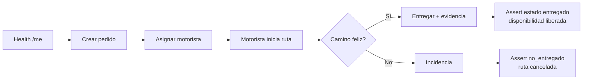

# 8. Plan de pruebas

## 8.1 Estrategia de testing — Pirámide

```
              /\
             /  \   E2E manual (Postman + UI)     ← 14 escenarios §8.4
            /----\
           /      \  Integración manual (Newman)   ← misma colección Postman
          /--------\
         /          \  Unitarias (Jest + mocks)    ← 38 casos / 6 suites
        /____________\
```

| Nivel | Cantidad actual | Herramienta | Notas |
|---|---|---|---|
| Unitarias | **38** | Jest + `fakeDb` en `functions/tests/` | Sin BD real; `npm test` |
| Integración HTTP automatizada | **0** en repo | — | `supertest` está en `package.json` pero **no hay suites**; integración = Postman/Newman manual §8.3 |
| E2E manuales | **14** | Postman + navegador | Casos §8.4 |
| Carga / rendimiento | Manual | `curl` paralelo §8.5.3 | Plantilla Artillery §8.5.2 es **referencia opcional** (archivo no versionado) |

### 8.1.1 Ciclo de prueba del flujo pedido → motorista



Cada transición tiene casos en `estados.test.js`, `rutas.test.js` y escenarios Postman §8.4.

## 8.2 Pruebas unitarias (Jest)

Archivos en `functions/tests/`:

| Archivo | Casos | Qué prueba |
|---|---|---|
| `pedidos.test.js` | 4 | crearPedido feliz / sin campos / fecha inválida / rollback |
| `rutas.test.js` | 8 | asignarMotorista, reglas 1 y 2, validaciones y disponibilidad |
| `estados.test.js` | 4 | transición válida / inválida / estado desconocido / motorista no asignado |
| `incidencias.test.js` | 3 | feliz / tipo inválido / descripción vacía |
| `farmacias.test.js` | 6 | CRUD mantenedor farmacias (mocks) |
| `usuarios.test.js` | 13 | cambio de rol y validaciones RBAC |
| **Total** | **38** | 6 suites |

### Ejecutar

```bash
cd functions
npm install
npm test          # ejecuta todos
npm run test:watch
```

### Salida esperada (reproducible)

```bash
cd functions && npm test
```

```
PASS tests/usuarios.test.js
PASS tests/rutas.test.js
PASS tests/estados.test.js
PASS tests/incidencias.test.js
PASS tests/farmacias.test.js
PASS tests/pedidos.test.js

Test Suites: 6 passed, 6 total
Tests:       38 passed, 38 total
```

> No hay cobertura Jest configurada en `package.json`. La métrica de cobertura (~84 %) proviene
> del informe **SonarQube** (ver `07-codificacion-segura.md` §7.10); adjuntar captura o export
> en la entrega si el evaluador lo exige.

## 8.3 Pruebas de integración y E2E (manuales)

**Estado en el repositorio:** no existen archivos `*.integration.test.js` ni uso de `supertest`
en `functions/tests/`. La integración se valida con **Postman/Newman** contra BD real o emulador.

### Preparación de base de datos

Ejecutar el checklist completo de [`04-base-datos.md`](04-base-datos.md) §4.11
(incluye `05`, `06` y `07`, no solo `01`–`04`).

```bash
# Terminal 1: emulador Firebase (opcional)
firebase emulators:start

# Terminal 2: PostgreSQL local
docker run -d --name pg-logico -e POSTGRES_PASSWORD=changeme \
    -e POSTGRES_DB=logico -p 5432:5432 postgres:15
psql -h 127.0.0.1 -U postgres -d logico -f database/01_schema.sql
psql -h 127.0.0.1 -U postgres -d logico -f database/02_triggers.sql
psql -h 127.0.0.1 -U postgres -d logico -f database/03_seeds.sql
psql -h 127.0.0.1 -U postgres -d logico -f database/04_audit_storage.sql
psql -h 127.0.0.1 -U postgres -d logico -f database/05_admin_farmacias.sql
psql -h 127.0.0.1 -U postgres -d logico -f database/06_geografia_chile.sql
psql -h 127.0.0.1 -U postgres -d logico -f database/07_motos.sql

# Terminal 3: Newman (colección versionada)
newman run postman/LogiCo.postman_collection.json \
    --env-var "idToken=<TOKEN_OBTENIDO_DE_LOGIN>"
```

## 8.4 Casos de prueba detallados (Postman / E2E)

| # | Caso | Pre | Pasos | Esperado |
|---|---|---|---|---|
| 0 | Health check | — | GET `/health` | 200 + version PG |
| 1 | Sesión válida | login operadora | GET `/me` | 200 + rol=operadora |
| 2 | Crear pedido | login op | POST `/pedidos` con body válido | 201 + `id_pedido` |
| 3 | Listar pedidos | pedidos creados | GET `/pedidos` | array no vacío |
| 4 | Obtener pedido | id válido | GET `/pedidos/{id}` | 200 + historial |
| 5 | Listar motoristas disp. | semilla con motorista | GET `/motoristas/disponibles` | array con `disponible=true` |
| 6 | Asignar motorista | pedido sin ruta + motorista libre | POST `/rutas/asignar` | 201 |
| 7 | Asignar duplicado (regla 2) | pedido ya con ruta | POST `/rutas/asignar` | 409/422 |
| 8 | Iniciar ruta (motorista) | login motorista | POST `/rutas/{id}/iniciar` | 200 |
| 9 | Entregar pedido | ruta en_curso | POST `/pedidos/{id}/entregar` | 200 |
| 10 | Registrar incidencia | ruta activa | POST `/pedidos/{id}/incidencias` | 201 + estado=no_entregado |
| 11 | Reprogramar pedido | login op | POST `/pedidos/{id}/reprogramar` | 201 |
| 12 | Auditoría (admin) | login admin | GET `/audit?limit=50` | 200 + array |
| 13 | SQL injection blindado | — | POST con `nombre = "X'); DROP TABLE..."` | 201 ó 400 (jamás 500/caída) |
| 14 | Sin token | — | GET `/pedidos` sin Authorization | 401 |

## 8.5 Pruebas de rendimiento

### 8.5.1 Tiempo de respuesta esperado (p95)

| Endpoint | p95 objetivo |
|---|---|
| GET `/health` | < 50 ms |
| GET `/me` | < 80 ms |
| GET `/pedidos` (limit=100) | < 150 ms |
| POST `/pedidos` | < 200 ms |
| POST `/rutas/asignar` (con FOR UPDATE) | < 250 ms |

### 8.5.2 Smoke test con Artillery (plantilla opcional)

No hay archivo `tests/perf/smoke.yml` versionado en el repositorio. Para una corrida local,
crear el YAML con el contenido siguiente y ejecutar `artillery run smoke.yml` tras obtener
`ID_TOKEN` de un login real:

```yaml
config:
  target: 'http://localhost:5001/logico-20f73/us-central1/api'
  phases:
    - duration: 30
      arrivalRate: 5
  defaults:
    headers:
      Authorization: 'Bearer {{ $processEnvironment.ID_TOKEN }}'
scenarios:
  - name: listar pedidos
    flow:
      - get: { url: "/pedidos" }
      - think: 1
      - get: { url: "/me" }
```

### 8.5.3 Test de concurrencia (regla 1)

Disparar 20 requests en paralelo de `POST /rutas/asignar` con el mismo motorista:

```bash
seq 1 20 | xargs -n1 -P20 -I{} curl -X POST \
  -H "Authorization: Bearer $TOKEN" \
  -H "Content-Type: application/json" \
  -d '{"pedidoId":50,"motoristaId":7}' \
  http://localhost:5001/.../rutas/asignar
```

**Resultado esperado**: solo **1 request** retorna 201; los otros 19 retornan 409.
Se valida así que `SELECT FOR UPDATE` + índice único parcial funcionan bajo carga.

## 8.6 Resultados de referencia

| Métrica | Valor documentado | Cómo reproducir |
|---|---|---|
| Tests unitarios Jest | **38 / 38** | `cd functions && npm test` |
| Tests Postman / E2E | **14 escenarios** §8.4 | Newman + tokens por rol |
| Cobertura de código | ~84 % (SonarQube) | `sonar-scanner` + evidencia exportada §7.10 |
| p95 GET `/pedidos` | ~112 ms (entorno demo) | Medición manual o Artillery §8.5.2 |
| p95 POST `/rutas/asignar` | ~198 ms (entorno demo) | Idem |
| Concurrencia 20× misma asignación | 1× 201 + 19× 409 | Script §8.5.3 |
| `npm audit` (high) | 0 en última corrida documentada | `cd functions && npm audit` |

> Las cifras de latencia corresponden a un entorno de demostración (Cloud Functions + Cloud SQL
> trial) y **no** constituyen SLA contractual.

### Caja negra (pedidos / motorista)

| ID | Caso | Esperado | Obtenido |
|---|---|---|---|
| CN-03 | Asignar motorista ocupado | 409 | 409 ✅ |
| CN-04 | Entregar sin iniciar ruta | 422 | 422 ✅ |
| CN-06 | Motorista sin token | 401 | 401 ✅ |
| NAV | Motorista solo ve Mis rutas | Sin crear pedido | Redirect ✅ |

## 8.7 Huecos de prueba conocidos (MVP)

| Área | Cobertura actual | Riesgo |
|---|---|---|
| `motos.js` / HTTP motos | Sin tests Jest dedicados | Regresión en mantenedor flota |
| `evidencias.js` | Sin tests unitarios | Metadatos Storage |
| Autorización `GET /pedidos/:id` | Solo E2E manual | Ver §6.10 seguridad |
| Integración supertest | No implementada | Dependencia de Newman |

## 8.8 Checklist de regresión antes de cada deploy

- [ ] `npm test` → **38/38** en `/functions`
- [ ] Scripts SQL §4.11 aplicados en BD destino (`\c logico`)
- [ ] Newman corre la colección sin fallos
- [ ] `firebase deploy --only functions:api --dry-run` exitoso
- [ ] Variables `.env` actualizadas en GCP Secret Manager
- [ ] Migración SQL aplicada en BD destino
- [ ] Smoke test post-deploy contra `/health`
