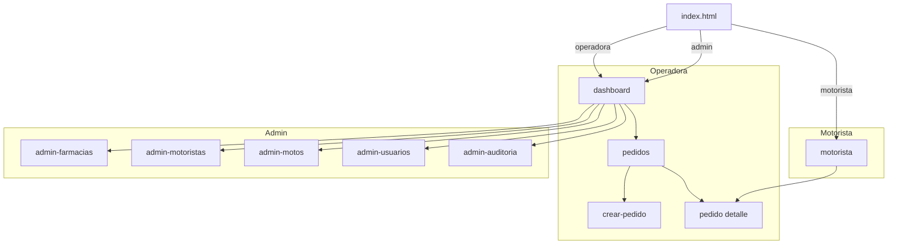
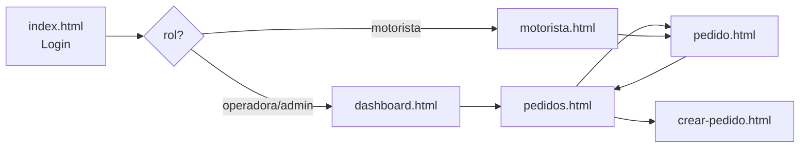
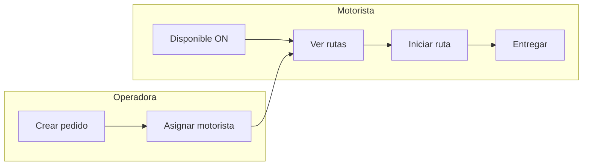

# 9. Prototipo funcional

El prototipo está implementado en HTML + CSS + JavaScript ES Modules.
Es **funcional**, no un mock visual: cada pantalla está cableada a la API real
de Firebase Functions y a PostgreSQL.

## 9.0 Contexto de negocio en la UI

| Rol | Objetivo en pantalla | Pantallas principales |
|---|---|---|
| Operadora | Crear pedidos, asignar motorista, reprogramar | `dashboard`, `pedidos`, `crear-pedido`, `pedido` |
| Motorista | Ver ruta activa, iniciar, entregar o reportar incidencia | `motorista` |
| Admin | Mantenedores + misma visión operativa | `admin-*` + dashboard |

Glosario de estados y limitaciones de acceso API: [`02-arquitectura-4+1.md`](02-arquitectura-4+1.md) §2.0.1
y [`06-seguridad.md`](06-seguridad.md) §6.11. La UI del motorista **no muestra** pedidos ajenos;
la defensa debe distinguir **experiencia de usuario** vs **contrato HTTP** documentado.

## 9.1 Pantallas

| Archivo | Roles | Propósito |
|---|---|---|
| `index.html` | Todos | Login con Firebase Auth |
| `dashboard.html` | operadora, admin | KPIs + últimos pedidos |
| `pedidos.html` | operadora, admin | Listado con filtros por estado |
| `pedido.html` | operadora, admin, motorista (enlace desde su ruta) | Detalle + asignar / reprogramar / incidencia |
| `crear-pedido.html` | operadora, admin | Formulario nuevo pedido |
| `motorista.html` | motorista, admin | Ruta activa + iniciar / entregar / incidencia |
| `admin-farmacias.html` | admin | CRUD farmacias |
| `admin-motoristas.html` | admin | Usuarios motorista + disponibilidad |
| `admin-motos.html` | admin | Flota y asignación patente ↔ motorista |
| `admin-usuarios.html` | admin | Alta usuarios y cambio de rol |
| `admin-auditoria.html` | admin | Consulta `audit_logs` |

### 9.1.1 Mapa de pantallas por rol



### 9.1.2 Matriz de cobertura proceso de negocio → interfaz (3.1.1.1)

Demuestra que el **100 % de los procesos requeridos** tiene interfaz funcional cableada a la API.

| # | Proceso de negocio | Pantalla(s) | Endpoint(s) | Rol |
|---|---|---|---|---|
| P1 | Autenticación y enrutado por rol | `index.html` | `GET /me` | Todos |
| P2 | Visión global (KPIs, últimos pedidos) | `dashboard.html` | `GET /pedidos` | operadora, admin |
| P3 | Crear pedido | `crear-pedido.html` | `POST /pedidos` | operadora, admin |
| P4 | Listar / filtrar pedidos | `pedidos.html` | `GET /pedidos?estado=` | operadora, admin |
| P5 | Ver detalle + historial | `pedido.html` | `GET /pedidos/:id` | operadora, admin, motorista (asignado) |
| P6 | Asignar motorista | `pedido.html` | `GET /motoristas/disponibles`, `POST /rutas/asignar` | operadora, admin |
| P7 | Reprogramar pedido | `pedido.html` | `POST /pedidos/:id/reprogramar` | operadora, admin |
| P8 | Marcar disponibilidad | `motorista.html` | `PUT /motoristas/:id/disponibilidad` | motorista |
| P9 | Consultar mis rutas | `motorista.html` | `GET /motoristas/:id/rutas` | motorista |
| P10 | Ver moto asignada | `motorista.html` | `GET /motoristas/:id/moto` | motorista |
| P11 | Iniciar ruta | `motorista.html` | `POST /rutas/:id/iniciar` | motorista |
| P12 | Confirmar entrega (+ evidencia) | `motorista.html` | `POST /pedidos/:id/entregar`, `POST /pedidos/:id/evidencias` | motorista |
| P13 | Registrar incidencia | `pedido.html`, `motorista.html` | `POST /pedidos/:id/incidencias` | motorista, operadora |
| P14 | Mantenedor farmacias | `admin-farmacias.html` | CRUD `/farmacias` | admin |
| P15 | Mantenedor flota motos | `admin-motos.html` | CRUD `/motos` | admin |
| P16 | Gestión usuarios y roles | `admin-usuarios.html` | `/usuarios`, cambio de rol | admin |
| P17 | Gestión motoristas | `admin-motoristas.html` | `/usuarios?rol=motorista` | admin |
| P18 | Auditoría | `admin-auditoria.html` | `GET /audit`, `/auditoria` | admin |

**Cobertura: 18/18 procesos = 100 %.** Ningún proceso del backlog (`01-metodologia-scrum.md` §1.5) queda sin interfaz.

## 9.2 Sistema de diseño

- **Tipografía**: Inter (system-ui fallback).
- **Paleta**: tokens CSS en `public/css/styles.css` (`:root`):

| Token | Valor | Uso |
|---|---|---|
| `--primary` | `#1d4ed8` | Acciones primarias, enlaces |
| `--primary-dark` | `#1e3a8a` | Sidebar, encabezados |
| `--primary-light` | `#3b82f6` | Hover, foco |
| `--success` / `--warning` / `--danger` / `--info` | verde / ámbar / rojo / cian | Estados y feedback |
| `--bg` / `--card` / `--border` / `--muted` | grises slate | Superficies y texto secundario |

- **Componentes reutilizables**: `card`, `kpi`, `badge` por estado, `table`, `modal`, `toast`, `btn`/`btn-danger`/`btn-success`.
- **Consistencia**: todas las pantallas comparten un único `styles.css` y el mismo patrón `shell + sidebar + main`, garantizando coherencia visual (criterio 3.1.1.2).
- **Iconografía**: símbolos Unicode para mantener cero dependencias y carga instantánea.
- **Accesibilidad**: `lang="es"`, `viewport` responsive, contraste AA en texto sobre `--primary-dark`, foco visible en formularios.

### Estados visuales con badges semánticos

| Estado | Color de badge |
|---|---|
| `retiro_receta` | celeste suave |
| `retiro_pedido` | ámbar |
| `en_ruta` | azul |
| `entregado` | verde |
| `no_entregado` | rojo |
| `reprogramado` | morado |

## 9.3 Diseño responsive

- **Desktop** (`> 900 px`): grid de sidebar 240 px + main.
- **Tablet** (`< 900 px`): sidebar colapsa a top bar; grids 3 col → 1 col.
- **Mobile** (`< 700 px`): formularios `two` se vuelven 1 columna; modales fullscreen.

```css
.shell { grid-template-columns: 240px 1fr; }
@media (max-width: 900px) {
    .shell { grid-template-columns: 1fr; }
    .grid.cols-3, .grid.cols-2 { grid-template-columns: 1fr; }
}
```

## 9.4 Flujo de navegación



## 9.5 Componentes reutilizables (JS modules)

```
public/js/
├── config.js          → window.LOGICO_CONFIG (Firebase + apiBase)
├── firebase-init.js   → app, auth, storage, apiFetch, requireSession,
│                        uploadEvidencia, toast, fmtDate, badgeEstado, escapeHtml
└── sidebar.js         → renderSidebar(activePath, me) según rol
```

## 9.6 Captura de comportamiento

Cada pantalla:
1. Monta `firebase-init` y espera `requireSession()`.
2. Llama a `apiFetch(...)` con el ID Token automático.
3. Renderiza datos. Errores se muestran con `toast(...)`.

Ejemplo (`dashboard.html`):

```js
const me = await requireSession();          // redirige si no logueado
const pedidos = await apiFetch('/pedidos?limit=200');
document.getElementById('kpi-activos').textContent =
    pedidos.filter(p => p.activo && p.estado_actual !== 'entregado').length;
```

## 9.7 Cómo levantarlo localmente

```bash
firebase emulators:start
# Hosting → http://localhost:5000
# Login con admin@logico.app / Admin123! (después de crear usuarios en Auth emulator)
```

## 9.8 Flujos pedidos y motorista (manual operativo)

**URL:** https://logico-20f73.web.app

### Operadora / admin — pedidos

1. Login → **Pedidos** → **Crear pedido** (`POST /api/pedidos`).
2. Abrir detalle → **Asignar motorista** (`GET /motoristas/disponibles`, `POST /rutas/asignar`).

### Motorista

1. Login → redirección a **Mis rutas** (`motorista.html`).
2. Activar **Disponible** (`PUT /motoristas/{id}/disponibilidad`).
3. Ver **moto asignada** (`GET /motoristas/{id}/moto`) — la asigna el admin en **Motos**.
4. Con ruta activa: **Iniciar ruta** → **Marcar entregado** (o incidencia).



## 9.9 Roadmap visual (post-MVP)

| Mejora | Prioridad |
|---|---|
| Mapa Leaflet/Maps con tracking del motorista | Media |
| Notificaciones push (FCM) al asignar pedido | Media |
| Drag & drop de evidencias | Baja |
| Modo oscuro | Baja |
| Exportar reportes a CSV/PDF | Media |
| PWA con service worker offline-first | Media |
