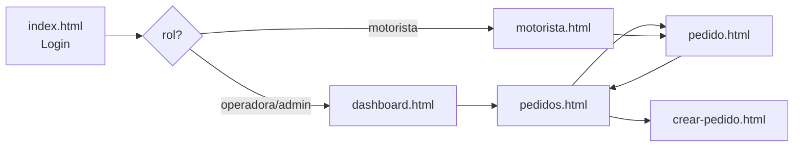

# 9. Prototipo funcional

El prototipo está implementado en HTML + CSS + JavaScript ES Modules.
Es **funcional**, no un mock visual: cada pantalla está cableada a la API real
de Firebase Functions y a PostgreSQL.

## 9.1 Pantallas

| Archivo | Roles | Propósito |
|---|---|---|
| `index.html` | Todos | Login con Firebase Auth |
| `dashboard.html` | operadora, admin | KPIs + últimos pedidos |
| `pedidos.html` | operadora, admin | Listado con filtros por estado |
| `pedido.html` | Todos | Detalle + asignar / reprogramar / incidencia |
| `crear-pedido.html` | operadora, admin | Formulario nuevo pedido |
| `motorista.html` | motorista, admin | Ruta activa + iniciar / entregar / incidencia |

## 9.2 Sistema de diseño

- **Tipografía**: Inter (system-ui fallback).
- **Paleta**: azul corporativo (`#1d4ed8` / `#1e3a8a` / `#3b82f6`) + escala neutra slate.
- **Componentes**: card, kpi, badge por estado, tabla, modal.
- **Iconografía**: símbolos Unicode para mantener cero dependencias.

### Estados visuales con badges semánticos

| Estado | Color de badge |
|---|---|
| `retiro_receta` | celeste suave |
| `retiro_pedido` | ámbar |
| `en_ruta` | azul |
| `entregado` | verde |
| `no_entregado` | rojo |
| `reprogramado` | morado |

## 9.3 Diseño responsive

- **Desktop** (`> 900 px`): grid de sidebar 240 px + main.
- **Tablet** (`< 900 px`): sidebar colapsa a top bar; grids 3 col → 1 col.
- **Mobile** (`< 700 px`): formularios `two` se vuelven 1 columna; modales fullscreen.

```css
.shell { grid-template-columns: 240px 1fr; }
@media (max-width: 900px) {
    .shell { grid-template-columns: 1fr; }
    .grid.cols-3, .grid.cols-2 { grid-template-columns: 1fr; }
}
```

## 9.4 Flujo de navegación



## 9.5 Componentes reutilizables (JS modules)

```
public/js/
├── config.js          → window.LOGICO_CONFIG (Firebase + apiBase)
├── firebase-init.js   → app, auth, storage, apiFetch, requireSession,
│                        uploadEvidencia, toast, fmtDate, badgeEstado, escapeHtml
└── sidebar.js         → renderSidebar(activePath, me) según rol
```

## 9.6 Captura de comportamiento

Cada pantalla:
1. Monta `firebase-init` y espera `requireSession()`.
2. Llama a `apiFetch(...)` con el ID Token automático.
3. Renderiza datos. Errores se muestran con `toast(...)`.

Ejemplo (`dashboard.html`):

```js
const me = await requireSession();          // redirige si no logueado
const pedidos = await apiFetch('/pedidos?limit=200');
document.getElementById('kpi-activos').textContent =
    pedidos.filter(p => p.activo && p.estado_actual !== 'entregado').length;
```

## 9.7 Cómo levantarlo localmente

```bash
firebase emulators:start
# Hosting → http://localhost:5000
# Login con admin@logico.app / Admin123! (después de crear usuarios en Auth emulator)
```

## 9.8 Roadmap visual (post-MVP)

| Mejora | Prioridad |
|---|---|
| Mapa Leaflet/Maps con tracking del motorista | Media |
| Notificaciones push (FCM) al asignar pedido | Media |
| Drag & drop de evidencias | Baja |
| Modo oscuro | Baja |
| Exportar reportes a CSV/PDF | Media |
| PWA con service worker offline-first | Media |
