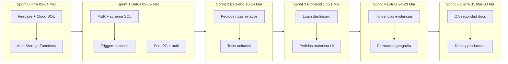

# Carta Gantt — LogiCo (28 días hábiles)

Cronograma del proyecto en **6 sprints** (28 días hábiles). El diagrama siguiente usa `flowchart`
porque el preview de Cursor/VS Code **no renderiza** diagramas `gantt`.

## Diagrama cronológico (renderiza en preview)

> Misma versión en [`gantt-logico.mmd`](gantt-logico.mmd) (abrir con preview Mermaid).

## Tabla resumen por sprint

| Sprint | Fechas | Objetivo | Entregables clave |
|:---:|---|---|---|
| **0** | 02–04 Mar | Infraestructura | Firebase, Cloud SQL, Auth, Functions |
| **1** | 05–09 Mar | Modelo de datos | `01_schema.sql`, triggers, seeds, `auth.js` |
| **2** | 10–14 Mar | Backend núcleo | Pedidos, rutas, estados, tests Jest |
| **3** | 17–21 Mar | Frontend | Login, dashboard, pedidos, vista motorista |
| **4** | 24–28 Mar | Extras | Incidencias, evidencias, farmacias, geografía |
| **5** | 31 Mar – 03 Abr | Cierre | QA, hardening seguridad, docs, deploy |

## Detalle de tareas por sprint

| Sprint | Tarea | Duración | Dependencia |
|---|---|:---:|---|
| 0 | Firebase + Cloud SQL | 2 d | — |
| 0 | Auth / Storage / Functions | 1 d | anterior |
| 1 | MER + schema SQL | 2 d | Sprint 0 |
| 1 | Triggers + seeds | 2 d | schema |
| 1 | Pool PG + auth middleware | 2 d | Sprint 0 |
| 2 | Pedidos + rutas + estados | 4 d | Sprint 1 |
| 2 | Tests unitarios core | 1 d | backend |
| 3 | Login + dashboard | 2 d | Sprint 2 |
| 3 | Pedidos + motorista UI | 3 d | login |
| 4 | Incidencias + evidencias | 3 d | Sprint 3 |
| 4 | Farmacias + geografía | 2 d | incidencias |
| 5 | QA + seguridad + docs | 3 d | Sprint 4 |
| 5 | Deploy producción | 2 d | QA |

## Gantt clásico (solo herramientas externas)

El tipo `gantt` de Mermaid **no funciona** en el preview integrado de Cursor/VS Code.
Para ver barras temporales:

1. Copiar el contenido de [`gantt-logico-gantt.txt`](gantt-logico-gantt.txt)
2. Pegar en [mermaid.live](https://mermaid.live) o exportar desde GitHub al subir el repo
