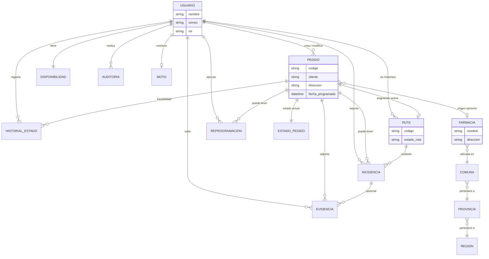
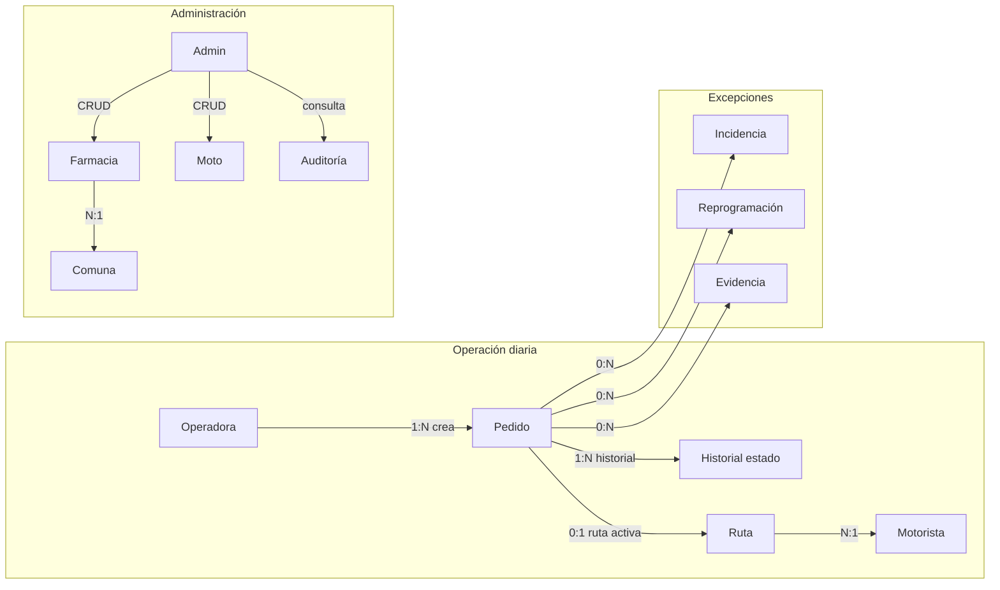
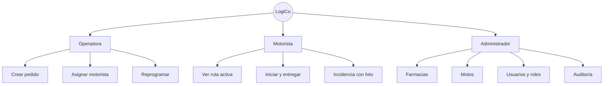

# 01 — Modelo conceptual

El **modelo conceptual** describe el dominio de negocio **sin detalles de implementación**
(tipos SQL, índices ni nombres de columnas técnicas). Representa *qué* existe en el mundo
real que LogiCo gestiona y *cómo* se relacionan las entidades.

## 1.1 Alcance del dominio

| Entidad | Descripción en el negocio |
|---|---|
| **Usuario** | Persona del sistema: operadora (crea pedidos), motorista (reparte) o administrador (mantenedores) |
| **Pedido** | Solicitud de entrega a un cliente final (dirección, fecha, detalle) |
| **Estado de pedido** | Etapa del ciclo logístico (retiro, en ruta, entregado, etc.) |
| **Historial de estado** | Registro inmutable de cada cambio de estado de un pedido |
| **Ruta** | Asignación de un motorista a un pedido para ejecutar la entrega |
| **Disponibilidad motorista** | Indica si un motorista puede recibir una nueva ruta |
| **Incidencia** | Evento que impide completar la entrega según lo planificado |
| **Reprogramación** | Cambio de fecha programada de un pedido |
| **Evidencia** | Prueba documental de entrega o incidencia (foto/archivo) |
| **Farmacia** | Punto de origen opcional del pedido |
| **Moto** | Vehículo de la flota asignado a un motorista |
| **Región / Provincia / Comuna** | Jerarquía geográfica para ubicar farmacias |
| **Auditoría** | Registro de acciones críticas realizadas por administradores |

## 1.2 Diagrama conceptual (Mermaid)

## 1.3 Relaciones de negocio (cardinalidades)

## 1.4 Reglas de negocio conceptuales

| ID | Regla | Entidades involucradas |
|---|---|---|
| RN-01 | Solo operadora o admin puede crear un pedido | Usuario, Pedido |
| RN-02 | Un pedido tiene **como máximo una ruta activa** a la vez | Pedido, Ruta |
| RN-03 | Un motorista tiene **como máximo una ruta activa** a la vez | Usuario, Ruta |
| RN-04 | El estado del pedido se cambia **solo** registrando historial | Pedido, Historial |
| RN-05 | Estados terminales (`entregado`) no vuelven atrás sin reprogramación | Pedido, Estado |
| RN-06 | La farmacia es **opcional** en un pedido | Pedido, Farmacia |
| RN-07 | Toda acción crítica de admin queda en auditoría | Usuario, Auditoría |
| RN-08 | La evidencia fotográfica complementa entrega o incidencia | Evidencia, Pedido |

## 1.5 Mejoras respecto a versión anterior

| Mejora | Descripción |
|---|---|
| Entidades admin | Incorporación de **Farmacia**, **Moto**, **Auditoría** y geografía Chile |
| Trazabilidad | Separación explícita **Estado actual** vs **Historial append-only** |
| Flota | Entidad **Moto** vinculada a motorista |
| Ubicación | Reemplazo de «ciudad libre» por jerarquía **Región → Provincia → Comuna** |
| Evidencias | Entidad explícita ligada a Storage (no estructurado) |

## 1.6 Actores y su vista del modelo

