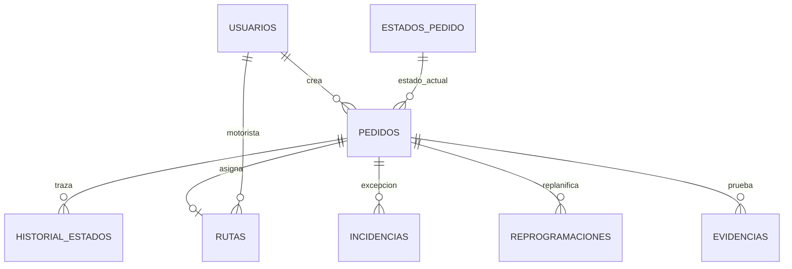
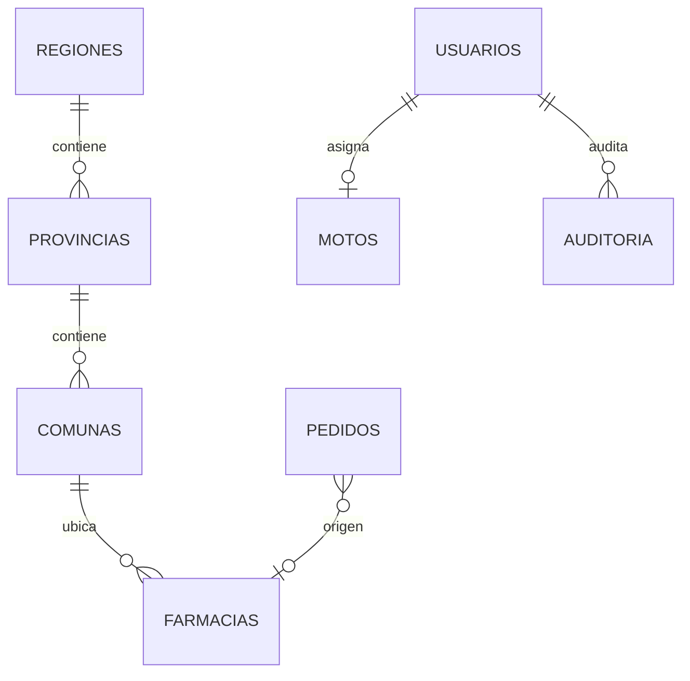
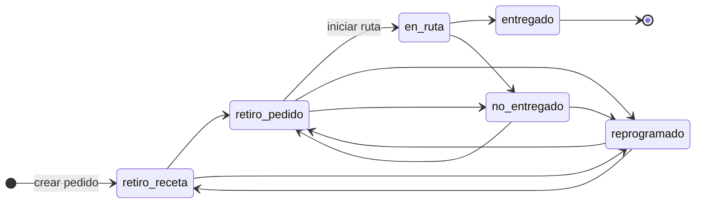
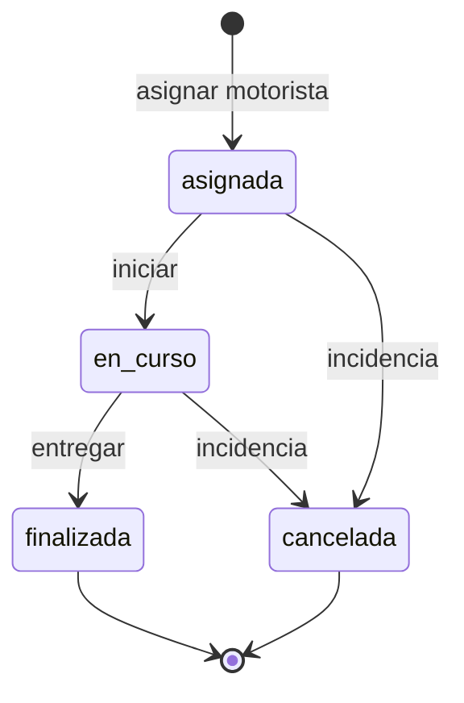

# 02 — Modelo lógico

El **modelo lógico** traduce el conceptual a un esquema relacional: entidades con
**atributos**, **tipos lógicos**, **claves primarias (PK)**, **foráneas (FK)** y
**cardinalidades**. Corresponde al diseño previo a la implementación en PostgreSQL.

## 2.1 Notación

| Símbolo | Significado |
|---|---|
| **PK** | Clave primaria |
| **FK** | Clave foránea |
| **UQ** | Restricción UNIQUE |
| **CK** | CHECK (dominio de valores) |
| `1` / `N` | Cardinalidad uno / muchos |

## 2.2 Diagrama lógico completo (Mermaid)

```mermaid
erDiagram
    USUARIOS {
        bigint id_usuario PK
        varchar firebase_uid UQ
        varchar nombre
        varchar apellido
        citext correo UQ
        varchar contrasena
        varchar rol CK
        boolean activo
        boolean es_admin_principal
        timestamptz fecha_creacion
    }

    ESTADOS_PEDIDO {
        int id_estado PK
        varchar nombre_estado UQ CK
    }

    PEDIDOS {
        bigint id_pedido PK
        varchar codigo_pedido UQ
        varchar nombre_cliente
        varchar direccion_entrega
        varchar telefono_cliente
        text detalle_pedido
        text observacion
        timestamptz fecha_creacion
        timestamptz fecha_programada
        int estado_actual_id FK
        bigint operadora_crea_id FK
        bigint operadora_modifica_id FK
        bigint farmacia_id FK
        boolean activo
    }

    HISTORIAL_ESTADOS {
        bigint id_historial PK
        bigint pedido_id FK
        int estado_id FK
        timestamptz fecha_hora
        text comentario
        bigint usuario_id FK
    }

    RUTAS {
        bigint id_ruta PK
        varchar codigo_ruta UQ
        bigint pedido_id FK
        bigint motorista_id FK
        timestamptz fecha_asignacion
        timestamptz fecha_inicio
        timestamptz fecha_fin
        varchar estado_ruta CK
    }

    DISPONIBILIDAD_MOTORISTA {
        bigint id_disponibilidad PK
        bigint motorista_id FK UQ
        boolean disponible
        timestamptz fecha_actualizacion
    }

    INCIDENCIAS {
        bigint id_incidencia PK
        bigint pedido_id FK
        bigint ruta_id FK
        varchar tipo_incidencia CK
        text descripcion
        timestamptz fecha_hora
        bigint usuario_id FK
    }

    REPROGRAMACIONES {
        bigint id_reprogramacion PK
        bigint pedido_id FK
        timestamptz fecha_anterior
        timestamptz fecha_nueva CK
        text motivo
        timestamptz fecha_registro
        bigint usuario_id FK
    }

    EVIDENCIAS {
        bigint id_evidencia PK
        bigint pedido_id FK
        bigint incidencia_id FK
        varchar tipo CK
        varchar storage_path
        text download_url
        bigint subido_por FK
        timestamptz fecha_subida
    }

    AUDIT_LOGS {
        bigint id_log PK
        timestamptz fecha_hora
        bigint usuario_id FK
        varchar accion
        jsonb payload
        varchar nivel CK
    }

    AUDITORIA {
        bigint id_auditoria PK
        bigint usuario_id FK
        varchar accion
        varchar entidad_afectada
        bigint id_entidad
        timestamptz fecha_hora
        text detalle
        boolean exito
        inet ip
    }

    FARMACIAS {
        bigint id_farmacia PK
        varchar nombre
        varchar direccion
        varchar telefono
        int comuna_id FK
        boolean activa
        timestamptz fecha_creacion
    }

    MOTOS {
        bigint id_moto PK
        varchar patente UQ
        varchar marca
        varchar modelo
        int anio
        bigint motorista_id FK
        boolean activa
        timestamptz fecha_creacion
    }

    REGIONES {
        int id_region PK
        varchar nombre UQ
        varchar codigo_romano UQ
        int orden UQ
    }

    PROVINCIAS {
        int id_provincia PK
        int region_id FK
        varchar nombre
    }

    COMUNAS {
        int id_comuna PK
        int provincia_id FK
        varchar nombre
    }

    USUARIOS ||--o{ PEDIDOS : "operadora_crea_id"
    USUARIOS ||--o{ PEDIDOS : "operadora_modifica_id"
    USUARIOS ||--o{ HISTORIAL_ESTADOS : "usuario_id"
    USUARIOS ||--o{ RUTAS : "motorista_id"
    USUARIOS ||--|| DISPONIBILIDAD_MOTORISTA : "motorista_id"
    USUARIOS ||--o{ INCIDENCIAS : "usuario_id"
    USUARIOS ||--o{ REPROGRAMACIONES : "usuario_id"
    USUARIOS ||--o{ EVIDENCIAS : "subido_por"
    USUARIOS ||--o{ AUDIT_LOGS : "usuario_id"
    USUARIOS ||--o{ AUDITORIA : "usuario_id"
    USUARIOS ||--o| MOTOS : "motorista_id"

    ESTADOS_PEDIDO ||--o{ PEDIDOS : "estado_actual_id"
    ESTADOS_PEDIDO ||--o{ HISTORIAL_ESTADOS : "estado_id"

    PEDIDOS ||--o{ HISTORIAL_ESTADOS : "pedido_id"
    PEDIDOS ||--o| RUTAS : "pedido_id"
    PEDIDOS ||--o{ INCIDENCIAS : "pedido_id"
    PEDIDOS ||--o{ REPROGRAMACIONES : "pedido_id"
    PEDIDOS ||--o{ EVIDENCIAS : "pedido_id"
    PEDIDOS }o--o| FARMACIAS : "farmacia_id"

    RUTAS ||--o{ INCIDENCIAS : "ruta_id"
    INCIDENCIAS ||--o{ EVIDENCIAS : "incidencia_id"

    REGIONES ||--o{ PROVINCIAS : "region_id"
    PROVINCIAS ||--o{ COMUNAS : "provincia_id"
    COMUNAS ||--o{ FARMACIAS : "comuna_id"
```

## 2.3 Submodelo núcleo logístico



## 2.4 Submodelo administración y geografía



## 2.5 Máquina de estados lógica del pedido

Los valores de `estados_pedido.nombre_estado` deben coincidir con la aplicación
(`functions/src/estados.js`).



## 2.6 Máquina de estados lógica de la ruta



## 2.7 Normalización (1FN – 3FN)

| Forma | Cumplimiento | Ejemplo en LogiCo |
|---|---|---|
| **1FN** | Atributos atómicos | Estados en catálogo `estados_pedido`, no listas en columnas |
| **2FN** | Dependencia total de PK | `historial_estados.comentario` depende de `id_historial` |
| **3FN** | Sin transitividad entre no claves | Comuna determina provincia/región vía FK, no duplicadas en `farmacias` |

**Desnormalización controlada:** `pedidos.estado_actual_id` replica el último estado para
consultas rápidas; se sincroniza con trigger `trg_sync_estado_pedido` desde `historial_estados`.

## 2.8 Índices lógicos de reglas de negocio

Estos índices **no son PK** pero implementan reglas en la capa física:

| Índice lógico | Regla |
|---|---|
| `uq_motorista_ruta_activa` | Máximo 1 ruta activa por motorista |
| `uq_pedido_ruta_activa` | Máximo 1 ruta activa por pedido |
| `uq_pedidos_no_duplicado` | Evita pedidos activos duplicados (cliente + fecha + detalle) |
| `uq_unico_admin_principal` | Solo un admin principal en el sistema |
| `uq_moto_activa_por_motorista` | Una moto activa por motorista |

## 2.9 Correspondencia conceptual → lógico

| Conceptual | Tabla lógica |
|---|---|
| Usuario | `usuarios` |
| Pedido | `pedidos` |
| Estado de pedido | `estados_pedido` + `historial_estados` |
| Ruta | `rutas` |
| Disponibilidad | `disponibilidad_motorista` |
| Incidencia | `incidencias` |
| Reprogramación | `reprogramaciones` |
| Evidencia | `evidencias` (+ archivo en Storage) |
| Farmacia | `farmacias` |
| Moto | `motos` |
| Geografía | `regiones`, `provincias`, `comunas` |
| Auditoría admin | `auditoria` |
| Auditoría técnica | `audit_logs` |
