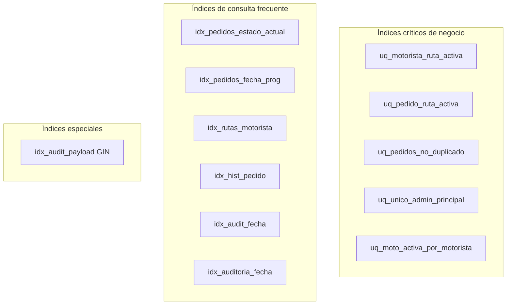

# 03 — Diccionario de datos

Diccionario completo del modelo LogiCo en PostgreSQL. Para cada tabla se documentan:
columnas, tipos, nulabilidad, **PK**, **FK**, **UNIQUE**, **CHECK** e **índices**.

> **Total:** 16 tablas de negocio + 3 catálogos geográficos = **19 tablas**.

---

## Leyenda

| Columna del diccionario | Significado |
|---|---|
| **PK** | Clave primaria |
| **FK →** | Referencia foránea |
| **UQ** | Valor único en la tabla |
| **CK** | Dominio restringido por CHECK |
| **IX** | Índice secundario (no único) |
| **UIX** | Índice único (incluye parciales) |

---

## 3.1 `usuarios`

Personas del sistema con rol operativo o administrativo.

| Columna | Tipo | Null | Default | PK/FK/UQ/CK | IX / UIX | Descripción |
|---|---|:---:|---|---|---|---|
| `id_usuario` | BIGSERIAL | NO | auto | **PK** | | Identificador interno |
| `firebase_uid` | VARCHAR(128) | SI | | **UQ** | | UID Firebase Auth |
| `nombre` | VARCHAR(80) | NO | | | | Nombre |
| `apellido` | VARCHAR(80) | NO | | | | Apellido |
| `correo` | CITEXT | NO | | **UQ** | | Email case-insensitive |
| `contrasena` | VARCHAR(255) | NO | | | | Hash bcrypt (fallback) |
| `rol` | VARCHAR(20) | NO | | **CK** `operadora\|motorista\|admin` | **IX** `idx_usuarios_rol` | Rol RBAC |
| `activo` | BOOLEAN | NO | TRUE | | **IX** `idx_usuarios_activo` | Soft delete lógico |
| `es_admin_principal` | BOOLEAN | NO | FALSE | **CK** solo si `rol=admin` | **UIX** `uq_unico_admin_principal` (parcial) | Un solo admin principal |
| `fecha_creacion` | TIMESTAMPTZ | NO | NOW() | | | Alta del usuario |

**Referenciada por:** `pedidos`, `historial_estados`, `rutas`, `disponibilidad_motorista`, `incidencias`, `reprogramaciones`, `evidencias`, `audit_logs`, `auditoria`, `motos`.

---

## 3.2 `estados_pedido`

Catálogo fijo de estados del ciclo de vida del pedido.

| Columna | Tipo | Null | PK/FK/UQ/CK | Descripción |
|---|---|:---:|---|---|
| `id_estado` | SERIAL | NO | **PK** | ID numérico |
| `nombre_estado` | VARCHAR(40) | NO | **UQ**, **CK** (6 valores) | Nombre canónico del estado |

**Valores CK:** `retiro_receta`, `en_ruta`, `entregado`, `no_entregado`, `reprogramado`, `retiro_pedido`.

**Referenciada por:** `pedidos.estado_actual_id`, `historial_estados.estado_id`.

---

## 3.3 `pedidos`

Entidad central del reparto.

| Columna | Tipo | Null | Default | PK/FK/UQ/CK | IX / UIX | Descripción |
|---|---|:---:|---|---|---|---|
| `id_pedido` | BIGSERIAL | NO | | **PK** | | |
| `codigo_pedido` | VARCHAR(30) | NO | | **UQ** | | Código humano PED-XXX |
| `nombre_cliente` | VARCHAR(120) | NO | | | | |
| `direccion_entrega` | VARCHAR(255) | NO | | | | |
| `telefono_cliente` | VARCHAR(30) | NO | | | | |
| `detalle_pedido` | TEXT | NO | | | | |
| `observacion` | TEXT | SI | | | | |
| `fecha_creacion` | TIMESTAMPTZ | NO | NOW() | | | |
| `fecha_programada` | TIMESTAMPTZ | NO | | | **IX** `idx_pedidos_fecha_prog` | Fecha objetivo entrega |
| `estado_actual_id` | INTEGER | NO | | **FK → estados_pedido** RESTRICT | **IX** `idx_pedidos_estado_actual` | Estado denormalizado |
| `operadora_crea_id` | BIGINT | NO | | **FK → usuarios** RESTRICT | **IX** `idx_pedidos_operadora` | Creador |
| `operadora_modifica_id` | BIGINT | SI | | **FK → usuarios** SET NULL | | Último editor |
| `farmacia_id` | BIGINT | SI | | **FK → farmacias** SET NULL | **IX** `idx_pedidos_farmacia` | Origen opcional |
| `activo` | BOOLEAN | NO | TRUE | | **IX** `idx_pedidos_activo` | Soft delete |

**UIX parcial:** `uq_pedidos_no_duplicado` ON `(nombre_cliente, telefono_cliente, fecha_programada, md5(detalle_pedido)) WHERE activo = TRUE`.

---

## 3.4 `historial_estados`

Trazabilidad **append-only** de cambios de estado.

| Columna | Tipo | Null | PK/FK | IX | Descripción |
|---|---|:---:|---|---|---|
| `id_historial` | BIGSERIAL | NO | **PK** | | |
| `pedido_id` | BIGINT | NO | **FK → pedidos** CASCADE | **IX** `idx_hist_pedido` | |
| `estado_id` | INTEGER | NO | **FK → estados_pedido** RESTRICT | | |
| `fecha_hora` | TIMESTAMPTZ | NO | | **IX** `idx_hist_fecha` DESC | Momento del cambio |
| `comentario` | TEXT | SI | | | |
| `usuario_id` | BIGINT | NO | **FK → usuarios** RESTRICT | | Actor del cambio |

---

## 3.5 `rutas`

Asignación pedido ↔ motorista.

| Columna | Tipo | Null | Default | PK/FK/CK | IX / UIX | Descripción |
|---|---|:---:|---|---|---|---|
| `id_ruta` | BIGSERIAL | NO | | **PK** | | |
| `codigo_ruta` | VARCHAR(30) | NO | | **UQ** | | Código RUT-XXX |
| `pedido_id` | BIGINT | NO | | **FK → pedidos** CASCADE | **UIX** `uq_pedido_ruta_activa` (parcial) | |
| `motorista_id` | BIGINT | NO | | **FK → usuarios** RESTRICT | **UIX** `uq_motorista_ruta_activa` (parcial), **IX** `idx_rutas_motorista` | |
| `fecha_asignacion` | TIMESTAMPTZ | NO | NOW() | | | |
| `fecha_inicio` | TIMESTAMPTZ | SI | | | | Inicio de ruta |
| `fecha_fin` | TIMESTAMPTZ | SI | | | | Cierre |
| `estado_ruta` | VARCHAR(20) | NO | `asignada` | **CK** 4 valores | **IX** `idx_rutas_estado` | asignada/en_curso/finalizada/cancelada |

**UIX parciales:** activas = `estado_ruta IN ('asignada','en_curso')`.

---

## 3.6 `disponibilidad_motorista`

Flag operativo por motorista (1:1).

| Columna | Tipo | Null | PK/FK/UQ | IX | Descripción |
|---|---|:---:|---|---|---|
| `id_disponibilidad` | BIGSERIAL | NO | **PK** | | |
| `motorista_id` | BIGINT | NO | **FK → usuarios** CASCADE, **UQ** | **IX** `idx_disp_motorista` | Un registro por motorista |
| `disponible` | BOOLEAN | NO | TRUE | | |
| `fecha_actualizacion` | TIMESTAMPTZ | NO | NOW() | | |

---

## 3.7 `incidencias`

Eventos que impiden la entrega planificada.

| Columna | Tipo | Null | PK/FK/CK | IX | Descripción |
|---|---|:---:|---|---|---|
| `id_incidencia` | BIGSERIAL | NO | **PK** | | |
| `pedido_id` | BIGINT | NO | **FK → pedidos** CASCADE | **IX** `idx_inc_pedido` | |
| `ruta_id` | BIGINT | SI | **FK → rutas** SET NULL | **IX** `idx_inc_ruta` | |
| `tipo_incidencia` | VARCHAR(40) | NO | **CK** 6 tipos | | |
| `descripcion` | TEXT | NO | | | |
| `fecha_hora` | TIMESTAMPTZ | NO | NOW() | **IX** `idx_inc_fecha` DESC | |
| `usuario_id` | BIGINT | NO | **FK → usuarios** RESTRICT | | Reportero |

---

## 3.8 `reprogramaciones`

Cambios de fecha programada.

| Columna | Tipo | Null | PK/FK/CK | IX | Descripción |
|---|---|:---:|---|---|---|
| `id_reprogramacion` | BIGSERIAL | NO | **PK** | | |
| `pedido_id` | BIGINT | NO | **FK → pedidos** CASCADE | **IX** `idx_rep_pedido` | |
| `fecha_anterior` | TIMESTAMPTZ | NO | | | |
| `fecha_nueva` | TIMESTAMPTZ | NO | **CK** `fecha_nueva > fecha_anterior` | | |
| `motivo` | TEXT | NO | | | |
| `fecha_registro` | TIMESTAMPTZ | NO | NOW() | | |
| `usuario_id` | BIGINT | NO | **FK → usuarios** RESTRICT | | |

---

## 3.9 `evidencias`

Metadatos de archivos en Firebase Storage.

| Columna | Tipo | Null | PK/FK/CK | IX | Descripción |
|---|---|:---:|---|---|---|
| `id_evidencia` | BIGSERIAL | NO | **PK** | | |
| `pedido_id` | BIGINT | NO | **FK → pedidos** CASCADE | **IX** `idx_ev_pedido` | |
| `incidencia_id` | BIGINT | SI | **FK → incidencias** SET NULL | **IX** `idx_ev_incidencia` | |
| `tipo` | VARCHAR(20) | NO | **CK** entrega/incidencia/firma/otro | **IX** `idx_ev_tipo` | |
| `storage_path` | VARCHAR(500) | NO | | | Ruta en bucket |
| `download_url` | TEXT | SI | | | URL firmada/pública |
| `mime_type` | VARCHAR(60) | SI | | | |
| `tamano_bytes` | BIGINT | SI | | | |
| `subido_por` | BIGINT | NO | **FK → usuarios** RESTRICT | | |
| `fecha_subida` | TIMESTAMPTZ | NO | NOW() | | |

---

## 3.10 `audit_logs`

Auditoría técnica semi-estructurada (JSONB).

| Columna | Tipo | Null | PK/FK/CK | IX | Descripción |
|---|---|:---:|---|---|---|
| `id_log` | BIGSERIAL | NO | **PK** | | |
| `fecha_hora` | TIMESTAMPTZ | NO | NOW() | **IX** `idx_audit_fecha` DESC | |
| `usuario_id` | BIGINT | SI | **FK → usuarios** SET NULL | | |
| `firebase_uid` | VARCHAR(128) | SI | | | |
| `accion` | VARCHAR(60) | NO | | **IX** `idx_audit_accion` | |
| `entidad` | VARCHAR(40) | SI | | **IX** `idx_audit_entidad` (compuesto) | |
| `entidad_id` | BIGINT | SI | | | |
| `ip` | INET | SI | | | |
| `user_agent` | TEXT | SI | | | |
| `payload` | JSONB | SI | | **GIN** `idx_audit_payload` | Datos flexibles |
| `nivel` | VARCHAR(10) | NO | INFO | **CK**, **IX** `idx_audit_nivel` | INFO/WARN/ERROR/SECURITY |

---

## 3.11 `farmacias`

Puntos de origen / despacho.

| Columna | Tipo | Null | PK/FK | IX | Descripción |
|---|---|:---:|---|---|---|
| `id_farmacia` | BIGSERIAL | NO | **PK** | | |
| `nombre` | VARCHAR(120) | NO | | | |
| `direccion` | VARCHAR(255) | NO | | | |
| `telefono` | VARCHAR(30) | SI | | | |
| `comuna_id` | INTEGER | SI | **FK → comunas** | | Ubicación normalizada |
| `activa` | BOOLEAN | NO | TRUE | **IX** `idx_farmacias_activa` | Desactivación lógica |
| `fecha_creacion` | TIMESTAMPTZ | NO | NOW() | | |

**UQ:** `(nombre, comuna_id)` — evita duplicados en la misma comuna (script `05` / migración geografía).

---

## 3.12 `auditoria`

Auditoría estructurada de acciones admin.

| Columna | Tipo | Null | PK/FK | IX | Descripción |
|---|---|:---:|---|---|---|
| `id_auditoria` | BIGSERIAL | NO | **PK** | | |
| `usuario_id` | BIGINT | SI | **FK → usuarios** SET NULL | **IX** `idx_auditoria_usuario` | Actor |
| `accion` | VARCHAR(60) | NO | | **IX** `idx_auditoria_accion` | ej. `farmacia_creada` |
| `entidad_afectada` | VARCHAR(40) | SI | | **IX** compuesto con `id_entidad` | |
| `id_entidad` | BIGINT | SI | | | PK de entidad afectada |
| `fecha_hora` | TIMESTAMPTZ | NO | NOW() | **IX** `idx_auditoria_fecha` DESC | |
| `detalle` | TEXT | SI | | | JSON serializado o texto |
| `exito` | BOOLEAN | NO | TRUE | **IX** `idx_auditoria_exito` | |
| `ip` | INET | SI | | | IP cliente (1.ª del X-Forwarded-For) |

---

## 3.13 `motos`

Flota vehicular.

| Columna | Tipo | Null | PK/FK/CK | IX / UIX | Descripción |
|---|---|:---:|---|---|---|
| `id_moto` | BIGSERIAL | NO | **PK** | | |
| `patente` | VARCHAR(12) | NO | **UQ** | | Identificador único vehículo |
| `marca` | VARCHAR(60) | NO | | | |
| `modelo` | VARCHAR(60) | NO | | | |
| `anio` | INTEGER | SI | **CK** 1990–2100 | | |
| `motorista_id` | BIGINT | SI | **FK → usuarios** SET NULL | **IX** `idx_motos_motorista`, **UIX** `uq_moto_activa_por_motorista` | |
| `activa` | BOOLEAN | NO | TRUE | **IX** `idx_motos_activa` | |
| `fecha_creacion` | TIMESTAMPTZ | NO | NOW() | | |

---

## 3.14 `regiones`

| Columna | Tipo | Null | PK/UQ | Descripción |
|---|---|:---:|---|---|
| `id_region` | SERIAL | NO | **PK** | |
| `nombre` | VARCHAR(80) | NO | **UQ** | Nombre oficial |
| `codigo_romano` | VARCHAR(5) | NO | **UQ** | ej. RM, VIII |
| `orden` | INTEGER | NO | **UQ** | Orden norte → sur |

---

## 3.15 `provincias`

| Columna | Tipo | Null | PK/FK/UQ | IX | Descripción |
|---|---|:---:|---|---|---|
| `id_provincia` | SERIAL | NO | **PK** | | |
| `region_id` | INTEGER | NO | **FK → regiones** CASCADE | **IX** `idx_provincias_region` | |
| `nombre` | VARCHAR(80) | NO | **UQ** `(region_id, nombre)` | | |

---

## 3.16 `comunas`

| Columna | Tipo | Null | PK/FK/UQ | IX | Descripción |
|---|---|:---:|---|---|---|
| `id_comuna` | SERIAL | NO | **PK** | | |
| `provincia_id` | INTEGER | NO | **FK → provincias** CASCADE | **IX** `idx_comunas_provincia` | |
| `nombre` | VARCHAR(80) | NO | **UQ** `(provincia_id, nombre)` | **IX** `idx_comunas_nombre` | |

---

## 3.17 Resumen de índices por tabla

## 3.18 Matriz FK (referencia rápida)

| Tabla origen | Columna | Tabla destino | ON DELETE |
|---|---|---|---|
| `pedidos` | `estado_actual_id` | `estados_pedido` | RESTRICT |
| `pedidos` | `operadora_crea_id` | `usuarios` | RESTRICT |
| `pedidos` | `operadora_modifica_id` | `usuarios` | SET NULL |
| `pedidos` | `farmacia_id` | `farmacias` | SET NULL |
| `historial_estados` | `pedido_id` | `pedidos` | CASCADE |
| `historial_estados` | `estado_id` | `estados_pedido` | RESTRICT |
| `historial_estados` | `usuario_id` | `usuarios` | RESTRICT |
| `rutas` | `pedido_id` | `pedidos` | CASCADE |
| `rutas` | `motorista_id` | `usuarios` | RESTRICT |
| `disponibilidad_motorista` | `motorista_id` | `usuarios` | CASCADE |
| `incidencias` | `pedido_id` | `pedidos` | CASCADE |
| `incidencias` | `ruta_id` | `rutas` | SET NULL |
| `incidencias` | `usuario_id` | `usuarios` | RESTRICT |
| `reprogramaciones` | `pedido_id` | `pedidos` | CASCADE |
| `reprogramaciones` | `usuario_id` | `usuarios` | RESTRICT |
| `evidencias` | `pedido_id` | `pedidos` | CASCADE |
| `evidencias` | `incidencia_id` | `incidencias` | SET NULL |
| `evidencias` | `subido_por` | `usuarios` | RESTRICT |
| `audit_logs` | `usuario_id` | `usuarios` | SET NULL |
| `auditoria` | `usuario_id` | `usuarios` | SET NULL |
| `farmacias` | `comuna_id` | `comunas` | — |
| `motos` | `motorista_id` | `usuarios` | SET NULL |
| `provincias` | `region_id` | `regiones` | CASCADE |
| `comunas` | `provincia_id` | `provincias` | CASCADE |

## 3.19 Vistas lógicas documentadas

| Vista | Propósito | Script |
|---|---|---|
| `v_pedidos_completos` | Pedido + estado + operadora + ruta + motorista | `01_schema.sql` |
| `v_motoristas_disponibles` | Motoristas activos sin ruta en curso | `01_schema.sql` |
