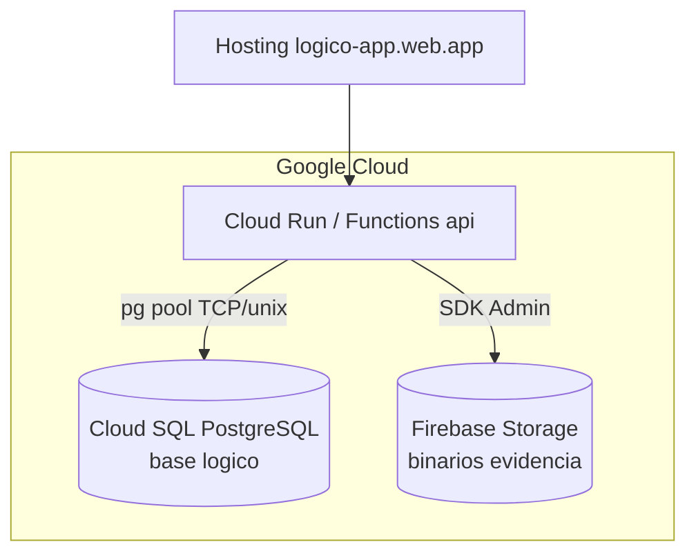
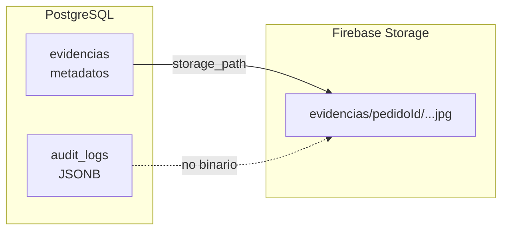
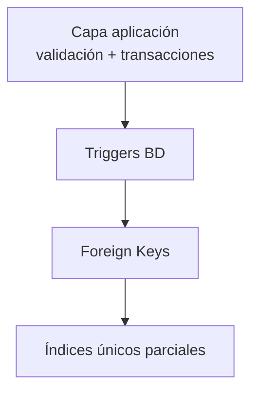

# 04 — Modelo físico

El **modelo físico** describe la implementación concreta en **PostgreSQL 15** (Cloud SQL):
motor, extensiones, tipos nativos, índices, triggers, vistas y estrategia de despliegue.

## 4.1 Plataforma y motor

| Parámetro | Valor |
|---|---|
| SGBD | PostgreSQL 15+ (Cloud SQL) |
| Base de datos | `logico` |
| Usuario aplicación | `logico_app` |
| Extensiones | `pgcrypto`, `citext` |
| Conexión producción | Socket Unix `/cloudsql/PROYECTO:REGION:INSTANCIA` |
| Charset | UTF-8 |



## 4.2 Mapeo lógico → físico (tipos)

| Tipo lógico | Tipo físico PostgreSQL | Uso |
|---|---|---|
| Identificador entero | `BIGSERIAL` / `SERIAL` | PK autoincrementales |
| Texto corto | `VARCHAR(n)` | nombres, códigos |
| Texto largo | `TEXT` | detalle, motivos |
| Email | `CITEXT` | `usuarios.correo` case-insensitive |
| Booleano | `BOOLEAN` | flags activo/disponible |
| Fecha-hora | `TIMESTAMPTZ` | zona horaria explícita |
| JSON flexible | `JSONB` | `audit_logs.payload` |
| IP | `INET` | auditoría (1 IP por registro) |
| Hash | `VARCHAR(255)` | bcrypt contraseña |

## 4.3 Diagrama físico — partición por scripts

```mermaid
flowchart LR
    subgraph Nucleo["Núcleo — 01_schema.sql"]
        T1[usuarios]
        T2[estados_pedido]
        T3[pedidos]
        T4[historial_estados]
        T5[rutas]
        T6[disponibilidad_motorista]
        T7[incidencias]
        T8[reprogramaciones]
    end
    subgraph Storage["04_audit_storage.sql"]
        T9[audit_logs]
        T10[evidencias]
    end
    subgraph Admin["05_admin_farmacias.sql"]
        T11[farmacias]
        T12[auditoria]
    end
    subgraph Geo["06_geografia_chile.sql"]
        T13[regiones]
        T14[provincias]
        T15[comunas]
    end
    subgraph Flota["07_motos.sql"]
        T16[motos]
    end
    Nucleo --> Storage --> Admin --> Geo --> Flota
```



## 4.4 Índices físicos implementados

### 4.4.1 Índices B-tree estándar

| Tabla | Índice | Columnas | Tipo |
|---|---|---|---|
| `usuarios` | `idx_usuarios_rol` | `rol` | B-tree |
| `usuarios` | `idx_usuarios_activo` | `activo` | B-tree |
| `pedidos` | `idx_pedidos_estado_actual` | `estado_actual_id` | B-tree |
| `pedidos` | `idx_pedidos_fecha_prog` | `fecha_programada` | B-tree |
| `pedidos` | `idx_pedidos_activo` | `activo` | B-tree |
| `pedidos` | `idx_pedidos_operadora` | `operadora_crea_id` | B-tree |
| `pedidos` | `idx_pedidos_farmacia` | `farmacia_id` | B-tree |
| `historial_estados` | `idx_hist_pedido` | `pedido_id` | B-tree |
| `historial_estados` | `idx_hist_fecha` | `fecha_hora DESC` | B-tree |
| `rutas` | `idx_rutas_motorista` | `motorista_id` | B-tree |
| `rutas` | `idx_rutas_estado` | `estado_ruta` | B-tree |
| `disponibilidad_motorista` | `idx_disp_motorista` | `disponible` | B-tree |
| `incidencias` | `idx_inc_pedido`, `idx_inc_ruta`, `idx_inc_fecha` | varios | B-tree |
| `reprogramaciones` | `idx_rep_pedido` | `pedido_id` | B-tree |
| `evidencias` | `idx_ev_*` | pedido, incidencia, tipo | B-tree |
| `audit_logs` | `idx_audit_*` | fecha, accion, entidad, nivel | B-tree |
| `auditoria` | `idx_auditoria_*` | fecha, usuario, accion, exito | B-tree |
| `farmacias` | `idx_farmacias_activa` | `activa` | B-tree |
| `motos` | `idx_motos_motorista`, `idx_motos_activa` | | B-tree |
| `provincias` | `idx_provincias_region` | `region_id` | B-tree |
| `comunas` | `idx_comunas_provincia`, `idx_comunas_nombre` | | B-tree |

### 4.4.2 Índices únicos parciales (reglas de negocio)

```sql
-- Regla 1: un motorista, una ruta activa
CREATE UNIQUE INDEX uq_motorista_ruta_activa
    ON rutas (motorista_id)
    WHERE estado_ruta IN ('asignada','en_curso');

-- Regla 2: un pedido, una ruta activa
CREATE UNIQUE INDEX uq_pedido_ruta_activa
    ON rutas (pedido_id)
    WHERE estado_ruta IN ('asignada','en_curso');

-- Anti-duplicado pedidos activos
CREATE UNIQUE INDEX uq_pedidos_no_duplicado
    ON pedidos (nombre_cliente, telefono_cliente, fecha_programada, md5(detalle_pedido))
    WHERE activo = TRUE;

-- Un solo admin principal
CREATE UNIQUE INDEX uq_unico_admin_principal
    ON usuarios ((es_admin_principal))
    WHERE es_admin_principal = TRUE;

-- Una moto activa por motorista
CREATE UNIQUE INDEX uq_moto_activa_por_motorista
    ON motos (motorista_id)
    WHERE activa = TRUE AND motorista_id IS NOT NULL;
```

### 4.4.3 Índice GIN (JSONB)

```sql
CREATE INDEX idx_audit_payload ON audit_logs USING GIN (payload jsonb_path_ops);
```

## 4.5 Triggers físicos

| Trigger | Tabla | Evento | Función |
|---|---|---|---|
| `trg_sync_estado_pedido` | `historial_estados` | AFTER INSERT | Sincroniza `pedidos.estado_actual_id` |
| `trg_validar_rol_pedido` | `pedidos` | BEFORE INSERT | Solo operadora/admin crea |
| `trg_validar_rol_ruta` | `rutas` | BEFORE INSERT/UPDATE | Motorista debe tener rol correcto |
| `trg_actualizar_disp_motorista` | `rutas` | AFTER INSERT/UPDATE | Actualiza disponibilidad |
| `trg_bloquear_update_estado_directo` | `pedidos` | BEFORE UPDATE | Impide saltarse historial |
| `trg_proteger_delete_admin_principal` | `usuarios` | BEFORE DELETE | Protege admin principal |
| `trg_proteger_update_admin_principal` | `usuarios` | BEFORE UPDATE | Protege rol/activo admin |

Script: [`../../database/02_triggers.sql`](../../database/02_triggers.sql)

## 4.6 Vistas físicas

| Vista | Definición resumida |
|---|---|
| `v_pedidos_completos` | JOIN pedidos + estado + operadora + ruta + motorista |
| `v_motoristas_disponibles` | Motoristas activos con flag disponible y sin ruta activa |

## 4.7 Almacenamiento híbrido (relacional + objetos)



| Dato | Ubicación física | Motivo |
|---|---|---|
| Metadatos evidencia | Tabla `evidencias` | JOIN con pedido, RBAC API |
| Archivo foto | Firebase Storage | Binario, escalable |
| Logs técnicos | `audit_logs.payload` JSONB | Esquema flexible |
| Acciones admin | `auditoria` relacional | Reportes SQL indexados |

## 4.8 Estrategia de integridad física



| Capa | Responsabilidad |
|---|---|
| Aplicación (`withTransaction`, `FOR UPDATE`) | Reglas de concurrencia |
| FK + CHECK | Integridad referencial y dominios |
| Triggers | Sincronía estado, protección admin |
| Índices parciales UNIQUE | Red de seguridad ante race conditions |

## 4.9 Orden de despliegue físico (producción)

Ver detalle en [05-scripts-sql.md](05-scripts-sql.md). Secuencia mínima:

1. `01_schema.sql` — núcleo + índices + FK inline + vistas  
2. `02_triggers.sql`  
3. `03_seeds.sql`  
4. `04_audit_storage.sql`  
5. `05_admin_farmacias.sql`  
6. `06_geografia_chile.sql`  
7. `07_motos.sql`  

## 4.10 Estimación de volumen (MVP)

| Tabla | Volumen estimado año 1 | Crecimiento |
|---|---|---|
| `pedidos` | 5 000–20 000 | Alto |
| `historial_estados` | 3–5× pedidos | Alto |
| `rutas` | ≈ pedidos | Medio |
| `evidencias` | 0.5–1× pedidos entregados | Medio |
| `audit_logs` | 10–50× operaciones | Alto |
| `comunas` | 346 (fijo) | Nulo |
| `regiones` | 16 (fijo) | Nulo |

## 4.11 Mejoras físicas respecto a versión anterior

| Aspecto | Antes | Ahora |
|---|---|---|
| Geografía | Campo texto `ciudad` | FK `comuna_id` + catálogo Chile |
| Farmacias | Sin auditoría estructurada | Tabla `auditoria` indexada |
| Reglas ruta | Solo aplicación | Índices UNIQUE parciales en BD |
| Evidencias | — | Tabla + Storage + índices |
| Admin | Sin jerarquía | `es_admin_principal` + triggers |
