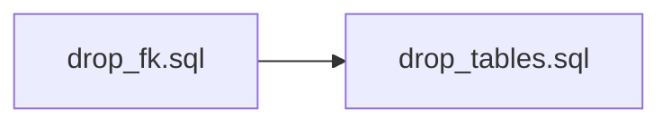
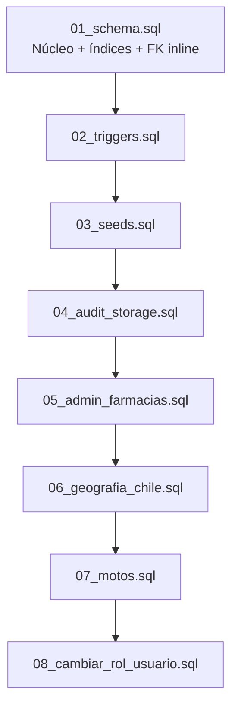
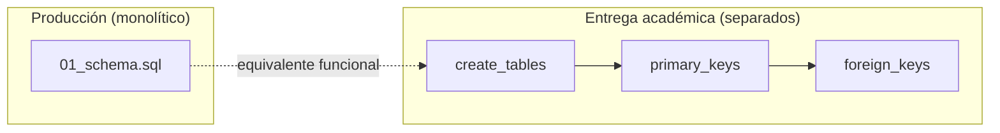

# 05 — Scripts SQL (separados)

Catálogo de scripts SQL del proyecto LogiCo. La rúbrica exige **scripts separados** para:
tablas, llaves primarias, llaves foráneas, drop de FK y drop de tablas.

## 5.1 Scripts académicos separados (rúbrica)

Ubicación: [`../../database/`](../../database/)

| # | Archivo | Contenido | Ejecutar |
|---|---|---|---|
| 1 | [`create_tables.sql`](../../database/create_tables.sql) | `CREATE TABLE` sin PK/FK inline (19 tablas) | Primero |
| 2 | [`primary_keys.sql`](../../database/primary_keys.sql) | `ALTER TABLE … PRIMARY KEY` y `UNIQUE` | Segundo |
| 3 | [`foreign_keys.sql`](../../database/foreign_keys.sql) | `FOREIGN KEY`, `CHECK` | Tercero |
| 4 | [`drop_fk.sql`](../../database/drop_fk.sql) | `DROP CONSTRAINT` FK y CHECK | Antes de drop tablas |
| 5 | [`drop_tables.sql`](../../database/drop_tables.sql) | `DROP TABLE IF EXISTS … CASCADE` | Limpieza |

### Orden de ejecución — creación (rúbrica)


### Orden de ejecución — eliminación (rúbrica)



### Comandos de ejemplo (psql)

```bash
# Creación (entorno académico / laboratorio)
psql -U logico_app -d logico -f database/create_tables.sql
psql -U logico_app -d logico -f database/primary_keys.sql
psql -U logico_app -d logico -f database/foreign_keys.sql

# Eliminación (CUIDADO: borra datos)
psql -U logico_app -d logico -f database/drop_fk.sql
psql -U logico_app -d logico -f database/drop_tables.sql
```

---

## 5.2 Contenido de cada script (resumen)

### 5.2.1 `create_tables.sql` — Tablas

Crea las tablas **sin** declarar PK/FK (se agregan en scripts 2 y 3):

| Tabla | Descripción |
|---|---|
| `usuarios` | Usuarios del sistema |
| `estados_pedido` | Catálogo de estados |
| `pedidos` | Pedidos de reparto |
| `historial_estados` | Trazabilidad de estados |
| `rutas` | Asignación motorista |
| `disponibilidad_motorista` | Disponibilidad 1:1 |
| `motos` | Flota vehicular |
| `incidencias` | Incidencias de entrega |
| `reprogramaciones` | Cambios de fecha |
| `evidencias` | Metadatos Storage |
| `audit_logs` | Auditoría JSONB |
| `farmacias` | Puntos de origen |

> **Nota:** `regiones`, `provincias`, `comunas` y `auditoria` se crean en scripts de extensión
> (`05_admin_farmacias.sql`, `06_geografia_chile.sql`). El script académico incluye el núcleo
> + farmacias base; el despliegue completo usa la secuencia §5.3.

### 5.2.2 `primary_keys.sql` — Llaves primarias y UNIQUE

| Tabla | Constraints |
|---|---|
| `usuarios` | PK `id_usuario`, UQ `correo`, UQ `firebase_uid` |
| `estados_pedido` | PK `id_estado`, UQ `nombre_estado` |
| `pedidos` | PK `id_pedido`, UQ `codigo_pedido` |
| `historial_estados` | PK `id_historial` |
| `rutas` | PK `id_ruta`, UQ `codigo_ruta` |
| `disponibilidad_motorista` | PK `id_disponibilidad`, UQ `motorista_id` |
| `motos` | PK `id_moto`, UQ `patente` |
| `incidencias` | PK `id_incidencia` |
| `reprogramaciones` | PK `id_reprogramacion` |
| `evidencias` | PK `id_evidencia` |
| `audit_logs` | PK `id_log` |
| `farmacias` | PK `id_farmacia` |

### 5.2.3 `foreign_keys.sql` — Llaves foráneas

| Origen | FK | Destino | ON DELETE |
|---|---|---|---|
| `pedidos` | `estado_actual_id` | `estados_pedido` | RESTRICT |
| `pedidos` | `operadora_crea_id` | `usuarios` | RESTRICT |
| `pedidos` | `operadora_modifica_id` | `usuarios` | SET NULL |
| `pedidos` | `farmacia_id` | `farmacias` | SET NULL |
| `historial_estados` | `pedido_id`, `estado_id`, `usuario_id` | varios | CASCADE/RESTRICT |
| `rutas` | `pedido_id`, `motorista_id` | pedidos/usuarios | CASCADE/RESTRICT |
| `disponibilidad_motorista` | `motorista_id` | `usuarios` | CASCADE |
| `motos` | `motorista_id` | `usuarios` | SET NULL |
| `incidencias` | 3 FK | pedidos/rutas/usuarios | mixto |
| `reprogramaciones` | 2 FK + CHECK fecha | pedidos/usuarios | CASCADE/RESTRICT |
| `evidencias` | 3 FK | pedidos/incidencias/usuarios | mixto |
| `audit_logs` | `usuario_id` | `usuarios` | SET NULL |

Incluye **CHECK** en: `usuarios.rol`, `estados_pedido.nombre_estado`, `rutas.estado_ruta`,
`reprogramaciones.fecha_nueva`.

### 5.2.4 `drop_fk.sql` — Eliminar FK

Elimina en orden inverso a `foreign_keys.sql` todas las constraints FK y CHECK listadas.

### 5.2.5 `drop_tables.sql` — Eliminar tablas

Orden de DROP (dependientes primero):

```
audit_logs → evidencias → reprogramaciones → incidencias → motos →
disponibilidad_motorista → rutas → historial_estados → pedidos →
farmacias → estados_pedido → usuarios
```

---

## 5.3 Scripts de producción (despliegue completo)

Para el sistema desplegado en Cloud SQL se usa la convención numerada:



| Script | Archivo | Descripción |
|---|---|---|
| 01 | `01_schema.sql` | Esquema núcleo completo (alternativa monolítica a create+pk+fk) |
| 02 | `02_triggers.sql` | Triggers de negocio |
| 03 | `03_seeds.sql` | Estados + usuarios demo |
| 04 | `04_audit_storage.sql` | `audit_logs`, `evidencias` |
| 05 | `05_admin_farmacias.sql` | Farmacias, auditoría, admin principal |
| 06 | `06_geografia_chile.sql` | Regiones, provincias, comunas (346) |
| 07 | `07_motos.sql` | Flota motos |
| 08 | `08_cambiar_rol_usuario.sql` | Función `fn_cambiar_rol_usuario` |

### Ejecución en Cloud Shell

```bash
gcloud sql connect INSTANCIA --user=logico_app --database=logico --project=PROYECTO
```

```sql
\set ON_ERROR_STOP on
\i database/01_schema.sql
\i database/02_triggers.sql
\i database/03_seeds.sql
\i database/04_audit_storage.sql
\i database/05_admin_farmacias.sql
\i database/06_geografia_chile.sql
\i database/07_motos.sql
```

---

## 5.4 Relación scripts académicos ↔ producción



| Aspecto | Scripts separados | `01_schema.sql` |
|---|---|---|
| Propósito | Cumplir rúbrica entrega 3 | Despliegue rápido idempotente |
| PK/FK | En archivos 2 y 3 | Inline en CREATE/ALTER |
| Geografía | No incluida | Script 06 aparte |
| Auditoría admin | No incluida | Script 05 aparte |
| Idempotencia | Parcial (`IF NOT EXISTS`) | Completa |

---

## 5.5 Scripts auxiliares

| Archivo | Uso |
|---|---|
| `seed.sql` | Semillas alternativas (académico) |
| `diagram_er_logico.sql` | Referencia ER en SQL comentado |
| `00_reset.sql` | Reset controlado entorno dev |
| `00_fix_owners.sql` | Corrección owners Cloud SQL |
| `09_diagnostico_usuarios.sql` | Diagnóstico rol/usuario |

---

## 5.6 Checklist de entrega 3

| Requisito | Evidencia | Estado |
|---|---|:---:|
| Modelo conceptual mejorado | [01-modelo-conceptual.md](01-modelo-conceptual.md) | ✅ |
| Modelo lógico mejorado | [02-modelo-logico.md](02-modelo-logico.md) | ✅ |
| Diccionario con índices y llaves | [03-diccionario-datos.md](03-diccionario-datos.md) | ✅ |
| Modelo físico | [04-modelo-fisico.md](04-modelo-fisico.md) | ✅ |
| Script tablas separado | `database/create_tables.sql` | ✅ |
| Script PK separado | `database/primary_keys.sql` | ✅ |
| Script FK separado | `database/foreign_keys.sql` | ✅ |
| Script drop FK separado | `database/drop_fk.sql` | ✅ |
| Script drop tablas separado | `database/drop_tables.sql` | ✅ |
