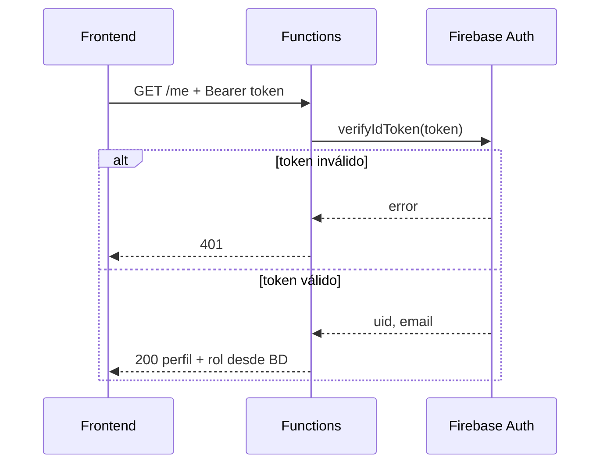
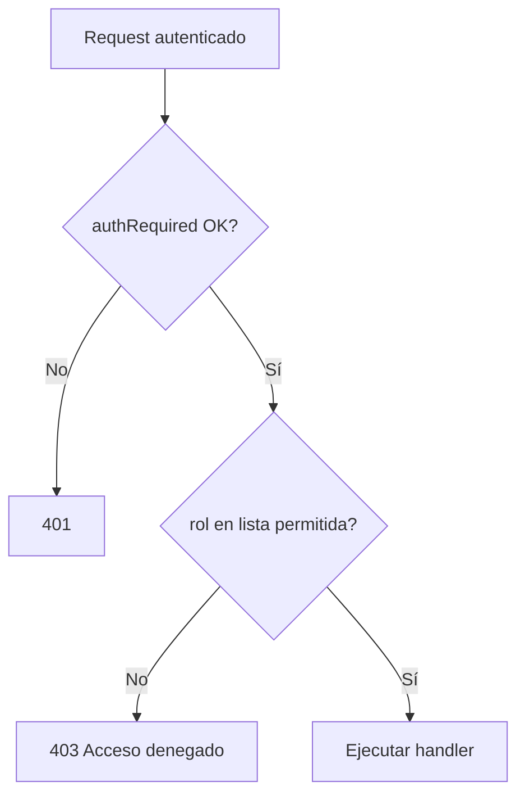
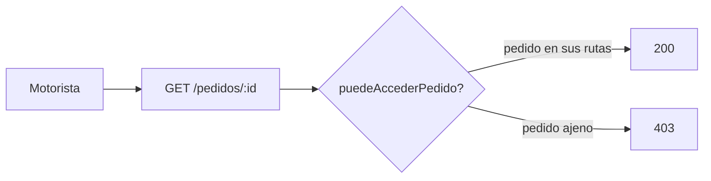
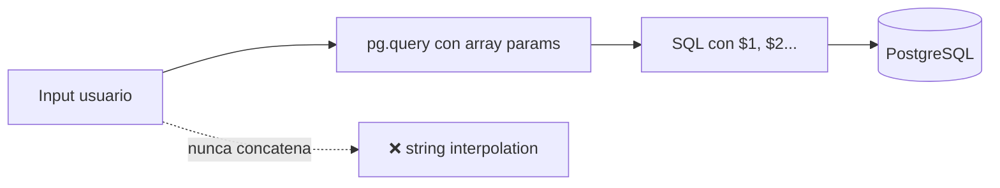
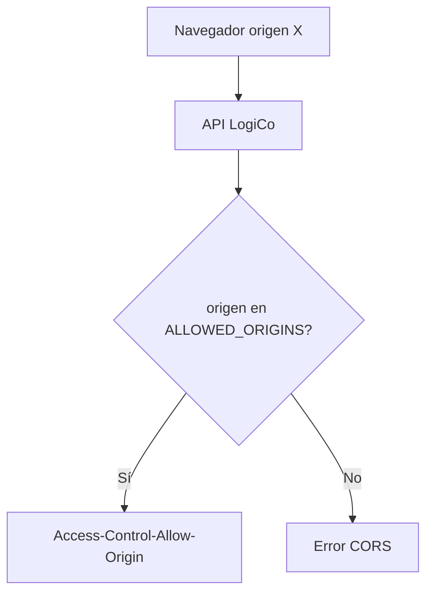
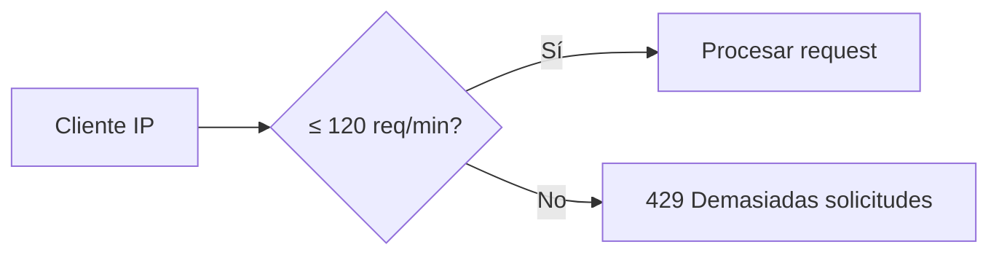
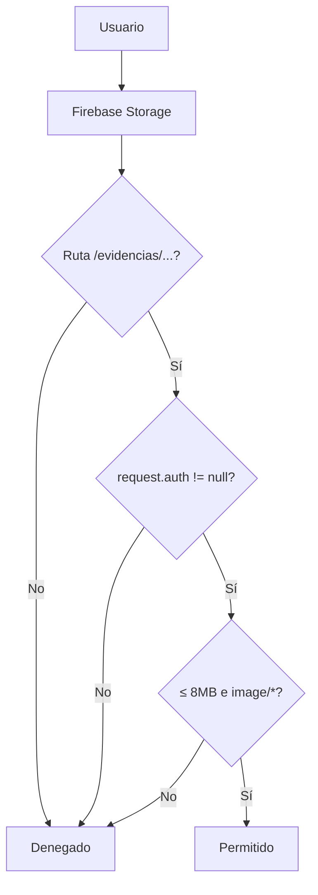

# 06 — Código fuente y patrones de seguridad

> **Entregable:** link al repositorio + documentación de **mínimo 5 patrones de seguridad**
> aplicados en el código, con descripción, diagrama y evidencia (capturas del IDE).

---

## 6.1 Código fuente del proyecto

| Campo | Valor |
|---|---|
| **Repositorio GitHub** | *(completar URL)* → `https://github.com/TU_USUARIO/Logico` |
| **Rama principal** | `main` |
| **Sitio en producción** | https://logico-app.web.app |
| **Stack** | Firebase (Hosting, Auth, Functions, Storage) + Cloud SQL PostgreSQL |

### Estructura relevante del repositorio

```
Logico/
├── functions/          Backend API (Express + Firebase Functions)
│   ├── index.js        Rutas HTTP + middlewares de seguridad
│   └── src/
│       ├── auth.js     Autenticación JWT + RBAC
│       ├── pedidos.js  Lógica de negocio (queries parametrizadas)
│       ├── db.js       Pool PG + transacciones
│       └── errors.js   Manejo seguro de errores
├── public/             Frontend (Auth + escapeHtml)
├── database/           Scripts SQL + triggers de integridad
├── storage.rules       Reglas Firebase Storage
└── firebase.json       Hosting rewrites + cabeceras HTTP
```

---

## 6.2 Resumen de patrones documentados

| # | Patrón | OWASP / categoría | Archivo principal | Control |
|---|---|---|---|---|
| P1 | Autenticación Bearer JWT | API2:2023 Broken Auth | `functions/src/auth.js` | C-01 |
| P2 | RBAC por rol | API5:2023 Broken AuthZ | `functions/src/auth.js` | C-02 |
| P3 | Control de acceso a objeto (anti-IDOR) | API1:2023 BOLA | `functions/index.js` | C-03 |
| P4 | Consultas SQL parametrizadas | API8:2023 SQL Injection | `functions/src/pedidos.js` | C-04 |
| P5 | CORS con lista blanca | API8 / A05 Misconfig | `functions/index.js` | C-05 |
| P6 | Rate limiting | API4:2023 Unrestricted Resource | `functions/index.js` | C-06 |
| P7 | Reglas Storage (mínimo privilegio) | A01 Broken Access Control | `storage.rules` | C-07 |

> Referencia ampliada: [`../06-seguridad.md`](../06-seguridad.md)

---

## P1 — Autenticación con Bearer Token (JWT Firebase)

### Descripción

Toda ruta protegida exige el header `Authorization: Bearer <ID_TOKEN>`. El backend
valida la firma RS256 con `firebase-admin` (`verifyIdToken`). Sin token válido → **401**.

### Aplicabilidad en el código

```62:80:c:\Users\Bruno\Documents\CLASES\Proyecto integrado final\Logico\functions\src\auth.js
async function authRequired(req, res, next) {
    const header = req.headers.authorization || '';
    const match = header.match(/^Bearer\s+(.+)$/i);
    if (!match) {
        return res.status(401).json({ error: 'Falta token de autenticación.' });
    }

    let decoded;
    try {
        decoded = await admin.auth().verifyIdToken(match[1]);
    } catch (err) {
        console.error('[auth] verifyIdToken falló:', err.code, err.message);
        return res.status(401).json({
            error: 'Token inválido o expirado.',
            ...(EXPONER_DETALLES ? { code: err.code, details: err.message } : {}),
        });
    }
```

El **rol no viene del token**: se resuelve desde PostgreSQL (`SELECT … FROM usuarios`),
evitando que el cliente eleve privilegios editando el JWT.

### Diagrama



### Evidencia (captura IDE)

> Insertar captura: `assets/patrones/p01-auth-jwt.png`  
> Mostrar `authRequired` en `functions/src/auth.js` (líneas 62–80).


---

## P2 — RBAC (Control de acceso basado en roles)

### Descripción

Middleware factory `requireRole(...roles)` que verifica que `req.user.rol` (cargado desde BD)
esté en la lista permitida. Ejemplo: solo `operadora` y `admin` pueden `POST /pedidos`.

### Aplicabilidad en el código

```215:225:c:\Users\Bruno\Documents\CLASES\Proyecto integrado final\Logico\functions\src\auth.js
function requireRole(...roles) {
    return (req, res, next) => {
        if (!req.user) return res.status(401).json({ error: 'No autenticado.' });
        if (!roles.includes(req.user.rol)) {
            return res.status(403).json({
                error: `Acceso denegado. Roles permitidos: ${roles.join(', ')}.`,
            });
        }
        return next();
    };
}
```

Uso en rutas (`functions/index.js`):

```javascript
app.post('/pedidos', requireRole('operadora', 'admin'), handler);
app.get('/audit', requireRole('admin'), handler);
app.get('/motos', requireRole('admin'), handler);
```

### Diagrama



### Evidencia (captura IDE)

> Insertar captura: `assets/patrones/p02-rbac.png`  
> Mostrar `requireRole` y un ejemplo de ruta protegida en `index.js`.


---

## P3 — Control de acceso a nivel de objeto (Anti-IDOR / BOLA)

### Descripción

Un motorista autenticado **no puede** leer pedidos, evidencias o incidencias de otros
motoristas aunque adivine el `id_pedido`. La función `puedeAccederPedido` verifica
asignación real en tabla `rutas`.

### Aplicabilidad en el código

```178:182:c:\Users\Bruno\Documents\CLASES\Proyecto integrado final\Logico\functions\index.js
async function puedeAccederPedido(usuario, pedidoId) {
    if (usuario.rol !== 'motorista') return true;
    const rutas = await rutasSvc.listarRutasDeMotorista(Number(usuario.id_usuario));
    return rutas.some((r) => Number(r.pedido_id) === Number(pedidoId));
}
```

Aplicado en endpoints sensibles:

```223:225:c:\Users\Bruno\Documents\CLASES\Proyecto integrado final\Logico\functions\index.js
        if (!(await puedeAccederPedido(req.user, pedidoId))) {
            return res.status(403).json({ error: 'Acceso denegado a este pedido.' });
        }
```

**Prueba validada:** Postman S-04 → motorista pide pedido ajeno → **403**.

### Diagrama



### Evidencia (captura IDE)

> Insertar captura: `assets/patrones/p03-idor.png`  
> Mostrar `puedeAccederPedido` y su uso en `GET /pedidos/:id`.


---

## P4 — Consultas SQL parametrizadas (Anti-SQL Injection)

### Descripción

Todas las interacciones con PostgreSQL usan placeholders `$1, $2, …` del driver `pg`.
Los inputs del usuario **nunca** se concatenan en el SQL. Un payload como
`Robert'); DROP TABLE pedidos; --` se almacena como texto literal.

### Aplicabilidad en el código

```41:44:c:\Users\Bruno\Documents\CLASES\Proyecto integrado final\Logico\functions\src\pedidos.js
        const { rows: estados } = await client.query(
            `SELECT id_estado FROM estados_pedido WHERE nombre_estado = $1`,
            [estadoInicialNombre]
        );
```

```67:72:c:\Users\Bruno\Documents\CLASES\Proyecto integrado final\Logico\functions\src\pedidos.js
        const { rows: pedidoRows } = await client.query(
            `INSERT INTO pedidos (
                codigo_pedido, nombre_cliente, direccion_entrega, telefono_cliente,
                detalle_pedido, observacion, fecha_programada,
                estado_actual_id, operadora_crea_id, farmacia_id
             ) VALUES ($1,$2,$3,$4,$5,$6,$7,$8,$9,$10)
```

**Prueba validada:** Postman S-03 → SQL injection en `nombre_cliente` → **201** (texto literal), tabla intacta.

### Diagrama



### Evidencia (captura IDE)

> Insertar captura: `assets/patrones/p04-sql-parametrizado.png`  
> Mostrar `INSERT … VALUES ($1,$2,…)` en `pedidos.js`.


---

## P5 — CORS con lista blanca (Allowlist)

### Descripción

En lugar de `origin: true` (acepta cualquier origen), la API solo responde a dominios
explícitos: Hosting de `logico-app` + localhost para desarrollo. Origen no listado → error CORS.

### Aplicabilidad en el código

```50:69:c:\Users\Bruno\Documents\CLASES\Proyecto integrado final\Logico\functions\index.js
const DEFAULT_ORIGINS = [
    'https://logico-app.web.app',
    'https://logico-app.firebaseapp.com',
    'http://localhost:5000',
    'http://localhost:5002',
    'http://127.0.0.1:5000',
];
const ALLOWED_ORIGINS = new Set(
    (process.env.CORS_ORIGINS
        ? process.env.CORS_ORIGINS.split(',').map((s) => s.trim()).filter(Boolean)
        : DEFAULT_ORIGINS)
);
app.use(cors({
    origin(origin, callback) {
        if (!origin || ALLOWED_ORIGINS.has(origin)) return callback(null, true);
        return callback(new Error('Origen no permitido por CORS.'));
    },
    credentials: false,
}));
```

**Prueba validada:** Postman S-07 → origen no permitido → bloqueado.

### Diagrama



### Evidencia (captura IDE)

> Insertar captura: `assets/patrones/p05-cors.png`  
> Mostrar `DEFAULT_ORIGINS` y callback `origin()` en `index.js`.


---

## P6 — Rate limiting (anti abuso / fuerza bruta)

### Descripción

Limita a **120 peticiones por minuto por IP** en toda la API. Mitiga scraping,
fuerza bruta y DoS ligero. Responde con cabeceras `RateLimit-*` estándar.

### Aplicabilidad en el código

```96:104:c:\Users\Bruno\Documents\CLASES\Proyecto integrado final\Logico\functions\index.js
const apiLimiter = rateLimit({
    windowMs: 60 * 1000,
    max: 120,
    standardHeaders: true,
    legacyHeaders: false,
    message: { error: 'Demasiadas solicitudes. Reintenta en un minuto.' },
});
app.use(apiLimiter);
```

Complemento: `express.json({ limit: '256kb' })` limita tamaño de payload (anti payload-bomb).

### Diagrama



### Evidencia (captura IDE)

> Insertar captura: `assets/patrones/p06-rate-limit.png`  
> Mostrar configuración `apiLimiter` en `index.js`.


---

## P7 — Reglas Firebase Storage (mínimo privilegio)

### Descripción

Solo usuarios autenticados pueden leer/escribir en `/evidencias/{pedidoId}/…`.
Escritura restringida a imágenes ≤ 8 MB. **Todo lo demás bloqueado por defecto.**

### Aplicabilidad en el código

```12:28:c:\Users\Bruno\Documents\CLASES\Proyecto integrado final\Logico\storage.rules
service firebase.storage {
  match /b/{bucket}/o {

    match /evidencias/{pedidoId}/{kind}/{fileName} {
      allow read: if request.auth != null;

      allow write: if request.auth != null
                    && request.resource.size < 8 * 1024 * 1024
                    && request.resource.contentType.matches('image/.*')
                    && kind in ['entrega', 'incidencia', 'firma', 'otro'];
    }

    match /{allPaths=**} {
      allow read, write: if false;
    }
  }
}
```

### Diagrama



### Evidencia (captura IDE)

> Insertar captura: `assets/patrones/p07-storage-rules.png`  
> Mostrar `storage.rules` completo o reglas de `/evidencias/`.


---

## 6.3 Patrones adicionales (bonus)

| Patrón | Ubicación | Breve descripción |
|---|---|---|
| **Helmet** (cabeceras HTTP) | `index.js` L45 | `X-Frame-Options`, `X-Content-Type-Options`, etc. |
| **escapeHtml** (anti-XSS) | `public/js/firebase-init.js` L192–200 | Escapa texto antes de `innerHTML` |
| **Errores genéricos en prod** | `auth.js` EXPONER_DETALLES, `errors.js` L74 | No filtra stack trace al cliente |
| **Transacciones + FOR UPDATE** | `functions/src/rutas.js` | Evita doble asignación en concurrencia |
| **Triggers BD** | `database/02_triggers.sql` | Defensa en profundidad server-side |
| **Auto-provisión opt-in** | `auth.js` AUTH_AUTO_PROVISION | Evita alta automática no autorizada |

---

## 6.4 Matriz de trazabilidad patrón → prueba

| Patrón | Prueba | Resultado esperado | Doc validación |
|---|---|---|---|
| P1 JWT | Postman S-01, S-02 | 401 sin token | `13-validacion-resultados.md` §13.5 |
| P2 RBAC | Postman S-09 | 403 motorista crea pedido | §13.5 |
| P3 IDOR | Postman S-04, S-05 | 403 pedido ajeno | §13.5 |
| P4 SQLi | Postman S-03 | Sin 500, tabla intacta | §13.5 |
| P5 CORS | Postman S-07 | Origen bloqueado | §13.5 |
| P6 Rate limit | Carga > 120/min | 429 | Manual |
| P7 Storage | Subir PDF > 8MB | Rechazado | Manual UI |

---

## 6.5 Instrucciones para completar las capturas

1. Abrir el archivo indicado en VS Code / Cursor.
2. Resaltar las líneas del bloque de código citado.
3. Capturar pantalla y guardar en `docs/entrega-3/assets/patrones/` con el nombre sugerido.
4. Verificar que la imagen se vea en la preview de Markdown.

| Archivo a capturar | Guardar como |
|---|---|
| `functions/src/auth.js` (authRequired) | `p01-auth-jwt.png` |
| `functions/src/auth.js` + `index.js` (requireRole) | `p02-rbac.png` |
| `functions/index.js` (puedeAccederPedido) | `p03-idor.png` |
| `functions/src/pedidos.js` ($1, $2…) | `p04-sql-parametrizado.png` |
| `functions/index.js` (CORS) | `p05-cors.png` |
| `functions/index.js` (rateLimit) | `p06-rate-limit.png` |
| `storage.rules` | `p07-storage-rules.png` |

---

## 6.6 Checklist entrega

| Requisito | Evidencia | Estado |
|---|---|:---:|
| Link código fuente (GitHub) | §6.1 | ⬜ completar URL |
| Mínimo 5 patrones documentados | P1–P7 (7 patrones) | ✅ |
| Descripción de cada patrón | §P1–P7 | ✅ |
| Aplicabilidad en el código | Citas con ruta y líneas | ✅ |
| Imágenes / capturas IDE | `assets/patrones/*.png` | ⬜ pegar capturas |
| Diagramas | Mermaid por patrón | ✅ |
