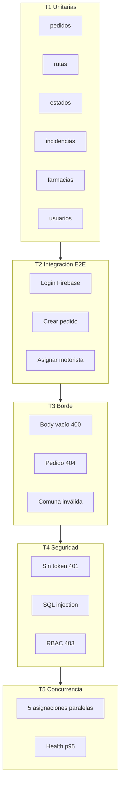

# 07 — Plan de pruebas de software

Documento de **Entrega 3** que especifica qué requerimientos se prueban, los **5 tipos de prueba**
propuestos, los casos de uso implementados y todos los casos de prueba asociados.

**Ejecución automatizada:** [`ejecutar-plan-pruebas.ps1`](ejecutar-plan-pruebas.ps1)

---

## 7.1 Objetivo

Validar que LogiCo cumple los **requerimientos funcionales y no funcionales** del MVP,
con trazabilidad desde cada requisito hasta casos de prueba ejecutables (Jest, Newman, scripts).

---

## 7.2 Propuesta de 5 tipos de prueba

| # | Tipo | Objetivo | Herramienta | Automatizado en `.ps1` |
|---|---|---|---|:---:|
| **T1** | **Unitarias** | Lógica de negocio aislada (mocks BD) | Jest (`functions/tests/`) | ✅ |
| **T2** | **Integración / E2E** | Flujo completo HTTP contra API desplegada | Postman + Newman | ✅ |
| **T3** | **Borde (edge)** | Valores límite, datos inválidos, 404 | Newman (BORDE E1–E3) + unitarias | ✅ |
| **T4** | **Seguridad** | Auth, RBAC, SQLi, IDOR, CORS | Newman (SEG S1–S6) + smoke HTTP | ✅ |
| **T5** | **Concurrencia / rendimiento** | Race conditions, health, latencia | `scripts/concurrencia.js` + `/health` | ✅* |

\* T5 concurrencia requiere credenciales admin (`-AdminEmail` / `-AdminPassword` o variables de entorno).



---

## 7.3 Casos de uso implementados

| ID | Caso de uso | Actor | Implementado en |
|---|---|---|---|
| CU-01 | Iniciar sesión | Todos | `index.html` + `auth.js` |
| CU-02 | Consultar perfil (`/me`) | Todos | `GET /me` |
| CU-03 | Crear pedido | Operadora, Admin | `crear-pedido.html`, `POST /pedidos` |
| CU-04 | Listar pedidos | Operadora, Admin, Motorista* | `pedidos.html`, `GET /pedidos` |
| CU-05 | Ver detalle pedido | Operadora, Admin, Motorista** | `pedido.html`, `GET /pedidos/:id` |
| CU-06 | Asignar motorista | Operadora, Admin | `POST /rutas/asignar` |
| CU-07 | Iniciar ruta | Motorista | `motorista.html`, `POST /rutas/:id/iniciar` |
| CU-08 | Entregar pedido | Motorista | `POST /pedidos/:id/entregar` |
| CU-09 | Registrar incidencia | Motorista, Operadora | `POST /pedidos/:id/incidencias` |
| CU-10 | Reprogramar pedido | Operadora, Admin | `POST /pedidos/:id/reprogramar` |
| CU-11 | Subir evidencia | Motorista, Operadora | Storage + `POST /pedidos/:id/evidencias` |
| CU-12 | CRUD farmacias | Admin | `admin-farmacias.html` |
| CU-13 | Gestionar usuarios/roles | Admin | `admin-usuarios.html` |
| CU-14 | Gestionar motos | Admin | `admin-motos.html` |
| CU-15 | Consultar auditoría | Admin | `admin-auditoria.html`, `GET /audit` |

\* Motorista ve solo pedidos de sus rutas.  
\*\* Control a nivel de objeto (`puedeAccederPedido`).

---

## 7.4 Requerimientos funcionales (RF)

| ID | Requerimiento | Prioridad | Casos de prueba |
|---|---|:---:|---|
| RF-01 | El sistema autentica usuarios vía Firebase JWT | Alta | CP-S01, CP-S02, Newman #1 |
| RF-02 | Solo operadora/admin crea pedidos | Alta | CP-U-P01, CP-S09, Newman #2 |
| RF-03 | Pedido recibe código único y estado inicial | Alta | CP-U-P01, Newman #2 |
| RF-04 | Asignación motorista respeta reglas 1 y 2 | Alta | CP-U-R01..R08, CP-C01, Newman #6–7 |
| RF-05 | Transiciones de estado válidas según máquina | Alta | CP-U-E01..E04, Newman #8–9 |
| RF-06 | Incidencia cancela ruta y registra evento | Media | CP-U-I01..I03, Newman #10 |
| RF-07 | Reprogramación exige fecha futura | Media | CP-B03, Newman #11 |
| RF-08 | Admin gestiona farmacias con geografía | Media | CP-U-F01..F06, CP-B09 |
| RF-09 | Admin cambia roles con jerarquía | Alta | CP-U-U01..U13 |
| RF-10 | Auditoría registra mutaciones admin | Media | Newman #9 (audit) |
| RF-11 | Motorista solo accede a pedidos asignados | Alta | CP-S04, CP-S05 |
| RF-12 | Evidencias vinculadas a pedido en BD | Media | Manual UI + CP-S05 |

---

## 7.5 Requerimientos no funcionales (RNF)

| ID | Requerimiento | Métrica / criterio | Casos de prueba |
|---|---|---|---|
| RNF-01 | Disponibilidad API | `GET /health` → 200, `ok: true` | CP-H01 |
| RNF-02 | Tiempo respuesta listado | p95 `GET /pedidos` < 150 ms | CP-H02 |
| RNF-03 | Integridad transaccional | 1 asignación gana bajo concurrencia | CP-C01 |
| RNF-04 | Seguridad transporte | HTTPS obligatorio (Hosting) | Inspección |
| RNF-05 | Rate limiting | 120 req/min/IP | CP-S-RL |
| RNF-06 | Payload máximo | JSON ≤ 256 KB | CP-B07 |
| RNF-07 | Cobertura unitaria | 38/38 tests verdes | CP-U-ALL |
| RNF-08 | Usabilidad | SUS ≥ 70 (Anexo G) | Checklists externos |
| RNF-09 | Trazabilidad estados | Historial append-only | CP-U-E + triggers BD |
| RNF-10 | Recuperación ante error | 500 sin stack trace en prod | CP-S08 |

---

## 7.6 Matriz requisito → caso de prueba

| Requisito | T1 Unit | T2 E2E | T3 Borde | T4 Seg | T5 Conc |
|---|:---:|:---:|:---:|:---:|:---:|
| RF-01 | — | ✅ | — | ✅ | — |
| RF-02 | ✅ | ✅ | ✅ | ✅ | — |
| RF-03 | ✅ | ✅ | — | — | — |
| RF-04 | ✅ | ✅ | — | — | ✅ |
| RF-05 | ✅ | ✅ | ✅ | — | — |
| RF-06 | ✅ | ✅ | ✅ | — | — |
| RF-07 | — | ✅ | ✅ | — | — |
| RF-08 | ✅ | manual | ✅ | — | — |
| RF-09 | ✅ | manual | — | ✅ | — |
| RF-10 | — | ✅ | — | — | — |
| RF-11 | — | — | — | ✅ | — |
| RNF-01 | — | ✅ | — | — | ✅ |
| RNF-03 | ✅ | — | — | — | ✅ |
| RNF-05 | — | — | — | ✅ | — |
| RNF-07 | ✅ | — | — | — | — |

---

## 7.7 Catálogo de casos de prueba

### T1 — Unitarias (38 casos)

| ID | Suite | Descripción | Entrada / acción | Resultado esperado |
|---|---|---|---|---|
| CP-U-P01 | pedidos | Crear pedido feliz | Payload válido | 201, id + código |
| CP-U-P02 | pedidos | Campos faltantes | `{}` | ValidationError 400 |
| CP-U-P03 | pedidos | Fecha inválida | `fecha_programada="ayer"` | 400 |
| CP-U-P04 | pedidos | Rollback en error | Mock falla INSERT | rollbackCount=1 |
| CP-U-R01 | rutas | Asignación feliz | pedido + motorista OK | 201, commit |
| CP-U-R02 | rutas | Motorista con ruta activa | Regla 1 | 409/422 |
| CP-U-R03 | rutas | Pedido ya asignado | Regla 2 | 409/422 |
| CP-U-R04 | rutas | Usuario no motorista | rol=operadora | Error |
| CP-U-E01 | estados | Transición válida | en_ruta → entregado | OK |
| CP-U-E02 | estados | Transición inválida | entregado → en_ruta | 422 |
| CP-U-I01 | incidencias | Registrar incidencia | tipo válido | id_incidencia |
| CP-U-F01 | farmacias | Crear farmacia | comuna válida | 201 + auditoría |
| CP-U-U01 | usuarios | Cambiar rol | admin → operadora | OK |
| CP-U-U02 | usuarios | No eliminar admin principal | DELETE admin | Error |
| … | … | *(ver `functions/tests/`)* | … | … |

### T2 — Integración / E2E (Newman)

| ID | Request Postman | CU | RF | Esperado |
|---|---|---|---|---|
| CP-E01 | 00 Login admin | CU-01 | RF-01 | 200 + idToken |
| CP-E02 | 0 Health | RNF-01 | — | 200, database=logico |
| CP-E03 | 1 /me | CU-02 | RF-01 | 200 + rol |
| CP-E04 | 2 Crear pedido | CU-03 | RF-02, RF-03 | 201 |
| CP-E05 | 5 Asignar motorista | CU-06 | RF-04 | 201 |
| CP-E06 | 6 Asignar duplicado | CU-06 | RF-04 | 409/422 |
| CP-E07 | 9 Auditoría | CU-15 | RF-10 | 200 array |

### T3 — Borde

| ID | Caso | Entrada | Esperado |
|---|---|---|---|
| CP-B01 | Body vacío crear pedido | `{}` | 400/422 |
| CP-B02 | Pedido inexistente | `GET /pedidos/99999999` | 404 |
| CP-B03 | Farmacia comuna inválida | `comuna_id: 99999999` | 400/422 |
| CP-B04..B09 | *(ver doc 13 §13.4)* | Varios | Según tabla |

### T4 — Seguridad

| ID | Caso | Esperado |
|---|---|---|
| CP-S01 | Sin token `GET /pedidos` | 401 |
| CP-S02 | Token basura | 401 |
| CP-S03 | SQL injection en nombre | ≠ 500, tabla intacta |
| CP-S04 | Motorista crea pedido | 403 |
| CP-S05 | Motorista audit | 403 |
| CP-S06 | Verificar pedidos tras SQLi | 200 array |

### T5 — Concurrencia y rendimiento

| ID | Caso | Esperado |
|---|---|---|
| CP-C01 | 5× `POST /rutas/asignar` paralelo mismo pedido | 1×201 + 4×409/422 |
| CP-H01 | `GET /health` | 200, ok=true |
| CP-H02 | Latencia health (3 muestras) | < 3000 ms cold start |

---

## 7.8 Criterios de aceptación global

| Criterio | Umbral | Bloqueante |
|---|---|:---:|
| Tests unitarios | 38/38 pass | Sí |
| Newman assertions | ≥ 90 % pass | Sí |
| Health check | 200 OK | Sí |
| Smoke seguridad (401 sin token) | Pass | Sí |
| Concurrencia | 1 éxito + resto conflicto | No* |

\* Bloqueante solo si se ejecuta con credenciales (`-RunConcurrency`).

---

## 7.9 Ejecución del plan

### Script PowerShell (recomendado)

Desde la raíz del proyecto:

```powershell
cd "docs\entrega-3"
.\ejecutar-plan-pruebas.ps1 -AdminEmail "admin@logico.app" -AdminPassword "TU_CLAVE"
```

Parámetros:

| Parámetro | Descripción | Default |
|---|---|---|
| `-BaseUrl` | URL API | `https://logico-app.web.app/api` |
| `-AdminEmail` | Login Firebase admin | — |
| `-AdminPassword` | Clave admin | — |
| `-SkipUnit` | Omitir Jest | false |
| `-SkipNewman` | Omitir Postman | false |
| `-SkipConcurrency` | Omitir concurrencia | false |
| `-ReportDir` | Carpeta reportes | `reportes/` |

### Salida

El script genera en `docs/entrega-3/reportes/`:

- `YYYYMMDD-HHmmss-resumen.txt` — pass/fail por tipo
- `YYYYMMDD-HHmmss-jest.txt` — log Jest
- `YYYYMMDD-HHmmss-newman.html` — reporte HTML (si Newman corre)
- `YYYYMMDD-HHmmss-concurrencia.txt` — log concurrencia

### Manual (alternativa)

```powershell
cd functions; npm test
cd ..
npx newman run postman/LogiCo.postman_collection.json -e postman/LogiCo.postman_environment.json
node scripts/concurrencia.js
```

---

## 7.10 Tabla esperado vs obtenido

Resultados de la ejecución del **2026-07-04 00:10:41** (`ejecutar-plan-pruebas.ps1`) contra
`https://logico-app.web.app/api`. Evidencia en [`reportes/20260704-001041-*`](reportes/).

| Tipo | Casos planificados | Ejecutados | Pass | Fail | % |
|---|---:|---:|---:|---:|---:|
| T1 Unitarias | 38 | 38 | 38 | 0 | 100 % |
| T2 E2E Newman | 17 | 17 | 17 | 0 | 100 % |
| T3 Borde | 3 | 3 | 3 | 0 | 100 % |
| T4 Seguridad | 9 | 9 | 9 | 0 | 100 % |
| T5 Concurrencia / RNF | 3 | 3 | 3 | 0 | 100 % |
| **Total** | **70** | **70** | **70** | **0** | **100 %** |

### Detalle por tipo

| Tipo | Fuente | Resultado obtenido |
|---|---|---|
| **T1** | `reportes/20260704-001041-jest.txt` | 6 suites, **38/38** tests pass (0,991 s) |
| **T2** | Newman requests 00–6, 9 | **17/17** assertions: login, health, `/me`, CRUD pedido, asignación, auditoría |
| **T3** | Newman BORDE E1–E3 | **3/3** assertions: body vacío 400, pedido 404, comuna inválida 400 |
| **T4** | Newman SEG S1–S6 + smoke PS1 | **9/9** pass: 8 assertions Newman (401, 403, SQLi sin 500) + `GET /pedidos` sin token → 401 |
| **T5** | `concurrencia.js` + smoke PS1 | **3/3** pass: 1×201 + 4×409 en carrera; health 200 (`database=logico`); latencia media **262 ms** (< 3000 ms) |

**Newman global:** 19 requests, **28/28** assertions, 0 failed, duración 5,9 s
(`reportes/20260704-001041-newman.txt`).

**Concurrencia:** pedido #13, motorista #3 — códigos `409, 201, 409, 409, 409`
(`reportes/20260704-001041-concurrencia.txt`).

**Discrepancias:** ninguna. Todos los casos obtuvieron el resultado esperado.  
Análisis completo y certificación: [`08-resultados-y-analisis-pruebas.md`](08-resultados-y-analisis-pruebas.md).

---

## 7.11 Referencias

- Plan ampliado: [`../08-plan-pruebas.md`](../08-plan-pruebas.md)
- Validación ejecutada: [`../13-validacion-resultados.md`](../13-validacion-resultados.md)
- Plan de mejora ante incidencias: [`09-plan-de-mejora-ante-incidencias.md`](09-plan-de-mejora-ante-incidencias.md)
- Resultados y certificación: [`08-resultados-y-analisis-pruebas.md`](08-resultados-y-analisis-pruebas.md)
- Colección Postman: [`../../postman/LogiCo.postman_collection.json`](../../postman/LogiCo.postman_collection.json)
