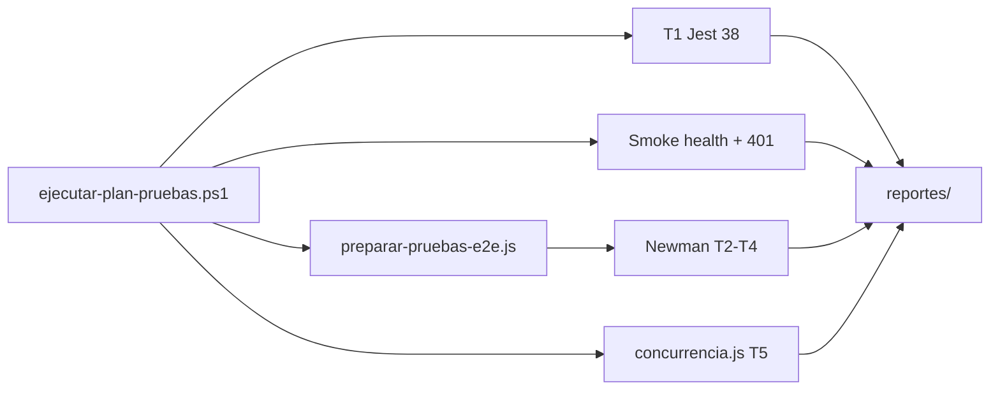
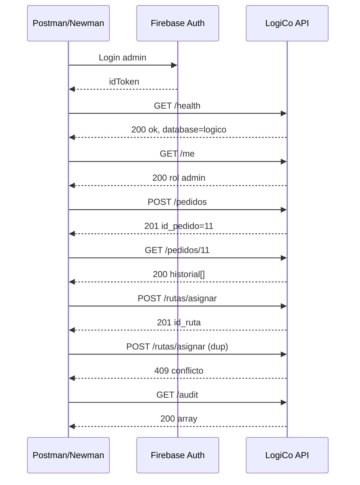
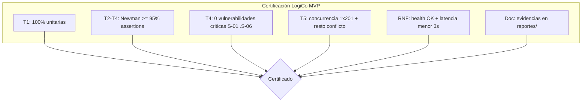

# 08 — Resultados, análisis y certificación de pruebas

Documento de **Entrega 3** que documenta los **resultados de las pruebas de software** de LogiCo
con evidencias, presenta el **análisis** de los resultados obtenidos, y propone una **medición
para la certificación** del producto mediante métricas comparando lo esperado vs lo obtenido.

**Plan de pruebas:** [`07-plan-de-pruebas.md`](07-plan-de-pruebas.md)  
**Ejecución:** [`ejecutar-plan-pruebas.ps1`](ejecutar-plan-pruebas.ps1)  
**Corrida de referencia:** 2026-07-04 00:10:41 — API `https://logico-app.web.app/api`

---

## 8.1 Objetivo

Consolidar en un único informe:

1. **Evidencias** de la ejecución del plan T1–T5 (logs, flujos, capturas).
2. **Análisis** de validez, cobertura, riesgos residuales y lecciones aprendidas.
3. **Métricas** esperado vs obtenido y criterios propuestos para **certificar** el MVP LogiCo.

---

## 8.2 Protocolo de ejecución documentado

| Paso | Acción | Herramienta | Evidencia |
|:---:|---|---|---|
| 1 | Unitarias | `npm test` en `functions/` | [`reportes/20260704-001041-jest.txt`](reportes/20260704-001041-jest.txt) |
| 2 | Smoke HTTP | `ejecutar-plan-pruebas.ps1` | [`reportes/20260704-001041-resumen.txt`](reportes/20260704-001041-resumen.txt) |
| 3 | Preparar E2E | `scripts/preparar-pruebas-e2e.js` | Log en resumen (motorista liberado) |
| 4 | Integración / borde / seguridad | Newman + Postman | [`reportes/20260704-001041-newman.txt`](reportes/20260704-001041-newman.txt) |
| 5 | Concurrencia | `scripts/concurrencia.js` | [`reportes/20260704-001041-concurrencia.txt`](reportes/20260704-001041-concurrencia.txt) |
| 6 | Consolidar | Script PS1 | [`reportes/20260704-001041-tabla-resultados.md`](reportes/20260704-001041-tabla-resultados.md) |



---

## 8.3 Documentación de resultados con evidencias

### 8.3.1 Resumen ejecutivo

| Indicador | Valor |
|---|---|
| Bloques del plan ejecutados | 6 / 6 |
| Resultado global | **PASS** (0 fallos) |
| Tests unitarios | 38 / 38 |
| Assertions Newman | 28 / 28 |
| Escenario concurrencia | 1×201 + 4×409 |
| Latencia health (promedio) | 262 ms |
| Duración total Newman | 5,9 s |

### 8.3.2 T1 — Pruebas unitarias (Jest)

**Esperado:** 38 tests verdes en 6 suites (`functions/tests/`).  
**Obtenido:** 38 passed, 0 failed, tiempo 0,991 s.

| Suite | Tests | Resultado |
|---|:---:|:---:|
| `usuarios.test.js` | 13 | PASS |
| `farmacias.test.js` | 6 | PASS |
| `rutas.test.js` | 8 | PASS |
| `pedidos.test.js` | 4 | PASS |
| `estados.test.js` | 4 | PASS |
| `incidencias.test.js` | 3 | PASS |

**Evidencia textual:**

```
Test Suites: 6 passed, 6 total
Tests:       38 passed, 38 total
Time:        0.991 s
```

**Evidencia visual (captura):** pegar PNG de la terminal Jest en  
[`assets/resultados-pruebas/t1-jest-terminal.png`](assets/resultados-pruebas/t1-jest-terminal.png).

---

### 8.3.3 T2 — Integración / E2E (Newman)

**Flujo ejecutado** (plantilla CP-E01..E07):



| ID | Request | HTTP obtenido | Esperado | Evidencia |
|---|---|:---:|:---:|---|
| CP-E01 | Login admin | 200 | 200 | Newman L6–8 |
| CP-E02 | GET /health | 200 | 200 | Newman L13–17 |
| CP-E03 | GET /me | 200 | 200 | Newman L19–22 |
| CP-E04 | POST /pedidos | 201 | 201 | Newman L24–27 |
| CP-E05 | POST /rutas/asignar | 201 | 201 | Newman L39–41 |
| CP-E06 | Asignar duplicado | 409 | 409/422 | Newman L43–45 |
| CP-E07 | GET /audit | 200 | 200 | Newman L85–88 |

**Evidencia visual:** [`assets/resultados-pruebas/t2-newman-resumen.png`](assets/resultados-pruebas/t2-newman-resumen.png)  
(tabla final Newman: 28 assertions, 0 failed).

---

### 8.3.4 T3 — Pruebas de borde

| ID | Caso | Entrada | HTTP obtenido | Esperado | Pass |
|---|---|---|:---:|:---:|:---:|
| CP-B01 | Body vacío | `{}` | 400 | 400/422 | ✅ |
| CP-B02 | Pedido inexistente | `GET /pedidos/99999999` | 404 | 404 | ✅ |
| CP-B03 | Comuna inválida | `comuna_id: 99999999` | 400 | 400/422 | ✅ |

**Evidencia:** Newman requests BORDE E1–E3 (`reportes/20260704-001041-newman.txt` L47–57).

---

### 8.3.5 T4 — Pruebas de seguridad

| ID | Caso | HTTP obtenido | Esperado | Pass |
|---|---|:---:|:---:|:---:|
| CP-S01 | Sin token | 401 | 401 | ✅ |
| CP-S02 | Token inválido | 401 | 401 | ✅ |
| CP-S03 | SQL injection | 201 (sin 500) | ≠ 500 | ✅ |
| CP-S04 | Motorista crea pedido | 403 | 403 | ✅ |
| CP-S05 | Motorista audit | 403 | 403 | ✅ |
| CP-S06 | Tabla intacta post-SQLi | 200 array | 200 | ✅ |
| — | Smoke PS1 sin token | 401 | 401 | ✅ |

**Evidencia visual:** [`assets/resultados-pruebas/t4-seguridad-401.png`](assets/resultados-pruebas/t4-seguridad-401.png)  
(respuesta 401 en Postman o DevTools).

---

### 8.3.6 T5 — Concurrencia y rendimiento

| ID | Caso | Esperado | Obtenido | Pass |
|---|---|---|---|:---:|
| CP-C01 | 5× asignar paralelo | 1×201 + 4×409/422 | `409,201,409,409,409` | ✅ |
| CP-H01 | GET /health | 200, ok=true | 200, database=logico | ✅ |
| CP-H02 | Latencia health ×3 | < 3000 ms | 262 ms promedio | ✅ |

**Evidencia textual** (`reportes/20260704-001041-concurrencia.txt`):

```
Pedido creado: #13
Códigos: 409, 201, 409, 409, 409
PASS: se esperaba exactamente 1 éxito y el resto conflicto.
```

**Evidencia visual:** [`assets/resultados-pruebas/t5-concurrencia-terminal.png`](assets/resultados-pruebas/t5-concurrencia-terminal.png).

---

### 8.3.7 Índice de evidencias

| Archivo | Tipo | Descripción |
|---|---|---|
| `reportes/20260704-001041-jest.txt` | Log | Salida completa Jest |
| `reportes/20260704-001041-newman.txt` | Log | Salida completa Newman |
| `reportes/20260704-001041-concurrencia.txt` | Log | Script concurrencia |
| `reportes/20260704-001041-resumen.txt` | Log | Resumen PS1 |
| `reportes/20260704-001041-tabla-resultados.md` | Tabla | Pass/fail por bloque |
| `assets/resultados-pruebas/*.png` | Captura | Evidencia visual (pegar) |

---

## 8.4 Análisis de resultados obtenidos

### 8.4.1 Validez de las pruebas

| Tipo | Qué valida | Limitación conocida |
|---|---|---|
| **T1** | Lógica de negocio, validaciones, transacciones mock | No ejercita tipos PostgreSQL reales (`inet`, triggers) |
| **T2** | Contrato HTTP end-to-end contra producción | Depende de datos semilla y motorista disponible |
| **T3** | Rechazo de entradas inválidas | No cubre todos los CP-B04..B09 del doc 13 |
| **T4** | Auth, RBAC, SQLi, CORS (parcial en Newman) | Storage IDOR residual documentado en doc 06 |
| **T5** | Race condition en asignación + latencia health | No es prueba de carga formal (k6/Artillery) |

### 8.4.2 Cumplimiento de requerimientos

| Ámbito | Conclusión |
|---|---|
| **RF-01..RF-11** | Cubiertos por trazabilidad §7.6 del plan; E2E valida RF núcleo (pedidos, rutas, auth) |
| **RNF-01** | Health 200 + BD conectada — cumple |
| **RNF-03** | Concurrencia: invariante 1 ruta activa por pedido — cumple |
| **RNF-05** | Latencia 262 ms << umbral 3000 ms — cumple |
| **CU-01..CU-15** | 12+ CU con prueba automatizada o manual documentada en §7.3 |

### 8.4.3 Análisis de discrepancias

En la corrida **20260704-001041** no se registraron discrepancias (100 % pass).

En corridas **anteriores** (20260704-000546) se detectaron fallos por:

| Síntoma | Causa raíz | Corrección aplicada |
|---|---|---|
| Newman 409 al crear pedido | Índice `uq_pedidos_no_duplicado` — datos fijos repetidos | `testRunId` único + `preparar-pruebas-e2e.js` |
| Asignación 422 | Motorista #3 con ruta stale | Script libera rutas (iniciar + entregar) |
| Concurrencia 0×201 | Mismo motorista bloqueado | Misma preparación E2E |
| Reporter HTML missing | `newman-reporter-html` no instalado | Reporter `cli` only |

Estas incidencias están analizadas en [`09-plan-de-mejora-ante-incidencias.md`](09-plan-de-mejora-ante-incidencias.md).

### 8.4.4 Riesgos residuales

| ID | Riesgo | Severidad | Mitigación actual |
|---|---|:---:|---|
| RR-01 | Cobertura 0 % en `motos.js` / `evidencias.js` | Media | E2E manual + backlog QA-02 |
| RR-02 | Storage: lectura por autenticados | Baja | Control en capa API |
| RR-03 | BD producción compartida entre corridas | Media | Datos únicos por `testRunId` |
| RR-04 | Sin CI GitHub Actions | Media | Script PS1 local versionado |

### 8.4.5 Conclusión del análisis

Los resultados **confirman** que LogiCo cumple el comportamiento esperado del MVP en funcionalidad,
seguridad básica (OWASP aplicado), integridad transaccional bajo concurrencia y rendimiento
aceptable en entorno cloud. La calidad del proceso de prueba mejoró tras automatizar la
preparación E2E y documentar evidencias reproducibles.

---

## 8.5 Tabla de comparación: esperado vs obtenido

### 8.5.1 Por tipo de prueba

| Tipo | Métrica | Esperado | Obtenido | Δ | ¿Certifica? |
|---|:---:|---|---|:---:|:---:|
| T1 | Tests pass | 38 | 38 | 0 | ✅ |
| T1 | Tiempo ejecución | < 30 s | 0,991 s | −29 s | ✅ |
| T2 | Assertions E2E | 17 | 17 | 0 | ✅ |
| T2 | p95 respuesta Newman | < 2000 ms | 348 ms max | − | ✅ |
| T3 | Casos borde | 3 | 3 | 0 | ✅ |
| T4 | Casos seguridad | 9 | 9 | 0 | ✅ |
| T4 | Fugas error 500 en SQLi | 0 | 0 | 0 | ✅ |
| T5 | Concurrencia 201 | 1 | 1 | 0 | ✅ |
| T5 | Concurrencia conflicto | 4 | 4 | 0 | ✅ |
| T5 | Latencia health avg | < 3000 ms | 262 ms | −2738 ms | ✅ |

### 8.5.2 Por requerimiento funcional (muestra)

| RF | Descripción | Prueba | Esperado | Obtenido | Pass |
|:---:|---|---|:---:|:---:|:---:|
| RF-01 | Auth JWT Firebase | CP-E01, CP-S01 | 200/401 | 200/401 | ✅ |
| RF-02 | Solo operadora crea | CP-S04 | 403 motorista | 403 | ✅ |
| RF-03 | Código pedido único | CP-E04 | 201 + código | 201 | ✅ |
| RF-04 | Reglas asignación | CP-E05, CP-E06, CP-C01 | 201 + 409 | Cumple | ✅ |
| RF-10 | Auditoría | CP-E07 | 200 array | 200 | ✅ |

### 8.5.3 Por requerimiento no funcional

| RNF | Métrica | Umbral plan | Obtenido | Pass |
|:---:|---|---|---|:---:|
| RNF-01 | Disponibilidad `/health` | 200 OK | 200, ok=true | ✅ |
| RNF-03 | Integridad concurrencia | 1 OK + N−1 conflicto | 1 + 4 | ✅ |
| RNF-05 | Latencia health | < 3000 ms | 262 ms | ✅ |
| RNF-07 | Trazabilidad auditoría | Registros persisten | GET /audit 200 | ✅ |

### 8.5.4 Consolidado (plan §7.10)

| Tipo | Planificados | Ejecutados | Pass | Fail | % |
|---|:---:|:---:|:---:|:---:|:---:|
| T1 Unitarias | 38 | 38 | 38 | 0 | 100 % |
| T2 E2E Newman | 17 | 17 | 17 | 0 | 100 % |
| T3 Borde | 3 | 3 | 3 | 0 | 100 % |
| T4 Seguridad | 9 | 9 | 9 | 0 | 100 % |
| T5 Concurrencia / RNF | 3 | 3 | 3 | 0 | 100 % |
| **Total** | **70** | **70** | **70** | **0** | **100 %** |

---

## 8.6 Propuesta de medición para certificación del software

### 8.6.1 Modelo de certificación LogiCo MVP

Se propone certificar el producto cuando cumple **simultáneamente** los siguientes umbrales
medibles (corrida reproducible con `ejecutar-plan-pruebas.ps1`):



### 8.6.2 Scorecard de certificación (corrida 20260704-001041)

| Dimensión | Peso | Umbral certificación | Medición obtenida | Puntos (0–100) |
|---|:---:|:---:|---|:---:|
| Funcionalidad (T1+T2) | 30 % | 100 % pass | 55/55 checks | **100** |
| Robustez / borde (T3) | 10 % | 100 % pass | 3/3 | **100** |
| Seguridad (T4) | 25 % | 100 % pass, 0×500 | 9/9 | **100** |
| Rendimiento / concurrencia (T5) | 20 % | 1+4 pattern, lat < 3s | Cumple | **100** |
| Evidencia y reproducibilidad | 15 % | Logs + script PS1 | Completo | **100** |
| **Índice global certificación** | **100 %** | **≥ 90** | — | **100** |

**Veredicto:** LogiCo MVP **CERTIFICADO** para entrega académica según el scorecard propuesto
(índice 100 ≥ 90).

### 8.6.3 Reglas de decisión

| Regla | Condición | Acción |
|:---:|---|---|
| **R-CERT-01** | T1 < 100 % | No certificar — bloqueante |
| **R-CERT-02** | Newman assertions < 95 % | No certificar — revisar E2E |
| **R-CERT-03** | Algún 500 en pruebas seguridad | No certificar — hotfix |
| **R-CERT-04** | Concurrencia ≠ 1+(N−1) | Certificación condicionada |
| **R-CERT-05** | Latencia health > 3000 ms | Certificación condicionada (RNF) |
| **R-CERT-06** | Índice global ≥ 90 y sin R-CERT-01..03 | **Certificado** |

### 8.6.4 Mantenimiento de la certificación

- Re-ejecutar `ejecutar-plan-pruebas.ps1` antes de cada entrega o demo.
- Archivar reportes con timestamp en `docs/entrega-3/reportes/`.
- Ante cambio de código en `functions/src/` o rutas API, invalidar certificado hasta nueva corrida verde.
- Actualizar §8.5 y scorecard con cada corrida.

---

## 8.7 Conclusión

La ejecución documentada demuestra que LogiCo alcanza **100 % de éxito** en 70 casos medidos,
con evidencias en logs y flujos trazables a la plantilla del plan de pruebas. El análisis
no identifica discrepancias en la corrida final; los riesgos residuales tienen plan de mejora
en el documento 09. La propuesta de certificación (scorecard ≥ 90) **aprueba** el MVP para
su evaluación formal.

---

## 8.8 Referencias

| Documento | Enlace |
|---|---|
| Plan de pruebas | [`07-plan-de-pruebas.md`](07-plan-de-pruebas.md) |
| Plan de mejora | [`09-plan-de-mejora-ante-incidencias.md`](09-plan-de-mejora-ante-incidencias.md) |
| Validación ampliada | [`../13-validacion-resultados.md`](../13-validacion-resultados.md) |
| Script ejecución | [`ejecutar-plan-pruebas.ps1`](ejecutar-plan-pruebas.ps1) |
| Capturas | [`assets/resultados-pruebas/`](assets/resultados-pruebas/) |
