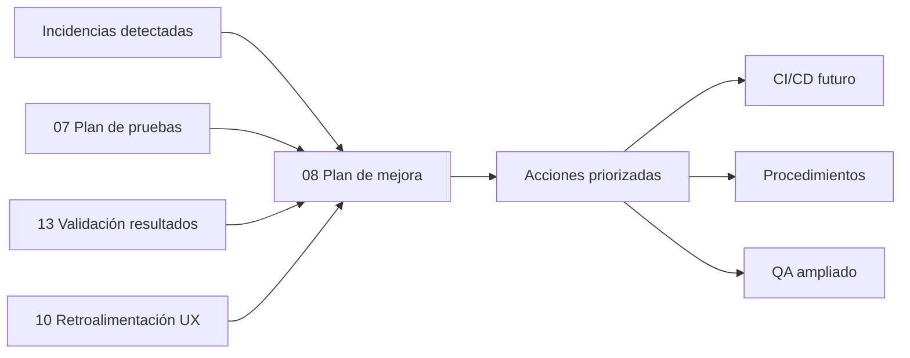
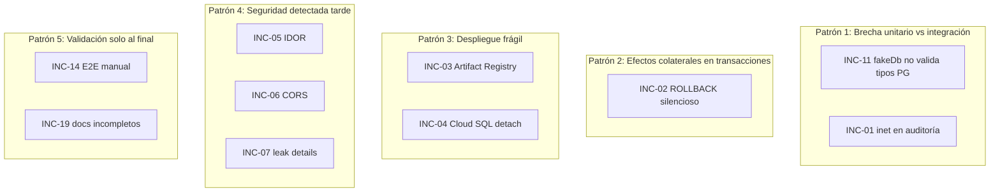
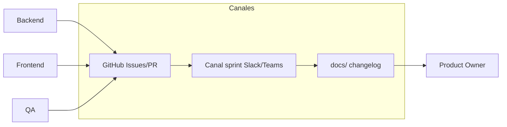
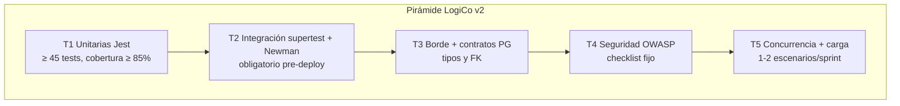
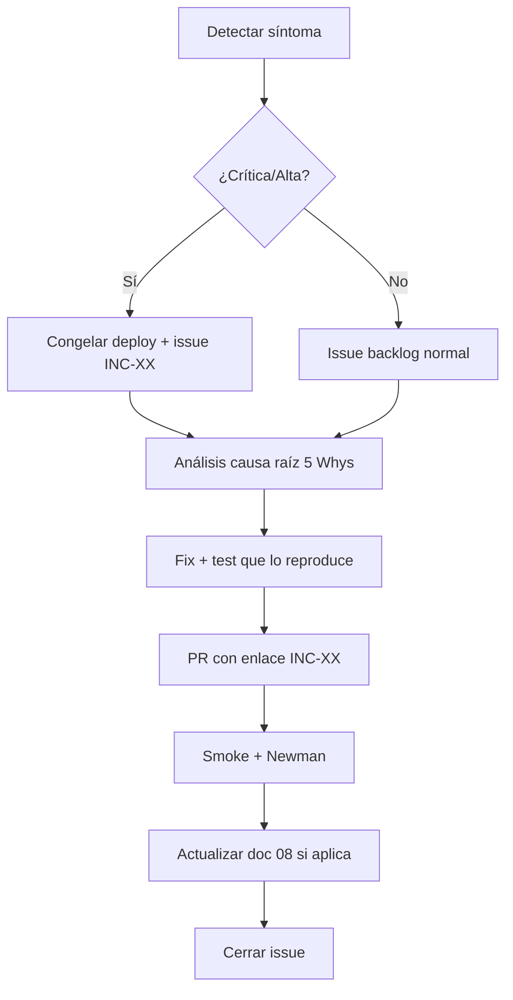
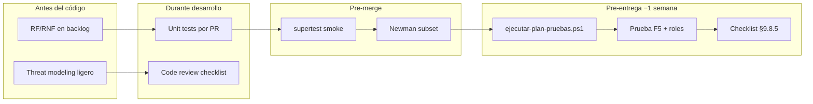
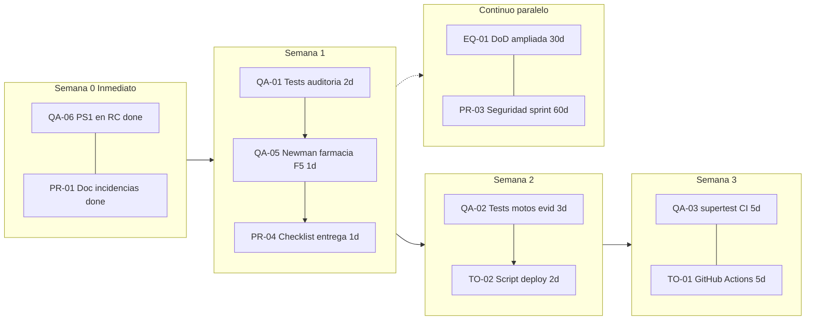

# 09 — Plan de mejora ante las incidencias

Documento de **Entrega 3** que consolida las **incidencias reales** detectadas durante el
desarrollo de LogiCo y propone un **plan de mejora continua** en cinco dimensiones exigidas
por la rúbrica: trabajo en equipo, proceso de pruebas, herramientas, procedimientos y
detección temprana de errores **antes** de la evaluación formal.

---

## 9.1 Objetivo y alcance

### 9.1.1 Objetivo

Transformar cada incidente ocurrido en el proyecto —técnico, de proceso o de calidad— en
**acciones concretas, medibles y asignables**, de modo que un equipo posterior no repita los
mismos fallos y eleve la madurez del ciclo de vida del software.

### 9.1.2 Alcance

| Incluye | Excluye |
|---|---|
| Incidencias de desarrollo, despliegue, pruebas y UX | Incidentes operativos en producción real (fuera del MVP académico) |
| Mejoras al proceso Scrum del equipo LogiCo | Reescritura completa del producto |
| Herramientas ya usadas (Jest, Newman, Firebase, Git) | Adopción de stack alternativo |
| Procedimientos documentados en `docs/` | Políticas corporativas externas al proyecto |

### 9.1.3 Relación con otros entregables



---

## 9.2 Metodología de análisis

Cada incidencia se documentó con la plantilla **5 Whys + acción correctiva/preventiva**:

| Campo | Descripción |
|---|---|
| **ID** | Identificador único `INC-XX` |
| **Fase** | Sprint o etapa donde apareció |
| **Severidad** | Crítica / Alta / Media / Baja |
| **Síntoma** | Lo que observó el usuario o el evaluador |
| **Causa raíz** | Por qué ocurrió (no el síntoma) |
| **Impacto** | Funcional, datos, seguridad, reputación académica |
| **Corrección aplicada** | Fix inmediato (si existe) |
| **Mejora propuesta** | Acción estructural para no repetir |
| **Dimensión** | Equipo / Pruebas / Herramientas / Procedimientos / Detección temprana |

---

## 9.3 Registro de incidencias del proyecto

### 9.3.1 Incidencias técnicas — backend y datos

| ID | Incidencia | Severidad | Sprint | Estado |
|---|---|:---:|:---:|:---:|
| INC-01 | Farmacias desaparecen al refrescar (F5) tras crear | **Crítica** | 5 | Corregido* |
| INC-02 | `POST /farmacias` retorna 201 pero registro no persiste | **Crítica** | 5 | Corregido* |
| INC-03 | Cloud Run: `Image not found` tras deploy Functions | Alta | 5 | Mitigado |
| INC-04 | Cloud SQL desvinculado de revisión Cloud Run post-deploy | Alta | 5 | Mitigado |
| INC-05 | IDOR: motorista accede a pedidos/evidencias ajenos | Alta | 5 | Corregido |
| INC-06 | CORS permite orígenes no autorizados | Media | 5 | Corregido |
| INC-07 | Respuestas 500 exponen `details` internos | Media | 5 | Corregido |
| INC-08 | Doble click crea pedidos duplicados | Alta | 4 | Corregido |
| INC-09 | Errores PG mostrados como "HTTP 500" genérico | Alta | 4 | Corregido |
| INC-10 | Listado pedidos lento con > 5000 registros | Media | 4 | Corregido |

\* INC-01/02: causa en `registrarAuditoria()` — IP multi-valor (`"ip1,ip2"`) insertada en
columna PostgreSQL `inet` → excepción → **ROLLBACK silencioso** de toda la transacción.
El cliente recibía 201 porque el error ocurría **después** del commit lógico aparente.
Corrección: `extraerIp()` + `SAVEPOINT sp_auditoria` en `functions/src/auditoria.js`.

### 9.3.2 Incidencias de proceso — pruebas y despliegue

| ID | Incidencia | Severidad | Sprint | Estado |
|---|---|:---:|:---:|:---:|
| INC-11 | Unitarias 38/38 verdes pero bug INC-01 en producción | **Crítica** | 5 | Analizado |
| INC-12 | Newman falla con `ENOENT` al ejecutar desde `functions/` | Media | 5 | Documentado |
| INC-13 | Cobertura ~84 % oculta módulos sin tests (`motos.js`, `evidencias.js`) | Media | 5 | Pendiente |
| INC-14 | E2E dependía de ejecución manual Postman (sin CI) | Media | 5 | Parcial** |
| INC-15 | Script concurrencia no integrado al DoD inicial | Baja | 5 | Corregido |

\*\* Parcial: script `ejecutar-plan-pruebas.ps1` automatiza T1–T5; CI en GitHub Actions pendiente.

### 9.3.3 Incidencias de UX y documentación

| ID | Incidencia | Severidad | Sprint | Estado |
|---|---|:---:|:---:|:---:|
| INC-16 | Estados de pedido indistinguibles visualmente | Media | 4 | Corregido |
| INC-17 | Motorista ve botón "Entregar" antes de iniciar ruta | Alta | 4 | Corregido |
| INC-18 | Lista motoristas incluye no disponibles | Media | 4 | Corregido |
| INC-19 | Placeholders sin completar (URL GitHub, capturas patrones) | Baja | 5 | Pendiente |
| INC-20 | Diagrama Gantt Mermaid no renderiza en preview IDE | Baja | 5 | Mitigado |

### 9.3.4 Resumen cuantitativo

| Categoría | Total | Corregidas | Mitigadas | Pendientes |
|---|:---:|:---:|:---:|:---:|
| Técnicas backend/datos | 10 | 9 | 1 | 0 |
| Proceso pruebas/deploy | 5 | 1 | 2 | 2 |
| UX y documentación | 5 | 3 | 1 | 1 |
| **Total** | **20** | **13** | **4** | **3** |

---

## 9.4 Análisis de causa raíz transversal

Las incidencias no son aisladas; convergen en **cinco patrones sistémicos**:



| Patrón | Incidencias asociadas | Lección aprendida |
|---|---|---|
| Brecha mock vs BD real | INC-01, INC-11, INC-13 | Los mocks validan lógica, no contratos SQL ni tipos PostgreSQL |
| Transacciones compartidas | INC-01, INC-02 | Operaciones auxiliares (auditoría) deben aislar fallos (`SAVEPOINT`) |
| Pipeline de deploy | INC-03, INC-04 | Deploy ≠ solo `firebase deploy`; verificar revisión activa y adjuntos |
| Seguridad reactiva | INC-05..07 | Checklist OWASP debe ejecutarse en Sprint 3, no solo Sprint 5 |
| Validación tardía | INC-14, INC-19 | Automatizar smoke post-deploy y checklist de entrega por sprint |

---

## 9.5 Mejoras en trabajo en equipo

### 9.5.1 Situación actual

El equipo adoptó Scrum con roles definidos (PO, SM, BE, FE, QA/DevOps) según
[`01-metodologia-scrum.md`](../01-metodologia-scrum.md). La colaboración funcionó en
desarrollo paralelo frontend/backend, pero las incidencias INC-01 e INC-05 revelaron
**silos**: QA validaba mocks verdes mientras BE desplegaba sin smoke integrado conjunto.

### 9.5.2 Problemas detectados

| Problema | Evidencia | Consecuencia |
|---|---|---|
| Revisiones de PR centradas en funcionalidad, no en transacciones | INC-01 | Bug crítico pasa code review |
| Falta de "dueño" del despliegue end-to-end | INC-03, INC-04 | Cada deploy requiere intervención manual |
| Documentación repartida sin checklist unificado | INC-19 | Entrega con placeholders |
| Conocimiento tácito (rutas Newman, orden deploy) | INC-12 | Dependencia de una persona |

### 9.5.3 Acciones de mejora propuestas

| # | Acción | Responsable | Entregable | Plazo |
|---|---|---|---|---|
| EQ-01 | **Definition of Done ampliada**: incluir smoke HTTP post-merge (`/health`, CRUD farmacia, F5) | SM + QA | Actualizar §1.3 metodología | Sprint +1 |
| EQ-02 | **Rotación de "Release Captain"** por sprint: una persona verifica deploy completo | SM | Acta sprint con checklist | Inmediato |
| EQ-03 | **Pair review** obligatorio en módulos transaccionales (`auditoria.js`, `rutas.js`, `pedidos.js`) | BE | Política en README repo | Sprint +1 |
| EQ-04 | **Daily de riesgos**: 2 min al final del standup para bloqueos de integración | SM | Template daily | Inmediato |
| EQ-05 | **Matriz RACI** deploy: quién ejecuta, verifica Cloud SQL, corre Newman | DevOps | Tabla en doc 12 | Sprint +1 |
| EQ-06 | **Sesión retrospectiva ampliada** post-incidente crítico (plantilla §9.12) | Todo el equipo | Acta INC-01 en retro | Por incidente |

### 9.5.4 Acuerdos de comunicación



- Todo bug **Crítico/Alto** abre issue con etiqueta `incidente` y referencia `INC-XX`.
- El fix debe enlazar al caso de prueba que lo habría detectado (trazabilidad inversa).
- Demo de Sprint Review incluye **recarga F5** en pantallas CRUD (lección INC-01).

---

## 9.6 Mejoras en el proceso de pruebas de software

### 9.6.1 Situación actual

El plan de pruebas ([`07-plan-de-pruebas.md`](07-plan-de-pruebas.md)) define **5 tipos**
(T1–T5) con 38 unitarias Jest y colección Newman. La validación ([`13-validacion-resultados.md`](../13-validacion-resultados.md))
reporta 100 % funcional, pero INC-11 demostró que **T1 sola no garantiza integridad en producción**.

### 9.6.2 Brechas identificadas

| Brecha | Incidencia | Tipo afectado | Riesgo residual |
|---|---|---|---|
| `fakeDb` no emula tipos PG (`inet`, constraints) | INC-11 | T1 | Alto |
| Sin tests de integración HTTP en repo (`supertest`) | INC-14 | T2 | Medio |
| Auditoría no cubierta por tests | INC-01 | T1/T2 | Alto |
| Módulos periféricos sin unitarias | INC-13 | T1 | Medio |
| Concurrencia opcional, no en DoD | INC-15 | T5 | Bajo |

### 9.6.3 Pirámide de pruebas objetivo (post-mejora)



### 9.6.4 Acciones de mejora propuestas

| # | Acción | Deriva de | Prioridad | Criterio de éxito |
|---|---|---|:---:|---|
| QA-01 | Añadir suite `auditoria.test.js` con IP multi-valor y SAVEPOINT | INC-01 | **Alta** | 3+ casos verdes |
| QA-02 | Tests unitarios `motos.js` y `evidencias.js` | INC-13, R1 | **Alta** | +7 tests, cobertura ≥ 85 % |
| QA-03 | Suite `supertest` smoke: `/health`, `/me`, 401, POST farmacia + GET | INC-11, R2 | **Alta** | 5+ tests en CI |
| QA-04 | Test integración: transacción completa con BD Docker (opcional sprint) | INC-11 | Media | 1 suite `@integration` |
| QA-05 | Caso Newman **"Crear farmacia + listar + F5"** explícito | INC-01 | **Alta** | Assertion count +2 |
| QA-06 | Ejecutar `ejecutar-plan-pruebas.ps1` en **cada Release Candidate** | INC-14 | **Alta** | Reporte en `reportes/` |
| QA-07 | Checklist seguridad S-01..S-10 antes de demo externa | INC-05 | **Alta** | Tabla firmada QA |
| QA-08 | `jest --coverage` en pipeline; umbral mínimo 80 % líneas | R4 | Media | Badge en README |
| QA-09 | Pruebas de carga k6/Artillery versionadas (`scripts/load/`) | R7 | Baja | Informe p95 |

### 9.6.5 Flujo de pruebas propuesto (antes de evaluación)

| Orden | Paso | Bloqueante | Tiempo estimado |
|:---:|---|:---:|:---:|
| 1 | `npm test` (T1) | Sí | ~6 s |
| 2 | `npm run test:integration` (T2 supertest, futuro) | Sí | ~30 s |
| 3 | `ejecutar-plan-pruebas.ps1` completo (T2–T5 Newman + smoke) | Sí | ~3 min |
| 4 | Verificación manual UI: F5 en CRUD admin | Sí | ~5 min |
| 5 | Revisión matriz trazabilidad §7.7 plan pruebas | No | ~10 min |

---

## 9.7 Mejoras en el uso de herramientas de software

### 9.7.1 Inventario de herramientas actuales

| Herramienta | Uso actual | Incidencia relacionada | Mejora propuesta |
|---|---|---|---|
| **Jest** + `fakeDb` | 38 tests unitarios | INC-11 | Complementar con supertest/BD |
| **Postman + Newman** | E2E contra API desplegada | INC-12 | Ejecutar siempre desde raíz proyecto |
| **Firebase CLI** | Deploy hosting + functions | INC-03, INC-04 | Script deploy verificado |
| **gcloud** | Adjuntar Cloud SQL a Cloud Run | INC-04 | Automatizar en `deploy.ps1` |
| **PowerShell** | `ejecutar-plan-pruebas.ps1` | — | Extender a deploy smoke |
| **Git / GitHub** | Control de versiones | INC-19 | Branch protection + CI |
| **Mermaid** | Diagramas en docs | INC-20 | Flowchart fallback en IDE |
| **SonarQube** (mencionado) | Cobertura ~84 % | INC-13 | Integrar en CI |
| **Cursor / VS Code** | Desarrollo + preview MD | — | Extensión Mermaid oficial |

### 9.7.2 Herramientas a incorporar o formalizar

| Herramienta | Propósito | Prioridad | Incidencia que previene |
|---|---|:---:|---|
| **GitHub Actions** | CI: test + Newman en PR | Alta | INC-14 |
| **Docker Compose** | PostgreSQL local para tests integración | Media | INC-11 |
| **husky + lint-staged** | Pre-commit: `npm test` rápido | Media | Regresiones locales |
| **Dependabot** | Alertas CVE en `functions/` | Media | Seguridad supply chain |
| **Firebase Emulator Suite** | E2E sin costo cloud | Media | INC-03 cold deploy |
| **Checklist Notion/Jira** | Entregables académicos | Baja | INC-19 |

### 9.7.3 Estandarización de rutas y comandos

Documentar en [`12-configuracion-entorno.md`](../12-configuracion-entorno.md) §12.9 (nuevo):

```powershell
# SIEMPRE desde la raíz del repositorio Logico/
cd "C:\...\Logico"

# Unitarias
cd functions; npm test; cd ..

# Plan completo Entrega 3
cd docs\entrega-3
.\ejecutar-plan-pruebas.ps1 -AdminEmail "..." -AdminPassword "..."

# Newman manual (alternativa)
npx newman run postman/LogiCo.postman_collection.json `
  -e postman/LogiCo.postman_environment.json `
  --env-var "baseUrl=https://logico-app.web.app/api"
```

> **Lección INC-12:** ejecutar Newman desde `functions/` provoca `ENOENT` porque las rutas
> de la colección son relativas a la raíz del monorepo.

### 9.7.4 Script de deploy propuesto (futuro)

| Paso | Comando / herramienta | Verificación |
|---|---|---|
| 1 | `npm test` | Exit 0 |
| 2 | `firebase deploy --only functions,hosting` | Log sin error |
| 3 | `gcloud run services update api --add-cloudsql-instances=...` | Cloud SQL attached |
| 4 | `GET /api/health` | `database=logico` |
| 5 | Newman smoke (5 requests) | 100 % assertions |

---

## 9.8 Mejoras en procedimientos

### 9.8.1 Procedimientos existentes y gaps

| Procedimiento | Documento | Gap detectado |
|---|---|---|
| Definition of Done | `01-metodologia-scrum.md` §1.3 | No exige smoke post-deploy ni F5 |
| Configuración entorno | `12-configuracion-entorno.md` | Falta sección deploy Cloud Run + SQL |
| Plan de pruebas | `07-plan-de-pruebas.md` | Ejecución automatizada reciente |
| Codificación segura | `07-codificacion-segura.md` | Checklist no amarrado a sprint |
| Gestión de incidencias | **No existía** | Este documento lo formaliza |

### 9.8.2 Procedimiento PRC-01 — Gestión de incidencias



| Paso | Acción | Responsable | SLA |
|:---:|---|---|:---:|
| 1 | Registrar en tabla §9.3 | Quien detecta | 24 h |
| 2 | Clasificar severidad | SM + QA | 4 h |
| 3 | Asignar dueño técnico | SM | 4 h |
| 4 | Implementar fix + test | BE/FE | Según severidad |
| 5 | Validar con plan de pruebas | QA | 1 h |
| 6 | Documentar lección aprendida | Autor fix | 24 h post-cierre |

### 9.8.3 Procedimiento PRC-02 — Deploy a producción (Firebase + Cloud SQL)

Derivado de INC-03 e INC-04:

| # | Paso | Comando / acción | Verificación |
|:---:|---|---|---|
| 1 | Confirmar tests verdes | `npm test` | 38+ passed |
| 2 | Revisar `.env` producción | Secretos en Firebase Functions config | Sin passwords en repo |
| 3 | Deploy | `firebase deploy --only functions,hosting` | Exit 0 |
| 4 | Verificar revisión activa | Consola Cloud Run / `gcloud run revisions list` | Última revisión OK |
| 5 | Re-adjuntar Cloud SQL si aplica | `gcloud run services update api --add-cloudsql-instances=PROJECT:REGION:INSTANCE` | Env `CLOUD_SQL_CONNECTION_NAME` |
| 6 | Smoke health | `GET /api/health` | `ok: true`, `database: logico` |
| 7 | Smoke seguridad | `GET /api/pedidos` sin token | HTTP 401 |
| 8 | Smoke funcional | Newman carpeta `SMOKE` o script PS1 | 100 % pass |
| 9 | Verificación UI | Crear farmacia → F5 → persiste | Manual 2 min |
| 10 | Registrar en log deploy | `docs/assets/deploy-log.md` | Fecha + revisión |

### 9.8.4 Procedimiento PRC-03 — Revisión de seguridad por sprint

| Checkpoint | Ítem | Herramienta | Sprint objetivo |
|---|---|---|:---:|
| CS-01 | Autenticación JWT en rutas protegidas | Newman S-01 | 2+ |
| CS-02 | RBAC por rol | Newman S-09 | 3+ |
| CS-03 | IDOR en recursos `:id` | Newman S-04, S-05 | 3+ |
| CS-04 | SQL injection en campos texto | Newman S-03 | 3+ |
| CS-05 | CORS allowlist | Newman S-07 | 4+ |
| CS-06 | Errores sin filtrar stack/details | Newman S-08 | 4+ |
| CS-07 | Auditoría no rompe transacciones | Test Jest auditoría | 5+ |
| CS-08 | `npm audit --audit-level=high` | CLI | Cada sprint |

> **Lección INC-05..07:** ejecutar CS-03..CS-06 en Sprint 3 habría reducido retrabajo en Sprint 5.

### 9.8.5 Procedimiento PRC-04 — Checklist entrega académica

Evita INC-19 (placeholders):

| # | Ítem | Ubicación | Estado mínimo |
|:---:|---|---|:---:|
| 1 | URL repositorio GitHub | `06` §6.1 | URL real |
| 2 | Capturas patrones P1–P7 | `assets/patrones/` | 7 PNG |
| 3 | Tabla resultados pruebas | `07` §7.10 o `reportes/` | Ejecutada |
| 4 | Plan de mejora | `08` (este doc) | Completo |
| 5 | Modelos Mermaid renderizables | `01`–`04` | Preview OK |
| 6 | Scripts SQL ejecutables | `database/` | Sin error psql |

**Regla:** ningún `(completar)` en docs el día **−3** antes de la entrega formal.

---

## 9.9 Mejoras para detección de errores antes de la evaluación

Esta sección responde directamente al requisito de **detectar fallos antes de ser evaluados**
por docente o tribunal.

### 9.9.1 Estrategia "Shift-left" adaptada a LogiCo



### 9.9.2 Controles de detección temprana (por fase)

| Fase | Control | Qué habría detectado | Costo de no tenerlo |
|---|---|---|---|
| Diseño BD | Revisión tipos PG vs JS (`inet`, `uuid`, `timestamptz`) | INC-01 | 4 h debug + datos perdidos |
| PR | Checklist "¿Operación auxiliar en misma TX?" | INC-01 | Bug en producción |
| PR | Test con IP `x-forwarded-for` multi-valor | INC-01 | Falso positivo 201 |
| Sprint 3 | OWASP CS-03..06 | INC-05..07 | Retrabajo seguridad |
| Post-deploy | Smoke farmacia + F5 | INC-01, INC-02 | Evaluador ve bug |
| Semanal | `ejecutar-plan-pruebas.ps1` | INC-11, INC-14 | Confianza falsa en unitarias |
| Pre-entrega | Simulacro evaluación (compañero externo) | INC-16..18 UX | Puntos usabilidad |

### 9.9.3 Casos de prueba "trampa" recomendados (anti-regresión)

Estos casos se añaden explícitamente porque **hubieran fallado antes de la evaluación** si
existieran desde el sprint correspondiente:

| ID | Caso | Tipo | Detecta |
|---|---|---|---|
| TR-01 | POST farmacia → GET list → recargar UI → registro visible | E2E | INC-01, INC-02 |
| TR-02 | `registrarAuditoria` con `x-forwarded-for: 1.1.1.1, 2.2.2.2` | Unit | INC-01 |
| TR-03 | Motorista GET pedido ajeno | Seguridad | INC-05 |
| TR-04 | Deploy + health + pedidos 401 en secuencia | Smoke deploy | INC-03, INC-04 |
| TR-05 | Doble submit formulario crear pedido | UI manual | INC-08 |
| TR-06 | Newman desde raíz vs subcarpeta (test CI path) | Proceso | INC-12 |

### 9.9.4 Calendario de verificación pre-evaluación

| Día relativo | Actividad | Responsable | Evidencia |
|:---:|---|---|---|
| **−7** | Ejecución completa plan T1–T5 | QA | `reportes/*-resumen.txt` |
| **−5** | Simulacro demo 30 min (3 roles) | PO + equipo | Acta observaciones |
| **−4** | Completar checklist §9.8.5 | SM | README entrega-3 ✅ |
| **−3** | Revisión cruzada docs vs código | Par externo | Lista correcciones |
| **−2** | Deploy producción + PRC-02 completo | Release Captain | deploy-log |
| **−1** | Congelación de código (`code freeze`) | SM | Tag `v-entrega-3` |
| **0** | Solo hotfixes críticos con QA express | SM | — |

---

## 9.10 Matriz consolidada de acciones

| ID | Dimensión | Acción | Prioridad | Esfuerzo | Incidencias | Estado |
|---|---|---|:---:|:---:|---|:---:|
| EQ-01 | Equipo | DoD con smoke F5 | Alta | S | INC-01 | Propuesto |
| EQ-02 | Equipo | Release Captain rotativo | Alta | S | INC-03,04 | Propuesto |
| EQ-03 | Equipo | Pair review transaccional | Media | M | INC-01 | Propuesto |
| QA-01 | Pruebas | Tests auditoría + SAVEPOINT | Alta | M | INC-01 | Propuesto |
| QA-02 | Pruebas | Tests motos + evidencias | Alta | M | INC-13 | Propuesto |
| QA-03 | Pruebas | Suite supertest | Alta | L | INC-11 | Propuesto |
| QA-05 | Pruebas | Newman farmacia + F5 | Alta | S | INC-01 | Propuesto |
| QA-06 | Pruebas | PS1 en cada RC | Alta | S | INC-14 | **Implementado** |
| QA-07 | Pruebas | Checklist S-01..S-10 | Alta | S | INC-05 | Parcial |
| TO-01 | Herramientas | GitHub Actions CI | Alta | L | INC-14 | Propuesto |
| TO-02 | Herramientas | Script deploy.ps1 | Alta | M | INC-03,04 | Propuesto |
| TO-03 | Herramientas | husky pre-commit test | Media | S | — | Propuesto |
| PR-01 | Procedimientos | PRC-01 gestión incidencias | Alta | S | Todos | **Este doc** |
| PR-02 | Procedimientos | PRC-02 deploy verificado | Alta | M | INC-03,04 | Propuesto |
| PR-03 | Procedimientos | PRC-03 seguridad por sprint | Alta | S | INC-05..07 | Propuesto |
| PR-04 | Procedimientos | PRC-04 checklist entrega | Alta | S | INC-19 | Propuesto |
| DT-01 | Detección | Casos TR-01..TR-06 | Alta | M | Varios | Propuesto |
| DT-02 | Detección | Calendario −7..0 días | Alta | S | INC-19 | Propuesto |
| DT-03 | Detección | Simulacro evaluación | Media | M | UX | Propuesto |

**Leyenda esfuerzo:** S = ≤ 4 h | M = 1–2 días | L = 3–5 días

---

## 9.11 Cronograma de implementación sugerido

El preview de Cursor/VS Code **no renderiza** diagramas `gantt`. A continuación un **flowchart**
cronológico (visible en preview) y el Gantt clásico en
[`assets/plan-mejora-gantt.txt`](assets/plan-mejora-gantt.txt) para [mermaid.live](https://mermaid.live).

### Diagrama cronológico (preview IDE)



### Tabla resumen

| Semana | Entregables | IDs acción |
|:---:|---|---|
| 0 (actual) | Plan de mejora + script PS1 pruebas | PR-01, QA-06 |
| 1 | Tests auditoría, Newman F5, checklist entrega | QA-01, QA-05, PR-04 |
| 2 | Cobertura motos/evidencias, script deploy | QA-02, TO-02 |
| 3 | supertest + GitHub Actions | QA-03, TO-01 |
| 4+ | Mantener PRC-02/03 en cada sprint | PR-02, PR-03, EQ-01 |

---

## 9.12 Indicadores de seguimiento (KPIs)

| KPI | Línea base (Jul 2026) | Meta 3 meses | Fuente |
|---|---|---|---|
| Incidencias críticas en demo | 2 (INC-01, INC-11) | 0 | Tabla §9.3 |
| Tests unitarios | 38 | ≥ 48 | Jest output |
| Cobertura líneas | ~84 % | ≥ 85 % | `jest --coverage` |
| Assertions Newman pass | Manual | 100 % automatizado | PS1 reportes |
| Tiempo detectar bug post-deploy | días (INC-01) | < 1 h | PRC-02 smoke |
| Placeholders en docs entrega | 2+ | 0 | Checklist §9.8.5 |
| SUS usabilidad | 81.8 | ≥ 85 | `10-retroalimentacion.md` |
| Deploy sin intervención manual gcloud | 0 % | 100 % | deploy.ps1 |

**Revisión KPI:** en cada Sprint Retrospective (viernes); responsable SM.

---

## 9.13 Lecciones aprendidas destacadas

### Lección 1 — "Verde en Jest ≠ verde en producción" (INC-11)

Los mocks (`fakeDb`) aceleraron el desarrollo pero **no validaron contratos PostgreSQL**.
La auditoría insertaba strings incompatibles con `inet`. **Mejora:** toda operación en
transacción compartida requiere test de integración o caso Newman que persista y relea datos.

### Lección 2 — "201 no implica commit" (INC-01/02)

Un middleware post-handler puede invalidar la transacción. **Mejora:** SAVEPOINT en
operaciones no críticas (`auditoria.js`) y smoke **F5** obligatorio en CRUD.

### Lección 3 — "Deploy es un procedimiento, no un comando" (INC-03/04)

Firebase + Cloud Run + Cloud SQL tiene pasos implícitos. **Mejora:** PRC-02 scriptado y
Release Captain.

### Lección 4 — "Seguridad temprana es más barata" (INC-05..07)

Cerrar IDOR en Sprint 5 costó más que un checklist OWASP en Sprint 3. **Mejora:** PRC-03.

### Lección 5 — "Automatizar lo repetible" (INC-12/14)

Un script PowerShell (`ejecutar-plan-pruebas.ps1`) elimina errores de ruta y genera
evidencia objetiva para la evaluación. **Mejora:** extender a deploy y CI.

---

## 9.14 Conclusión

LogiCo atravesó **20 incidencias documentadas**, de las cuales **13 fueron corregidas**,
**4 mitigadas** y **3 permanecen como trabajo planificado** (cobertura motos/evidencias,
CI Newman, placeholders documentales). El análisis revela que la mayoría de fallos críticos
no se debieron a desconocimiento técnico, sino a **procedimientos incompletos**: falta de
smoke post-deploy, brecha entre mocks y BD real, y validación de seguridad tardía.

Este plan de mejora establece **21 acciones concretas** distribuidas en las cinco dimensiones
requeridas. La prioridad inmediata es cerrar la brecha integración (QA-01, QA-03, QA-05),
formalizar el deploy (PRC-02, TO-02) y ejecutar el calendario pre-evaluación (§9.9.4) en
cualquier entrega futura.

La ejecución del plan de pruebas automatizado ya disponible:

```powershell
cd docs\entrega-3
.\ejecutar-plan-pruebas.ps1 -AdminEmail "admin@logico.app" -AdminPassword "TU_CLAVE"
```

…constituye la primera línea de defensa **antes** de presentar el sistema a evaluación.

---

## 9.15 Referencias

| Documento | Relación |
|---|---|
| [`07-plan-de-pruebas.md`](07-plan-de-pruebas.md) | Tipos T1–T5 y casos CP-* |
| [`08-resultados-y-analisis-pruebas.md`](08-resultados-y-analisis-pruebas.md) | Evidencias, análisis y certificación |
| [`ejecutar-plan-pruebas.ps1`](ejecutar-plan-pruebas.ps1) | Automatización pre-evaluación |
| [`../13-validacion-resultados.md`](../13-validacion-resultados.md) | Recomendaciones R1–R7 |
| [`../10-retroalimentacion.md`](../10-retroalimentacion.md) | Hallazgos UX INC-16..18 |
| [`../01-metodologia-scrum.md`](../01-metodologia-scrum.md) | DoD y roles |
| [`06-codigo-fuente-y-patrones-seguridad.md`](06-codigo-fuente-y-patrones-seguridad.md) | Patrones P1–P7 |
| [`../12-configuracion-entorno.md`](../12-configuracion-entorno.md) | Setup y deploy |
| `functions/src/auditoria.js` | Fix INC-01 (`extraerIp`, SAVEPOINT) |
