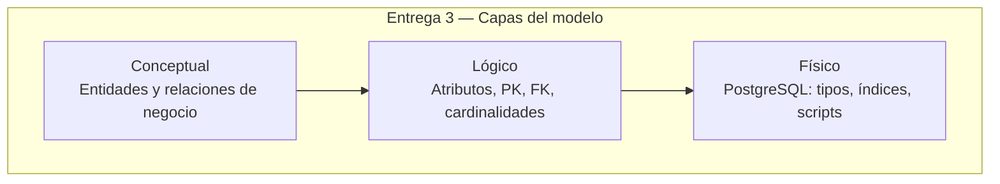

# Entrega 3 — Modelo de datos LogiCo

Documentación de la **tercera entrega** del proyecto: modelos conceptual, lógico y físico,
diccionario de datos y scripts SQL separados.

## Contenido

| # | Documento | Entregable solicitado |
|---|---|---|
| 01 | [Modelo conceptual](01-modelo-conceptual.md) | Diagrama conceptual mejorado (Mermaid) |
| 02 | [Modelo lógico](02-modelo-logico.md) | Diagrama lógico con atributos, PK y FK (Mermaid) |
| 03 | [Diccionario de datos](03-diccionario-datos.md) | Campos, tipos, llaves, índices y restricciones |
| 04 | [Modelo físico](04-modelo-fisico.md) | Implementación PostgreSQL, índices, vistas, despliegue |
| 05 | [Scripts SQL](05-scripts-sql.md) | Catálogo de scripts separados y orden de ejecución |
| 06 | [Código fuente y patrones de seguridad](06-codigo-fuente-y-patrones-seguridad.md) | Link GitHub + mín. 5 patrones con evidencia |
| 07 | [Plan de pruebas de software](07-plan-de-pruebas.md) | 5 tipos, RF/RNF, casos de uso, casos de prueba |
| 08 | [Resultados y análisis de pruebas](08-resultados-y-analisis-pruebas.md) | Evidencias, análisis, métricas, certificación |
| 09 | [Plan de mejora ante incidencias](09-plan-de-mejora-ante-incidencias.md) | Mejoras equipo, pruebas, herramientas, procedimientos |
| — | [`ejecutar-plan-pruebas.ps1`](ejecutar-plan-pruebas.ps1) | Script que ejecuta T1–T5 y genera reportes |

## Scripts SQL (repositorio)

Los scripts físicos viven en [`../../database/`](../../database/):

| Script | Propósito |
|---|---|
| `create_tables.sql` | Creación de tablas (sin PK/FK inline) |
| `primary_keys.sql` | Claves primarias y UNIQUE |
| `foreign_keys.sql` | Claves foráneas y CHECK |
| `drop_fk.sql` | Eliminación de FK y CHECK |
| `drop_tables.sql` | Eliminación de tablas |

> **Producción:** el despliegue completo usa además `01_schema.sql` … `08_cambiar_rol_usuario.sql`
> (ver §05).

## Resumen del dominio

**LogiCo** modela la última milla de pedidos: usuarios con roles (operadora, motorista, admin),
pedidos con estados trazables, rutas de asignación, incidencias, evidencias, farmacias,
flota de motos y catálogo geográfico de Chile (región → provincia → comuna).

## Checklist entrega 3 (completo)

| Requisito | Evidencia | Estado |
|---|---|:---:|
| Link código fuente (GitHub) | [06](06-codigo-fuente-y-patrones-seguridad.md) §6.1 | ⬜ completar URL |
| Mín. 5 patrones de seguridad | [06](06-codigo-fuente-y-patrones-seguridad.md) P1–P7 | ✅ |
| Plan de pruebas (5 tipos) | [07](07-plan-de-pruebas.md) | ✅ |
| Resultados y certificación pruebas | [08](08-resultados-y-analisis-pruebas.md) | ✅ |
| Plan de mejora ante incidencias | [09](09-plan-de-mejora-ante-incidencias.md) | ✅ |
| Script ejecutar plan | [ejecutar-plan-pruebas.ps1](ejecutar-plan-pruebas.ps1) | ✅ |
| Modelo conceptual | [01](01-modelo-conceptual.md) | ✅ |
| Modelo lógico | [02](02-modelo-logico.md) | ✅ |
| Diccionario (índices, llaves) | [03](03-diccionario-datos.md) | ✅ |
| Modelo físico | [04](04-modelo-fisico.md) | ✅ |
| Scripts SQL separados | [05](05-scripts-sql.md) | ✅ |
| Capturas IDE patrones | [assets/patrones/](assets/patrones/) | ⬜ pegar PNG |
