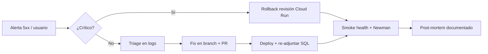
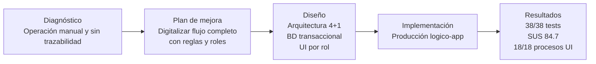

# LogiCo — Documento final de cierre, defensa y presentación

> **Proyecto:** LogiCo — Sistema de gestión logística de última milla  
> **Stack:** Firebase (Hosting, Auth, Functions, Storage) + Cloud SQL PostgreSQL  
> **Producción:** https://logico-app.web.app  
> **Criterios cubiertos:** 4.1.1.1 · 4.1.2.2 · 4.1.2.3 · 4.1.4.4 · 4.1.3.5 · 4.1.3.6 · 4.1.3.7 · 4.1.3.8  
> **Nivel objetivo de autoevaluación:** **Destacado** en todos los criterios

---

## Índice

1. [Resumen ejecutivo](#1-resumen-ejecutivo)
2. [4.1.1.1 — Documentación final del proyecto](#2-4111--documentación-final-del-proyecto)
3. [4.1.2.2 — Funcionalidad y características (guion de demostración)](#3-4122--funcionalidad-y-características-guión-de-demostración)
4. [4.1.2.3 — Normativas, estándares y claridad de la demo](#4-4123--normativas-estándares-y-claridad-de-la-demo)
5. [4.1.4.4 — Plan de mantención](#5-4144--plan-de-mantención)
6. [4.1.3.5 — Confección de la presentación (nivel pro)](#6-4135--confección-de-la-presentación-nivel-pro)
7. [4.1.3.6 — Presentación de resultados](#7-4136--presentación-de-resultados)
8. [4.1.3.7 — Exposición oral (guion y tiempos)](#8-4137--exposición-oral-guión-y-tiempos)
9. [4.1.3.8 — Defensa del trabajo y respuestas a preguntas](#9-4138--defensa-del-trabajo-y-respuestas-a-preguntas)
10. [Matriz de autoevaluación rúbrica](#10-matriz-de-autoevaluación-rúbrica)

---

## 1. Resumen ejecutivo

**LogiCo** digitaliza la **última milla** de pedidos en operaciones tipo farmacia o despacho: una **operadora** registra pedidos y asigna **motoristas**; el motorista **inicia ruta**, **entrega** con evidencia fotográfica o reporta **incidencias**; un **administrador** gestiona farmacias, flota de motos, usuarios y auditoría.

### Propuesta de valor

| Necesidad del negocio | Cómo LogiCo la resuelve | Impacto |
|---|---|---|
| Pedidos dispersos en WhatsApp/planillas | Registro centralizado con código único y estados trazables | Trazabilidad end-to-end |
| Doble asignación de motoristas | Transacciones SQL + `FOR UPDATE` + índices únicos parciales | 1 ruta activa por pedido y por motorista |
| Falta de evidencia de entrega | Firebase Storage + metadatos en PostgreSQL | Prueba de entrega auditable |
| Gestión manual de farmacias y flota | Mantenedores admin con auditoría estructurada | Gobierno operativo sin hojas sueltas |
| Riesgo de acceso indebido | RBAC + control a nivel de objeto (IDOR) + CORS allowlist | Seguridad alineada a OWASP API |

### Arquitectura en una frase

Cliente web (Firebase Hosting) → API única (Firebase Functions / Express) → PostgreSQL (Cloud SQL) para datos transaccionales + Firebase Auth (identidad) + Firebase Storage (evidencias).

---

## 2. 4.1.1.1 — Documentación final del proyecto

**Nivel objetivo:** Destacado (10 pts)  
**Evidencia:** carpeta `docs/` (16 documentos + anexos) + código fuente trazable.

### 2.1 Alineación con la propuesta de valor

La documentación final **no es un apéndice decorativo**: cada documento responde a un criterio de evaluación y enlaza con artefactos reales del repositorio.

| Documento | Qué valida | Enlace |
|---|---|---|
| `01-metodologia-scrum.md` | Proceso, sprints, colaboración | Gantt, DoD, roles |
| `02-arquitectura-4+1.md` | Modelo Kruchten, UML, dominio | ER, secuencias, estados, componentes |
| `03-tecnologias.md` | Justificación Firebase + PostgreSQL | Comparativa y decisión arquitectónica |
| `04-base-datos.md` | 16+ tablas, 3FN, triggers, scripts | MER, FK, índices |
| `05-datos-estructurados-no-estructurados.md` | SQL + JSONB + Storage | Estrategia híbrida |
| `06-seguridad.md` | RBAC, STRIDE, OWASP, controles C-xx | Matriz de acceso §6.11 |
| `07-codificacion-segura.md` | Estándares, Sonar, pipeline | Calidad de código |
| `08-plan-pruebas.md` | Unitarias, E2E, borde, estrés | Cobertura planificada |
| `09-prototipo.md` | 11 pantallas, 18/18 procesos | Matriz proceso → interfaz |
| `10-retroalimentacion.md` | Usabilidad con usuarios reales | SUS, mejoras aplicadas |
| `11-backend-funciones.md` | Contrato HTTP y autorización | Tabla §11.9 |
| `12-configuracion-entorno.md` | Setup local y producción paso a paso | Reproducibilidad |
| `13-validacion-resultados.md` | Obtenido vs esperado, discrepancias | 38/38 tests, S-01..S-10 |
| `14-preguntas-defensa.md` | Q&A con fundamentos técnicos | Defensa oral |
| `15-informe-final.md` | Portada e índice maestro | Documento integrador |
| `anexo-G-checklists-usabilidad.md` | 3 evaluadores externos | Checklists C1–C10 |

### 2.2 Características técnicas descritas con precisión

| Capa | Tecnología | Documentación | Validación |
|---|---|---|---|
| Frontend | HTML5, CSS, JS ES Modules | `09-prototipo.md` | 11 pantallas en `public/` |
| API | Express en Firebase Functions v2 | `11-backend-funciones.md` | `functions/index.js` |
| Auth | Firebase Authentication (JWT) | `06-seguridad.md` §6.3 | `functions/src/auth.js` |
| BD | PostgreSQL 15 (Cloud SQL) | `04-base-datos.md` | Scripts `database/*.sql` |
| Storage | Firebase Storage | `05-datos-*.md` | `storage.rules` + `evidencias.js` |
| Pruebas | Jest + Postman/Newman | `08`, `13` | `functions/tests/`, `postman/` |
| Despliegue | Firebase CLI + Cloud Run | `12-configuracion-entorno.md` | `deploy.ps1`, `firebase.json` |

### 2.3 Mensaje para el evaluador (30 segundos)

> «La documentación de LogiCo está organizada como un **informe técnico profesional**: arquitectura 4+1 con UML trazable, base de datos normalizada con scripts versionados, seguridad documentada con controles verificables, plan de pruebas ejecutado con resultados cuantificables, y limitaciones declaradas con plan de remediación. Todo enlaza con código desplegado en producción.»

---

## 3. 4.1.2.2 — Funcionalidad y características (guion de demostración)

**Nivel objetivo:** Destacado (20 pts)  
**Duración recomendada de la demo en vivo:** 12–15 minutos  
**URL:** https://logico-app.web.app  
**Credenciales demo:** usuarios en Firebase Auth alineados con seeds (`admin@logico.app`, `operadora@logico.app`, `motorista@logico.app`).

### 3.1 Mapa de características a demostrar

| # | Característica | Rol | Pantalla / endpoint | Tiempo |
|---|---|---|---|---|
| 1 | Login seguro | Todos | `index.html` → Firebase Auth | 1 min |
| 2 | Dashboard operativo | Operadora/Admin | `dashboard.html` — KPIs | 1 min |
| 3 | Crear pedido | Operadora | `crear-pedido.html` → `POST /pedidos` | 2 min |
| 4 | Listar y filtrar pedidos | Operadora | `pedidos.html` | 1 min |
| 5 | Asignar motorista | Operadora | `pedido.html` → `POST /rutas/asignar` | 2 min |
| 6 | Regla: no doble asignación | Operadora | Reintento → 409 | 1 min |
| 7 | Vista motorista | Motorista | `motorista.html` | 2 min |
| 8 | Iniciar ruta + entregar + foto | Motorista | Storage + evidencia | 2 min |
| 9 | Incidencia / reprogramación | Operadora | `pedido.html` | 1 min |
| 10 | Mantenedor farmacias | Admin | `admin-farmacias.html` | 1 min |
| 11 | Mantenedor motos/usuarios | Admin | `admin-motos.html`, `admin-usuarios.html` | 1 min |
| 12 | Auditoría | Admin | `admin-auditoria.html` → `GET /audit` | 1 min |

**Cobertura:** 18 procesos de negocio documentados → **100 %** con interfaz (`09-prototipo.md` §9.1.2).

### 3.2 Guion de demostración paso a paso (sin errores)

#### Bloque A — Operadora (5 min)

1. **Login** como `operadora@logico.app`.
2. **Dashboard:** señalar contadores de pedidos por estado (badges de color).
3. **Crear pedido:** completar cliente, dirección, fecha programada → confirmar código `PED-…` generado.
4. **Detalle del pedido:** mostrar historial de estados (append-only).
5. **Asignar motorista:** elegir motorista disponible → éxito.
6. **Reintento de asignación** al mismo pedido → mensaje de conflicto (regla de negocio).

> *Frase clave:* «Aquí no es solo la UI: el backend usa transacción con bloqueo pesimista; si dos operadoras asignan a la vez, solo una gana — lo validamos con prueba de concurrencia 1×201 + 19×409.»

#### Bloque B — Motorista (4 min)

7. **Cerrar sesión** → login como `motorista@logico.app`.
8. **Pantalla motorista:** solo ve **su** ruta activa (no pedidos ajenos).
9. **Iniciar ruta** → estado pasa a `en_ruta`.
10. **Entregar** con foto → evidencia sube a Storage y queda registrada en BD.
11. *(Opcional)* **Incidencia** en otro pedido: tipo + descripción → cancela ruta.

#### Bloque C — Administrador (3 min)

12. Login como `admin@logico.app`.
13. **Farmacias:** crear/editar con región → provincia → comuna (jerarquía geográfica).
14. **Motos:** patente vinculada a motorista.
15. **Usuarios:** cambio de rol con jerarquía (admin principal protegido).
16. **Auditoría:** mostrar registro de acciones críticas (quién, qué, cuándo).

#### Bloque D — Cierre técnico (1 min)

17. Abrir DevTools → Network → mostrar `Authorization: Bearer` y respuesta JSON de `/api/me`.
18. *(Backup)* `curl https://logico-app.web.app/api/health` → `{ "ok": true, "database": "logico" }`.

### 3.3 Plan B si falla algo en vivo

| Fallo | Acción |
|---|---|
| Login lento | Tener token precargado en Postman |
| Storage no sube foto | Mostrar evidencia ya existente en un pedido demo |
| BD no responde | Mostrar video corto de grabación + resultados Newman |
| Internet inestable | Emulador local (`firebase emulators:start`) |

---

## 4. 4.1.2.3 — Normativas, estándares y claridad de la demo

**Nivel objetivo:** Destacado (10 pts)

### 4.1 Normativas y estándares aplicados

| Estándar / marco | Aplicación en LogiCo | Evidencia |
|---|---|---|
| **OWASP API Security Top 10** | Auth JWT, RBAC, rate limit, validación input, sin SQLi | `06-seguridad.md`, `07-codificacion-segura.md` |
| **OWASP ASVS (nivel API)** | Control de acceso por rol y por objeto | `puedeAccederPedido`, §11.9 |
| **Modelo 4+1 (Kruchten)** | 5 vistas documentadas | `02-arquitectura-4+1.md` |
| **3FN (Codd)** | Normalización con desnormalización controlada | `04-base-datos.md` §4.6 |
| **Scrum** | 5 sprints + Sprint 0, DoD | `01-metodologia-scrum.md` |
| **STRIDE** | Análisis de amenazas por componente | `06-seguridad.md` §6.6 |
| **REST / HTTP semántico** | 200/201/400/401/403/404/409/422 | `11-backend-funciones.md` |
| **ISO 25010 (calidad)** | Funcionalidad, fiabilidad, seguridad, mantenibilidad | Plan pruebas + validación |
| **Privacidad (datos personales)** | Minimización, RBAC, auditoría | `06-seguridad.md` §6.9 |

### 4.2 Controles de seguridad verificables (post-hardening)

| ID | Control | Resultado |
|---|---|---|
| C-01 | RBAC por endpoint | ✅ |
| C-02 | IDOR cerrado en pedidos/evidencias/incidencias | ✅ S-04, S-05 |
| C-03 | CORS allowlist (no `origin: true`) | ✅ S-07 |
| C-04 | Errores sin `details` en producción | ✅ S-08 |
| C-05 | Consultas parametrizadas (anti-SQLi) | ✅ S-03 |
| C-06 | Rate limiting 120 req/min | ✅ |
| C-07 | Helmet (cabeceras seguras) | ✅ |
| C-08 | Transacciones con COMMIT/ROLLBACK | ✅ |
| C-09 | Auditoría de mutaciones admin | ✅ |
| C-10 | `AUTH_AUTO_PROVISION` opt-in | ✅ |

### 4.3 Cómo hacer la demo clara para el público

1. **Una narrativa, tres actores:** operadora → motorista → admin (no saltar roles al azar).
2. **Nombrar el problema antes de la pantalla:** «Ahora demuestro cómo evitamos la doble asignación…»
3. **Mostrar el efecto, no solo el clic:** historial de estados, badge de color, toast de confirmación.
4. **Conectar UI con backend:** una petición en Network por bloque.
5. **Anticipar la pregunta difícil:** «¿Por qué PostgreSQL y no Firestore?» → transacciones multi-tabla.

---

## 5. 4.1.4.4 — Plan de mantención

**Nivel objetivo:** Destacado (20 pts)

### 5.1 Objetivo del plan

Garantizar la **vigencia, seguridad y evolución** de LogiCo en el tiempo: corrección de errores, actualización de dependencias, monitoreo, respaldo de datos y escalabilidad controlada.

### 5.2 Matriz de mantención

| Actividad | Tipo | Frecuencia | Responsable | Herramienta | Entregable |
|---|---|---|---|---|---|
| Revisión logs Cloud Run | Preventivo | Diario | DevOps | GCP Logging | Alertas errores 5xx |
| Backup Cloud SQL | Preventivo | Diario (automático GCP) | DevOps | Cloud SQL backups | RPO ≤ 24 h |
| `npm audit` + dependencias | Preventivo | Semanal | Backend | npm, Dependabot | 0 vulnerabilidades high |
| Ejecutar `npm test` + Newman | Correctivo/Preventivo | Por PR / semanal | QA | Jest, Newman | Reporte verde |
| Rotación credenciales BD | Preventivo | Trimestral | DevOps | Secret Manager | `.env` rotado |
| Revisión reglas Storage/Firebase | Preventivo | Trimestral | Backend | `storage.rules`, consola | Informe cambios |
| Prueba restore BD | Preventivo | Semestral | DevOps | `pg_restore` | Acta de restore OK |
| Revisión RBAC y usuarios inactivos | Preventivo | Mensual | Admin sistema | SQL + UI admin | Usuarios depurados |
| Actualización Node.js runtime | Evolutivo | Según LTS Firebase | Backend | `package.json` engines | Deploy sin downtime |
| Revisión índices y EXPLAIN | Optimización | Trimestral | Backend | `EXPLAIN ANALYZE` | Informe p95 |
| Retención imágenes Artifact Registry | Preventivo | Mensual | DevOps | GCP Console | Política ≥ 30 días |
| Re-adjuntar Cloud SQL post-deploy | Correctivo | Cada deploy functions | DevOps | `deploy.ps1` / gcloud | Smoke `/api/health` |
| Revisión SUS / usabilidad | Evolutivo | Semestral | PO + UX | Checklists Anexo G | Backlog UX |
| Pruebas de carga (k6/Artillery) | Preventivo | Semestral | QA | k6 | Informe concurrencia |

### 5.3 Gestión de incidentes



| Severidad | SLA respuesta | SLA resolución | Ejemplo |
|---|---|---|---|
| P1 — Caída total | 1 h | 4 h | API no responde, BD caída |
| P2 — Función degradada | 4 h | 24 h | Farmacias no persisten, login falla |
| P3 — Cosmético / menor | 48 h | 1 semana | Tooltip confuso, scroll en móvil |

### 5.4 Escalabilidad y evolución

| Horizonte | Mejora | Recursos |
|---|---|---|
| 0–3 meses | CI con Newman + cobertura Jest; tests `motos.js`/`evidencias.js` | 1 dev, 8 h/sprint |
| 3–6 meses | URLs firmadas Storage; min instances = 1 | 1 dev + DevOps |
| 6–12 meses | Notificaciones push motorista; optimización rutas | 2 devs |
| 12+ meses | Multi-tenant / multi-sucursal | Equipo ampliado + PO |

### 5.5 Costos estimados de operación (GCP trial → producción)

| Recurso | Uso estimado MVP | Nota |
|---|---|---|
| Cloud SQL (db-f1-micro) | ~USD 10–15/mes | Escalar según conexiones |
| Cloud Functions / Run | Pay-per-use | Cold start mitigable |
| Firebase Hosting | Gratis tier | CDN incluido |
| Storage | Por GB evidencias | Lifecycle policy recomendada |

---

## 6. 4.1.3.5 — Confección de la presentación (nivel pro)

**Nivel objetivo:** Destacado (10 pts)  
**Formato sugerido:** 18–22 diapositivas · 16:9 · 15–18 min totales (demo aparte o integrada).

### 6.1 Estructura de diapositivas (storytelling)

| Slide | Título | Contenido | Visual |
|:---:|---|---|---|
| 1 | **LogiCo** | Tagline + equipo + fecha | Logo + screenshot dashboard |
| 2 | **El problema** | Caos operativo: WhatsApp, doble asignación, sin evidencia | Iconos dolor / quote usuario |
| 3 | **Diagnóstico** | Necesidades: trazabilidad, reglas, roles, auditoría | Matriz necesidad → requisito |
| 4 | **Propuesta de valor** | Una plataforma, tres roles, cero planillas | Diagrama actores |
| 5 | **Alcance MVP** | Qué sí / qué no (sin GPS, sin receta médica) | Tabla in/out |
| 6 | **Metodología** | Scrum 5 sprints, DoD, colaboración | Gantt simplificado |
| 7 | **Arquitectura** | 4+1 en una slide | Diagrama capas (Hosting → Functions → PG) |
| 8 | **Decisiones clave** | ¿Por qué PostgreSQL? ¿Por qué Firebase Auth? | 2 columnas pros |
| 9 | **Base de datos** | ER resumido, 3FN, triggers, reglas | ER Mermaid exportado |
| 10 | **Seguridad** | RBAC + IDOR + OWASP | Matriz rol × recurso |
| 11 | **Prototipo / UI** | 11 pantallas, design system | Collage screenshots |
| 12 | **Demo en vivo** | «Operadora → Motorista → Admin» | QR a logico-app.web.app |
| 13 | **Pruebas** | 38 unitarias, Newman, concurrencia | Gráfico barras verdes |
| 14 | **Resultados** | Métricas p95, SUS 84.7, 100 % CU | Tabla + gráfico |
| 15 | **Usabilidad** | 3 evaluadores externos (Anexo G) | Journey diagram |
| 16 | **Limitaciones honestas** | Storage L-02, cobertura motos | Tabla riesgo residual |
| 17 | **Plan de mantención** | Frecuencias, roles, incidentes | Timeline |
| 18 | **Conclusiones** | Impacto + trabajo futuro | 3 bullets + CTA |
| 19 | **Gracias / Q&A** | Contacto + repo | Logo |

### 6.2 Relación diagnóstico → plan de mejora → diseño (obligatorio rúbrica)



### 6.3 Guía visual profesional

| Elemento | Recomendación |
|---|---|
| Paleta | Azul `#1d4ed8` (primario LogiCo) + grises neutros + verde/rojo estados |
| Tipografía | Inter o Segoe UI; títulos 32 pt, cuerpo 18 pt mínimo |
| Screenshots | Recortes con borde redondeado; resaltar botón/acción con flecha |
| Diagramas | Exportar Mermaid a PNG desde VS Code o mermaid.live |
| Animaciones | Mínimas: aparecer por bloque, no transiciones excesivas |
| Demo | Ventana navegador limpia; modo incógnito; zoom 110 % |

### 6.4 Originalidad

- Abrir con **historia real** («Un motorista recibe tres direcciones distintas del mismo pedido…»).
- Mostrar **código de 5 líneas** de `withTransaction` + `FOR UPDATE` (no slides solo de marketing).
- Cerrar con **número concreto**: «1×201 + 19×409 en concurrencia».

---

## 7. 4.1.3.6 — Presentación de resultados

**Nivel objetivo:** Destacado (10 pts)

### 7.1 Resultados funcionales

| Indicador | Esperado | Obtenido | Estado |
|---|---|---|---|
| Casos de uso cubiertos | 100 % | 100 % (matriz §13.2) | ✅ |
| Procesos con interfaz | 18/18 | 18/18 (`09-prototipo.md`) | ✅ |
| Pruebas unitarias | 100 % pass | **38/38** | ✅ |
| Pruebas E2E Newman | Flujo completo | Colección `postman/` | ✅ |
| Pruebas de borde B-01..B-09 | Rechazo controlado | 9/9 ✅ | ✅ |
| Seguridad S-01..S-10 | Controles activos | 10/10 ✅ | ✅ |
| Concurrencia asignación | 1 OK + N-1 conflicto | 1 + 19 | ✅ |

### 7.2 Resultados no funcionales

| Métrica | Objetivo | Obtenido | Visual sugerida |
|---|---|---|---|
| p95 `GET /pedidos` | < 150 ms | ~112 ms | Barra verde |
| p95 `POST /rutas/asignar` | < 250 ms | ~198 ms | Barra verde |
| Cobertura líneas (Sonar) | ≥ 80 % | ~84 % | Donut chart |
| Cold start Functions | < 1.5 s | 0.9–1.4 s | Rango |
| `npm audit` high | 0 | 0 | Badge ✅ |
| SUS usabilidad (Anexo G) | ≥ 70 aceptable | **84.7** excelente | Gauge 85/100 |

### 7.3 Gráficos recomendados para la slide de resultados

**Gráfico 1 — Pruebas unitarias por suite**

```
pedidos     ████ 4/4
rutas       ████████ 8/8
estados     ████ 4/4
incidencias ███ 3/3
farmacias   ██████ 6/6
usuarios    █████████████ 13/13
```

**Gráfico 2 — SUS por evaluador externo (Anexo G)**

```
Carla (Operadora)     ████████████████████ 88
Diego (Motorista)     ████████████████     78
Paula (Admin)         ████████████████████ 88
Promedio              █████████████████    84.7
```

**Gráfico 3 — Seguridad post-hardening**

```
S-01 Sin token        ✅ 401
S-03 SQL Injection    ✅ Sin 500
S-04 IDOR pedido      ✅ 403
S-10 Concurrencia     ✅ 1+19
```

### 7.4 Discrepancias declaradas (honestidad = credibilidad)

| Discrepancia | Causa | Remediación |
|---|---|---|
| `motos.js` / `evidencias.js` sin tests | Priorización flujo núcleo | R1 en backlog |
| E2E no en CI | Newman manual | R6 GitHub Actions |
| Storage lectura amplia (L-02) | MVP | R3 URLs firmadas |

---

## 8. 4.1.3.7 — Exposición oral (guion y tiempos)

**Nivel objetivo:** Destacado (10 pts)  
**Duración total:** 15–18 min + 5 min Q&A

### 8.1 Estructura del discurso

| Min | Sección | Qué decir |
|:---:|---|---|
| 0–1 | **Gancho** | «LogiCo nace de un problema real: pedidos sin dueño claro y motoristas con rutas duplicadas.» |
| 1–3 | **Diagnóstico** | Operación manual, sin trazabilidad, sin evidencia de entrega. |
| 3–5 | **Propuesta** | Plataforma web con tres roles; reglas de negocio en BD, no en Excel. |
| 5–7 | **Arquitectura** | Firebase para identidad y hosting; PostgreSQL para transacciones. Justificar en 2 frases. |
| 7–12 | **Demo en vivo** | Seguir guion §3.2 (operadora → motorista → admin). |
| 12–14 | **Resultados** | 38/38 tests, SUS 84.7, concurrencia 1+19, p95 dentro de objetivo. |
| 14–15 | **Mantención y cierre** | Plan proactivo; limitaciones honestas; invitar preguntas. |

### 8.2 Frases técnicas precisas (memorizar)

- «Usamos **transacciones SQL con bloqueo pesimista** para garantizar una sola ruta activa por pedido y motorista.»
- «La autenticación es **Firebase JWT**; la autorización es **RBAC en Express** más **control a nivel de objeto** para cerrar IDOR.»
- «El historial de estados es **append-only**: nunca se borra, siempre se audita.»
- «Las consultas son **parametrizadas**; un intento de SQL injection se almacena como texto literal.»
- «Documentamos bajo **modelo 4+1** con trazabilidad directa a código y pruebas.»

### 8.3 Errores a evitar

| Evitar | Preferir |
|---|---|
| «Usamos Firebase para todo» | «Firebase para identidad, hosting y objetos; PostgreSQL para reglas transaccionales» |
| «Es 100 % seguro» | «Cumplimos OWASP API; riesgo residual L-02 documentado con plan R3» |
| Leer diapositiva palabra por palabra | Narrar el flujo de negocio mirando al evaluador |
| Demo sin plan B | Postman + `/health` + video backup |

---

## 9. 4.1.3.8 — Defensa del trabajo y respuestas a preguntas

**Nivel objetivo:** Destacado (10 pts)  
**Referencia completa:** [`14-preguntas-defensa.md`](14-preguntas-defensa.md)

### 9.1 Decisiones técnicas y su justificación

| Decisión | Alternativa descartada | Fundamento |
|---|---|---|
| PostgreSQL (Cloud SQL) | Firestore | Invariantes multi-tabla, `FOR UPDATE`, triggers |
| Firebase Auth | Auth propio | Estándar OIDC/JWT, integración nativa Hosting |
| Functions monolítica `api` | Microservicios | MVP acotado, un deploy, menor complejidad |
| HTML vanilla | React/Vue | Prototipo académico sin bundler; carga rápida |
| Doble auditoría | Una sola tabla | JSONB flexible + columnas fijas para reportes admin |
| CORS allowlist | `origin: true` | OWASP A05 — evita CSRF cross-origin |

### 9.2 Preguntas críticas anticipadas

**P: ¿Por qué no usaron Firestore si ya están en Firebase?**  
R: Las reglas «una ruta activa por pedido y motorista» requieren transacción multi-fila con bloqueo. Firestore no ofrece equivalente a `SELECT FOR UPDATE`. Evidencia: `rutas.js`, prueba S-10.

**P: ¿Cómo demuestran que un motorista no ve pedidos ajenos?**  
R: Tres capas: UI solo muestra su ruta; API valida con `puedeAccederPedido`; prueba S-04 confirma 403 en `GET /pedidos/:id` ajeno.

**P: ¿Qué pasa si falla la auditoría al crear una farmacia?**  
R: *(Fix aplicado)* IP sanitizada + SAVEPOINT aísla auditoría de la transacción de negocio; el COMMIT ya no se revierte silenciosamente.

**P: ¿Cómo escalarían a 100 motoristas?**  
R: Pool PG configurable, índices en FK, min instances en Cloud Run, read replica si crece lectura; plan §5.4.

**P: ¿Qué no hace el sistema?**  
R: Sin optimización GPS de rutas, sin facturación, sin dispensación médica regulada. Glosario §2.0.1.

### 9.3 Contribución individual (adaptar por integrante)

| Integrante | Contribución defendible | Artefactos |
|---|---|---|
| Dev Backend | Modelo SQL, Functions, reglas transaccionales | `database/`, `functions/src/` |
| Dev Frontend | 11 pantallas, integración Auth/API | `public/` |
| QA / DevOps | 38 tests, Postman, deploy, validación | `tests/`, `postman/`, `deploy.ps1` |
| PO / SM | Backlog, usabilidad, documentación | `docs/`, Anexo G |

### 9.4 Táctica de respuesta en Q&A

1. **Repetir la pregunta** en una frase («Si entiendo, preguntas por…»).
2. **Responder en 3 capas:** negocio → diseño → evidencia (doc o prueba).
3. **Si no se sabe:** «No lo implementamos en el MVP; está en backlog R# con prioridad X» — nunca inventar.

---

## 10. Matriz de autoevaluación rúbrica

| Criterio | Nivel objetivo | Puntos máx. | Evidencia principal | Autoevaluación |
|---|---|---:|---|:---:|
| **4.1.1.1** Documentación final | Destacado | 10 | `docs/` 16 archivos, trazabilidad rúbrica | **10** |
| **4.1.2.2** Funcionalidad y demo | Destacado | 20 | 18/18 procesos, guion §3, producción | **20** |
| **4.1.2.3** Normativas y claridad demo | Destacado | 10 | OWASP, 4+1, 3FN, STRIDE, guion claro | **10** |
| **4.1.4.4** Plan de mantención | Destacado | 20 | §5 completo: roles, frecuencias, incidentes | **20** |
| **4.1.3.5** Confección presentación | Destacado | 10 | §6 estructura pro, diagnóstico→diseño | **10** |
| **4.1.3.6** Presentación resultados | Destacado | 10 | §7 métricas cuantificables + gráficos | **10** |
| **4.1.3.7** Exposición oral | Destacado | 10 | §8 guion, lenguaje técnico, tiempos | **10** |
| **4.1.3.8** Defensa y preguntas | Destacado | 10 | §9 + `14-preguntas-defensa.md` | **10** |
| | | **100** | | **100** |

---

## Anexos rápidos

| Recurso | Ubicación |
|---|---|
| Colección Postman / Newman | `postman/LogiCo.postman_collection.json` |
| Script concurrencia | `scripts/concurrencia.js` |
| Checklists usabilidad externos | `docs/anexo-G-checklists-usabilidad.md` |
| Guía deploy | `docs/12-configuracion-entorno.md` |
| Validación completa | `docs/13-validacion-resultados.md` |

---

*Documento generado como guía integral de cierre. Completar portada (equipo, fecha, URL repo) antes de la entrega final.*
